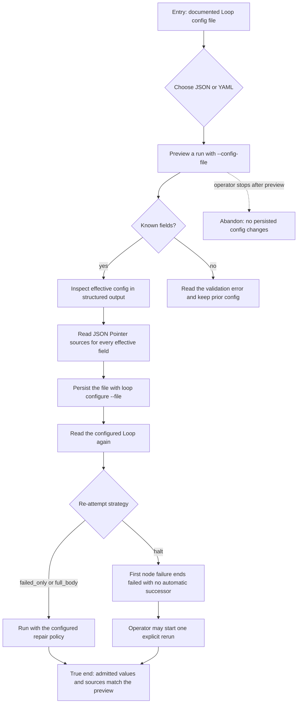

# J-configure-and-run-loop — Reuse Loop settings from a file

A delivery builder keeps repeatable Loop limits in a reviewed JSON or YAML file. They preview the
effective run settings, persist the same settings for later runs, and confirm an invalid field is
rejected without changing the saved configuration.



```yaml
journey:
  id: J-configure-and-run-loop
  name: "Configure and run a Loop from reusable files"
  value_statement: "A builder can reuse reviewed Loop limits in JSON or YAML without retyping flags or losing strict validation."
  personas: [Bruno]
  entry_points:
    - url: "CLI: compozy loop run --config-file"
      origin: direct
    - url: "CLI: compozy loop configure --file"
      origin: direct
  actions:
    - step: 1
      verb: "Preview a Loop run with a JSON or YAML config file"
      expected_observable: "Structured output contains the requested snake_case fields, including nested enabled checks"
    - step: 2
      verb: "Persist the same file as the Loop configuration"
      expected_observable: "A fresh structured read returns the same effective settings and JSON Pointer sources"
    - step: 3
      verb: "Try one unknown field"
      expected_observable: "The CLI rejects the file before mutation and the previous configuration remains intact"
    - step: 4
      verb: "Run a deterministic failure with the halt strategy"
      expected_observable: "The run ends failed without an automatic successor, while explicit rerun remains available"
  goal:
    observable: "Previewed, persisted, and admitted Loop settings and sources match, and the selected failure policy is enforced"
    side_effects: [loop-config-updated]
  true_end_state: "Fresh current and run-history reads explain each winning value, invalid input leaves config unchanged, and halt admits no automatic successor."
  exit:
    natural: "The builder can run the Loop again without reconstructing the override flags."
  abandonment:
    - at_step: 1
      how: "The builder stops after the preview."
      resume: "No workspace configuration changed; the same file can be used later."
  crosses: [CLI, HTTP, UDS, native-tools, Web, config-lifecycle, JSON, YAML, run-history]
```
