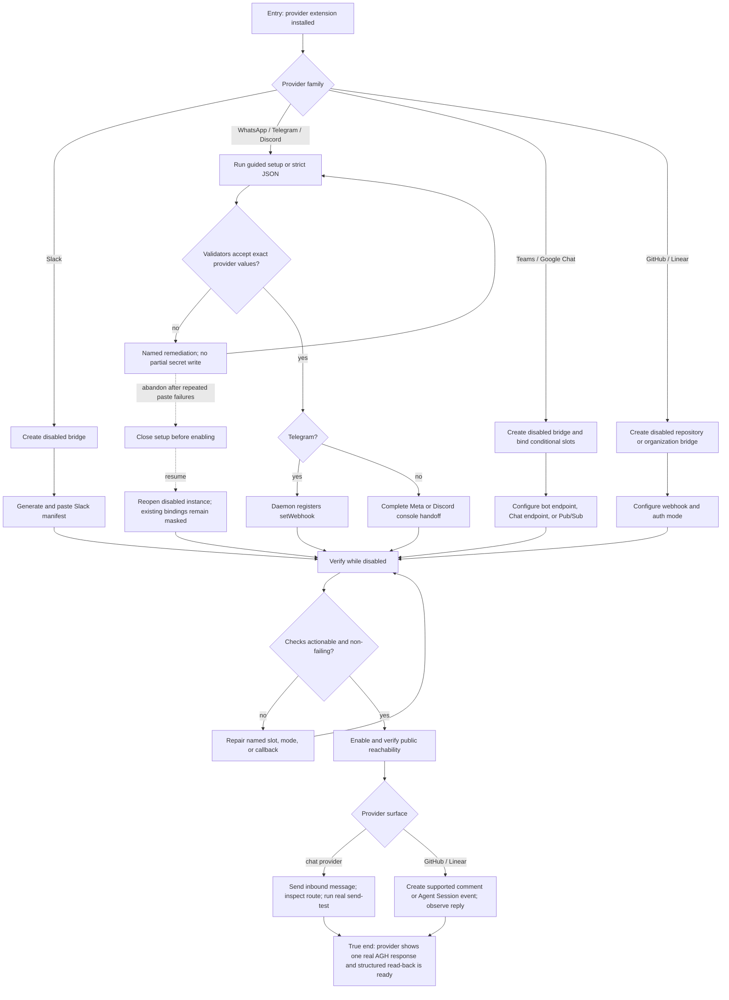

# J-connect-bridge-provider — Connect a bridge provider and receive the first response

An operator starts with an installed provider and finishes with a provider-visible AGH response.
The journey branches by the provider's real setup surface: Slack uses a generated manifest;
WhatsApp, Telegram, and Discord use guided setup; Teams, Google Chat, GitHub, and Linear use the
generic disabled-create and binding flow. GitHub and Linear finish in an issue or Agent Session,
not a fabricated chat conversation.



```yaml
journey:
id: J-connect-bridge-provider
  name: "Connect a bridge provider and receive the first response"
  value_statement: "I can follow the setup path that actually belongs to my provider and prove the bridge with a visible response."
  personas: [Tessa, Ada]
  entry_points:
    - url: "agh bridge manifest slack; agh bridge setup whatsapp|telegram|discord; agh bridge create"
      origin: direct
    - url: "GET /api/bridges/providers/slack/manifest; bridge create/bind/register/verify/send-test HTTP or UDS routes"
      origin: direct
    - url: "agh.network bridge setup guides"
      origin: external-share
  actions:
    - step: 1
      verb: "Choose the provider's documented setup path"
      expected_observable: "Only real provider-specific commands and conditional credentials are shown"
    - step: 2
      verb: "Create the bridge disabled and bind write-only credentials"
      expected_observable: "The instance and binding metadata are readable while every supplied secret remains masked"
    - step: 3
      verb: "Complete the provider-console callback or manifest handoff"
      expected_observable: "The public URL, local listener, event subscription, and auth mode agree with the provider guide"
    - step: 4
      verb: "Verify, repair, enable, and verify again"
      expected_observable: "Checks name pass, warn, fail, or skipped truthfully and public reachability is attempted only after enablement"
    - step: 5
      verb: "Create an inbound route and perform a real provider response"
      expected_observable: "A chat message, issue comment, review comment, or Agent Activity shows the AGH response exactly once"
  goal:
    observable: "The external provider contains a real AGH response, and bridge detail/routes agree with that provider identity after a fresh read."
    side_effects: [bridge-instance-created-disabled, secrets-bound-write-only, provider-callback-configured, bridge-route-created, provider-message-delivered]
  true_end_state: "After re-reading the bridge and the provider surface, the instance is enabled and healthy or truthfully degraded, and the first response remains visible at the intended target."
  exit:
    natural: "The operator leaves the bridge ready for teammates or issue authors to use."
  abandonment:
    - at_step: 2
      how: "The operator stops after repeated credential-shape failures and closes the setup flow."
      resume: "The disabled instance can be reopened without duplicate creation; existing values stay masked and verification resumes from the next unresolved fact."
  crosses: [extension-catalog, bridge-cli, http, uds, vault, provider-console, provider-webhook, routing, delivery]
```

Automated backbone: `_tests.md` integration 5.7–5.11 and E2E runtime 6.4. Task 10 adds the
persona walk and TTFM measurements that fake-provider contracts cannot supply.
