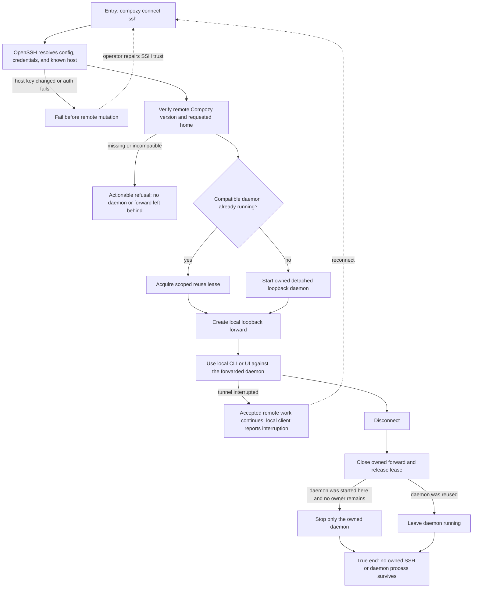

# J-connect-gateway-ssh: Connect to a remote daemon over SSH

An operator uses one command and existing OpenSSH trust to start or reuse a remote loopback daemon, works through a local forward, and disconnects without killing resources they do not own.



```yaml
journey:
  id: J-connect-gateway-ssh
  name: Connect to a remote daemon over SSH
  value_statement: "I can operate a server I already trust through SSH without exposing a gateway tier or leaving hidden processes behind."
  personas: [Bruno, Iris]
  entry_points:
    - url: compozy connect ssh <host>
      origin: direct
    - url: ~/.ssh/config and known_hosts
      origin: direct
  actions:
    - step: 1
      verb: Connect using the existing SSH host identity
      expected_observable: OpenSSH applies the operator's configuration and refuses changed host keys or failed authentication before mutation
    - step: 2
      verb: Verify the remote binary, version, and selected home
      expected_observable: Missing or incompatible Compozy returns an actionable refusal without starting resources
    - step: 3
      verb: Start or reuse the remote daemon
      expected_observable: The daemon listens only on loopback, preserves the requested home, and records whether this connection owns it
    - step: 4
      verb: Work through the local loopback forward
      expected_observable: CLI and UI behave like local access while no gateway provider or surface state changes
    - step: 5
      verb: Disconnect or lose the tunnel
      expected_observable: Accepted work continues, owned resources tear down within bounds, reused daemons and unrelated SSH masters survive
  goal:
    observable: The operator completes work through a loopback-only SSH forward with strict host trust and scoped ownership
    side_effects: [ssh-session-opened, daemon-started-or-reused, loopback-forward-created, ownership-lease-released]
  true_end_state: After disconnect, process and socket checks show no resource owned solely by this connection survives; a pre-existing daemon and unrelated SSH control master remain healthy
  exit:
    natural: The operator disconnects after work completes and returns to the local terminal
  abandonment:
    - at_step: 1
      how: Host identity changed or SSH authentication fails
      resume: Repair known-host or credential state outside Compozy, then retry; no remote mutation needs cleanup
    - at_step: 2
      how: Compozy is missing or the remote version is incompatible
      resume: Install the matching binary, then rerun the same connect command
    - at_step: 4
      how: The tunnel or parent process dies during accepted work
      resume: Reconnect; inspect the still-running remote work, then release any recovered scoped lease
  crosses: [cli, openssh, known-hosts, remote-daemon, process-ownership, loopback-forward, ui]
```

## Coverage notes

- Taxonomy sweep: functional coverage includes host trust, version, home, reuse/start, forward, and ownership cleanup; experiential coverage requires actionable refusal copy; edge coverage includes busy owners, tunnel loss, parent crash, and non-default homes; cross-cutting coverage verifies process isolation and that gateway exposure state is unchanged.
- Deliberate skip: mobile is not a meaningful SSH command surface; the forwarded web UI is covered by the pairing journey.

