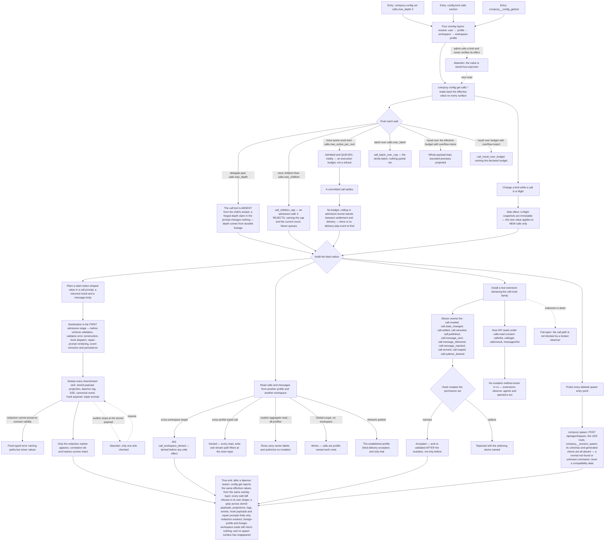

# J-contain-and-audit-delegation — Keep delegated work inside its walls, and be able to prove it

Recursive delegation is enabled by default, which only works if the walls are real. This journey is
the administrator's: set the `[calls]` limits, push each one until it refuses, and then audit —
prove that no secret-shaped value ever reached a stored payload, a projection, a log line, an event,
a hook payload or a repair prompt; that no read or write crossed a profile or workspace boundary;
and that the deleted spawn surface is genuinely gone rather than aliased.

Containment here is **budget-based, not permission-based**. Two different refusal shapes matter and
must not be confused: `max_children` is an admission wall that **rejects** with a typed error, while
`max_active_per_root` is an execution budget where admitted work **queues visibly**. And once a call
is committed, nothing may stand between its settlement and its delivery — no budget, no ceiling, no
admission funnel.

Covers ADR-008 (depth 3 by default, budget-based containment), ADR-011 (activations are
accounting-only in v1), ADR-014 (calls are profile-owned work roots with Global scope), ADR-002 (the
spawn surface is deleted), and safety invariants 7 (narrowing re-validated after every hook
mutation), 8 (depth from durable lineage, never prompt claims), 9 (profile/scope/workspace filtered
at the store layer) and 10 (sanitize before everything).



```yaml
journey:
  id: J-contain-and-audit-delegation
  name: "Contain delegated work and audit its boundaries"
  value_statement: "I can set the walls delegation runs inside, watch each one refuse in the shape it promises, and prove afterwards that nothing leaked past a profile, a workspace, or a redaction marker."
  personas: [Dora, Ada]
  entry_points:
    - url: "CLI: compozy config get calls.max_depth | calls.max_batch | calls.max_children | calls.max_active_per_root | calls.idle_ttl | calls.results.default_budget | calls.results.max_budget | calls.results.overflow | calls.messages.rate_limit_per_minute | calls.messages.dedup_window | calls.messages.pending_cap | calls.messages.max_bytes; compozy config set calls.*"
      origin: direct
    - url: "config.toml: the [calls], [calls.results] and [calls.messages] sections over the user → profile → workspace → workspace-profile overlays"
      origin: direct
    - url: "native: compozy__config_get; compozy__config_set; compozy__agent_call at the depth wall (absent from the child toolset)"
      origin: direct
    - url: "CLI/HTTP: compozy call list --all-profiles; Global-scope calls with no workspace; cross-workspace and cross-profile targets"
      origin: direct
    - url: "extension: declared call hook family (call.created, call.state_changed, call.settled, call.canceled, call.published, call.message_sent, call.message_delivered, call.message_rejected, call.revived, call.reaped, call.subtree_drained); Host API calls/list, calls/get, calls/result, messages/list under calls:read consent"
      origin: direct
    - url: "removed surfaces probed as negatives: compozy spawn; POST /api/agent/spawn; the UDS spawn route; compozy__session_spawn; the native catalog"
      origin: direct
  actions:
    - step: 1
      verb: "Set each [calls] key through a structured surface and read it back"
      expected_observable: "Every key is gettable and settable through CLI, native tool and config.toml; the effective value resolves through the user → profile → workspace → workspace-profile overlays and reads back identically on all three surfaces"
    - step: 2
      verb: "Change a limit while a call is in flight"
      expected_observable: "The in-flight call keeps its immutable snapshot; the new value applies only to calls created after the change"
    - step: 3
      verb: "Push the depth wall, including with a forged depth claim in the prompt"
      expected_observable: "At the wall the call tool is absent from the child's toolset rather than present-and-refusing; depth is enforced from durable lineage, so the prompt claim changes nothing"
    - step: 4
      verb: "Exceed max_children, then max_active_per_root, then max_batch and a result budget"
      expected_observable: "max_children rejects with call_children_cap naming the cap and current count; max_active_per_root admits and queues visibly instead of rejecting; max_batch rejects the whole batch with nothing partial run; overflow store keeps the whole payload with bounded previews while overflow reject fails with call_result_over_budget"
    - step: 5
      verb: "Let a queued call settle and look for any admission decision after commit"
      expected_observable: "The committed call settles and delivers with no budget, ceiling or admission funnel in between; there is no delivery-skip event in the catalog because completions are never admission-denied"
    - step: 6
      verb: "Plant claim-token-shaped values in a prompt, a returned result and a message body, then sweep every sink"
      expected_observable: "Only the redaction marker appears in the stored payload, projections, daemon logs, SSE, canonical events, hook payloads and the repair prompt, while correlation ids and hashes stay intact; validator errors are verbatim from the already-sanitized output; when redaction cannot preserve contract validity the return fails with a fixed typed error naming paths but never values"
    - step: 7
      verb: "Read and target calls and messages across profile and workspace boundaries"
      expected_observable: "Cross-workspace targets are denied with call_workspace_denied before any side effect; cross-profile typed calls are denied; --all-profiles aggregate reads carry owner labels and authorize no mutation; Global scope with no workspace works; Network publish keeps its documented profile-blind delivery exception and nothing else does"
    - step: 8
      verb: "Install a test extension that declares the call hooks and reads through the Host API, then take it down"
      expected_observable: "All eleven events fire with sanitized payloads carrying the resolved profile owner; transition events carry the previous state and sender-side rejections or reaping carry their reason; a narrowing hook mutation is accepted and re-validated after the mutation, a widening one is rejected with its atoms named; calls/list, calls/get, calls/result and messages/list work under calls:read and no mutation method exists; a downed extension fails open rather than blocking the call path"
    - step: 9
      verb: "Probe every deleted spawn entry point"
      expected_observable: "CLI verb, HTTP route, UDS route, native tool, schemas and generated clients all respond as genuinely absent — a normal not-found or unknown-command with no compatibility alias, no deprecation shim and no 'formerly known as' text"
  goal:
    observable: "Every wall refused in its documented shape, and the audit found no leak across a redaction, profile, or workspace boundary"
    side_effects: [config-overlay-resolution, immutable-in-flight-snapshots, visible-queued-activations, canonical-call-events, sanitized-hook-payloads, host-api-consent-checks]
  true_end_state: "After a daemon restart: config get reports the same effective values and names the same overlay layer; the depth wall still removes the tool rather than refusing it; a grep across stored payloads, projections, logs, events, hook payloads and repair prompts finds only redaction markers; foreign-profile and foreign-workspace reads still return nothing and mutate nothing; and no spawn surface has reappeared on any of the six probed entry points."
  exit:
    natural: "The administrator leaves the limits in place and the audit evidence recorded."
  abandonment:
    - at_step: 6
      how: "The auditor checks the stored payload, sees a redaction marker, and stops there."
      resume: "The invariant is about ordering, not about one sink: the sweep only means something once the projection, log, SSE event, hook payload and repair prompt have each been checked, because those are the stages that run after admission and would leak if sanitization ran second."
    - at_step: 1
      how: "The administrator sets a limit and never verifies its runtime effect."
      resume: "The stored value is readable but unproven; the next read plus one boundary probe is what turns a config write into a wall."
  crosses: [config-overlays, calls-admission, contracts-registry, redaction-pipeline, profile-and-workspace-scoping, hooks-catalog, extension-host-api, task_runs-activation, GlobalDB, CLI, HTTP, UDS, native-tools]
```
