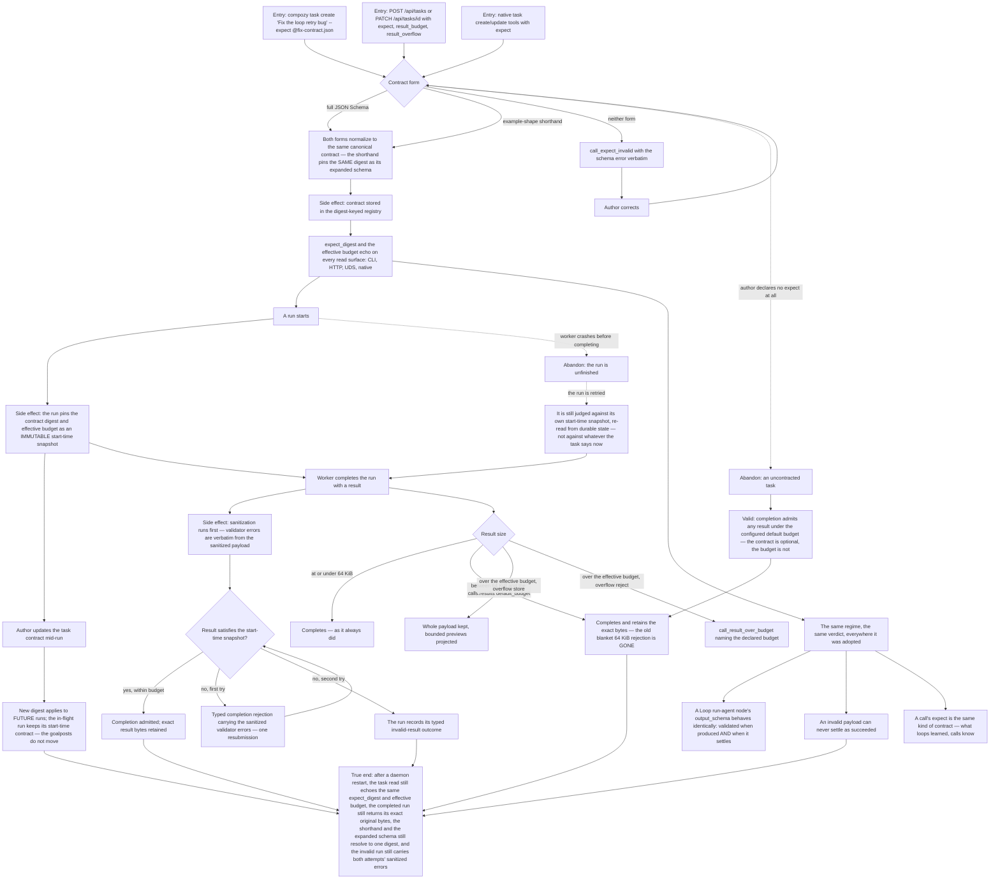

# J-contract-a-task-result — Say what a valid task result looks like, and have it enforced

Before this feature there were five different structured-output pipelines with five different ideas
of what a valid result was, and a blanket 64 KiB ceiling on task results that had nothing to do with
any of them. Now there is one contract regime: a task declares `expect` — either a full JSON Schema
or the example-shape shorthand — and the runtime enforces it at **completion admission**, with the
same one-resubmission repair round a call gets.

The two things this journey exists to prove are the ones a worker actually feels. First,
**the contract a run is judged against is the one it started with**: updating a task's contract
mid-flight applies to future runs only, so a worker never has the goalposts moved under it. Second,
**the old blanket ceiling is gone**: a result between 64 KiB and the configured `[calls.results]`
default budget now completes and retains its exact bytes, where it used to be rejected.

Covers ADR-006 (one contract package unifies all five structured-output pipelines) and ADR-013
(contracts live in a digest-keyed registry; runs pin the digest), plus safety invariant 14
(`internal/contracts` does no I/O beyond its registry store — validation is pure given digest and
payload, so every pipeline gets the identical verdict for identical input).



```yaml
journey:
  id: J-contract-a-task-result
  name: "Contract a task result and have it enforced"
  value_statement: "I say once what a valid result looks like, and every pipeline judges it the same way — against the contract the run started with, not the one I edited since."
  personas: [Bruno, Ada]
  entry_points:
    - url: "CLI: compozy task create <title> --expect @file|inline; compozy task update <task-id> --expect …; task reads echoing expect_digest and the effective budget"
      origin: direct
    - url: "HTTP/UDS: POST /api/tasks and PATCH /api/tasks/{id} with expect, result_budget, result_overflow; task read payloads returning expect_digest and the effective budget"
      origin: direct
    - url: "native: the task create and update tools with the same expect argument; task run completion"
      origin: direct
    - url: "CLI: compozy config get/set calls.results.default_budget | calls.results.max_budget | calls.results.overflow"
      origin: direct
    - url: "Loop DSL: a run-agent node's output_schema — the same contract kind"
      origin: direct
  actions:
    - step: 1
      verb: "Declare a contract in both accepted forms and one invalid form"
      expected_observable: "The full JSON Schema and the example-shape shorthand normalize to the same canonical contract and pin the identical digest; anything that is neither form fails with call_expect_invalid carrying the schema error verbatim"
    - step: 2
      verb: "Read the contracted task from CLI, HTTP, UDS and the native tool"
      expected_observable: "All four echo the same expect_digest and the same effective budget"
    - step: 3
      verb: "Start a run, then update the task's contract while it is in flight"
      expected_observable: "The new digest applies to future runs only; the in-flight run keeps its immutable start-time snapshot and is judged against that"
    - step: 4
      verb: "Complete the run with a non-conforming result, then resubmit against the original snapshot"
      expected_observable: "The first attempt returns a typed completion rejection carrying the sanitized validator errors and grants exactly one resubmission; a valid resubmission is admitted; a second failure records the run's typed invalid-result outcome"
    - step: 5
      verb: "Complete uncontracted runs on both sides of the old 64 KiB boundary and of the configured default budget"
      expected_observable: "A result at or under 64 KiB completes as before; a result between 64 KiB and the calls.results default budget now completes and retains its exact bytes — the blanket ceiling is gone; over the effective budget, overflow store keeps the whole payload with bounded previews while overflow reject fails with call_result_over_budget"
    - step: 6
      verb: "Run the same contract through a Loop run-agent node's output_schema"
      expected_observable: "It is validated both when the result is produced and when it settles, gives the identical verdict for the identical payload, and an invalid payload can never settle as succeeded"
  goal:
    observable: "A contracted run is admitted only against the contract it started with, and its exact result bytes are retained"
    side_effects: [contract-registered-by-digest, run-start-contract-snapshot, exact-result-bytes-retained, typed-invalid-result-outcome]
  true_end_state: "After a daemon restart and fresh reads: the task echoes the same expect_digest and effective budget on every surface, the completed run returns byte-identical result content, the shorthand and expanded schema still resolve to one digest, the invalid run still carries both attempts' sanitized errors, and the Loop node and the task agree on the verdict for the same payload."
  exit:
    natural: "The author leaves the contract in place and workers complete against it."
  abandonment:
    - at_step: 3
      how: "The worker crashes before completing, and the task's contract is edited before the run is retried."
      resume: "The retry is still judged against the run's own start-time snapshot, re-read from durable state — a run is never re-scored under a contract it never saw."
    - at_step: 1
      how: "The author never declares expect at all."
      resume: "The task stays valid and uncontracted: completion admits any result inside the configured default budget. The contract is optional; the budget is not."
  crosses: [internal-contracts-registry, task-service, task-run-completion-admission, loop-action-validation, redaction-pipeline, config-overlays, GlobalDB, CLI, HTTP, UDS, native-tools]
```
