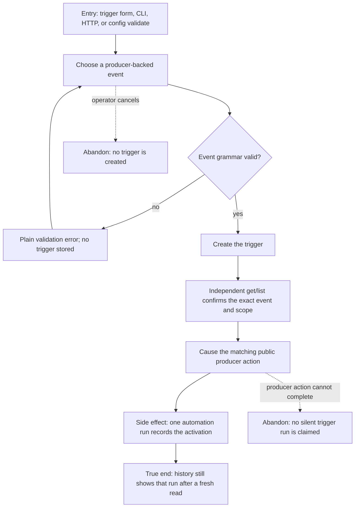

# J-create-and-activate-trigger — Create and activate a producer-backed trigger



```yaml
journey:
  id: J-create-and-activate-trigger
  name: "Create and activate a producer-backed trigger"
  value_statement: "An operator can choose an event the runtime really emits, reject impossible names before save, and observe the resulting automation run."
  personas: [Bruno, Ada]
  entry_points:
    - url: "Web /triggers event catalog"
      origin: in-app-nav
    - url: "CLI automation triggers create/update and config validate"
      origin: direct
    - url: "HTTP/UDS /api/automation/triggers"
      origin: direct
  actions:
    - step: 1
      verb: "Choose or enter a trigger event"
      expected_observable: "Only session.created, session.stopped, memory.consolidated, hook.<hook_name>.completed, webhook, and ext.* can be submitted; invalid or padded values are rejected"
    - step: 2
      verb: "Create the trigger and read it again"
      expected_observable: "The independent get/list surface returns the exact event, filter, scope, and workspace binding"
    - step: 3
      verb: "Perform the matching producer action"
      expected_observable: "A matching activation creates one trigger run; filtered or failed producer actions create none"
    - step: 4
      verb: "Read trigger history from a fresh public request"
      expected_observable: "The run remains visible with the matching trigger id and workspace scope"
  goal:
    observable: "Every accepted event family has a reachable producer, while impossible event names fail before persistence"
    side_effects: [automation-trigger-created, automation-run-recorded]
  true_end_state: "A fresh trigger-history read shows exactly one run for the producer action, and invalid attempts left no trigger or run behind."
  exit:
    natural: "The operator leaves the trigger enabled and can trust that its event will fire."
  abandonment:
    - at_step: 1
      how: "The operator enters an unknown event or whitespace-padded hook name."
      resume: "The product rejects it immediately and preserves the rest of the authored definition for correction."
    - at_step: 3
      how: "The producer action is skipped or fails."
      resume: "History remains unchanged; the product never claims an activation that did not complete."
  crosses: [automation-trigger-crud, config-validation, session-hooks, memory-consolidation, extension-host-api, workspace-scope]
```
