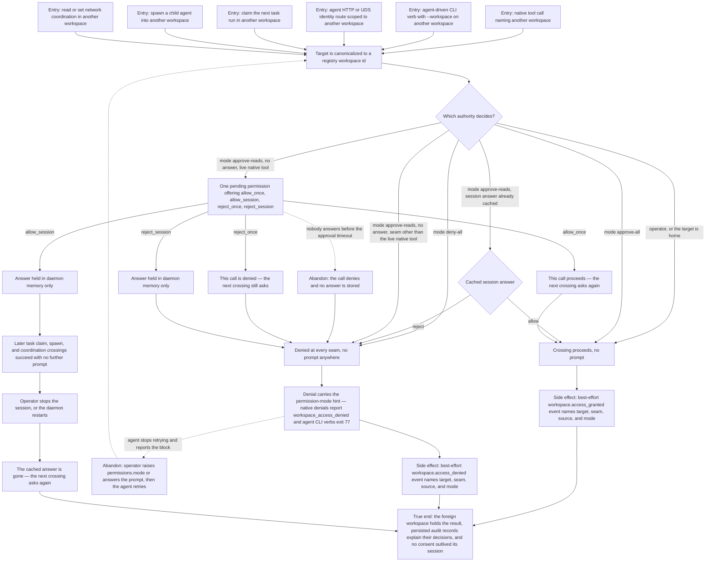

# J-cross-workspace-access — Reach another workspace under the session's permission mode

An agent working in one workspace needs something that lives in another: a workspace read, a task to
claim, a child to spawn, a coordination setting. The session's own permission mode is the only
authority. `approve-all` crosses without asking, `deny-all` never crosses and never asks, and
`approve-reads` asks the operator once at the native-tool seam and denies with a hint everywhere
else. In a healthy event store, the operator can read the decision afterwards; an audit append
failure is warned and never changes the access decision.



```yaml
journey:
  id: J-cross-workspace-access
  name: "Reach another workspace under the session's permission mode"
  value_statement: "An agent can work across workspace boundaries when its operator allows it, is blocked deterministically when they don't, and a healthy event store gives the operator an audit trail of the decisions."
  personas: [Ada, Bruno]
  entry_points:
    - url: "compozy__workspace_info / compozy__memory_* / compozy__task_run_claim_next with a foreign workspace input"
      origin: direct
    - url: "compozy task next --workspace / compozy network coordination status --workspace / compozy spawn --workspace"
      origin: direct
    - url: "POST /api/agent/spawn, POST /api/agent/tasks/claim-next, GET /api/agent/me over HTTP and UDS"
      origin: direct
    - url: "GET|PUT /api/workspaces/:workspace_id/network-coordination"
      origin: direct
    - url: "compozy session approve <session-id> --request-id <request-id> --decision <decision> / POST /api/workspaces/:workspace_id/sessions/:session_id/approve"
      origin: in-app-nav
    - url: "compozy logs --type workspace.access_granted|workspace.access_denied, GET /api/logs, compozy__logs, compozy__observe_search"
      origin: direct
  actions:
    - step: 1
      verb: "Name another workspace from a session whose agent is approve-all"
      expected_observable: "The crossing succeeds at the native-tool, task-claim, spawn, and coordination seams with no prompt, and the work lands in the named workspace"
    - step: 2
      verb: "Repeat the same crossings from a deny-all session"
      expected_observable: "Every seam denies with the permission-mode hint, nothing prompts anywhere, and native denials report reason workspace_access_denied while agent CLI verbs exit 77"
    - step: 3
      verb: "Repeat from an approve-reads session and answer the native-tool prompt"
      expected_observable: "Exactly one pending permission offers allow once, allow for this session, reject once, and reject for this session; the non-tool seams deny with the same hint and never prompt"
    - step: 4
      verb: "Answer allow for this session, then cross at a seam that never prompts"
      expected_observable: "Task claim, spawn, and coordination crossings now succeed without asking, and no approval appears in any list or revoke surface"
    - step: 5
      verb: "Stop the session, or restart the daemon, and cross again"
      expected_observable: "The first crossing prompts again — the session answer did not survive"
    - step: 6
      verb: "Read the audit trail as the operator"
      expected_observable: "In a healthy event store, each policy evaluation appears once, scoped to the actor's own workspace, naming the target workspace, seam, decision source, and mode; an append failure warns without changing access"
  goal:
    observable: "Each crossing attempt resolves to exactly the outcome the session's mode promises, and persisted audit records let the operator name why"
    side_effects: [workspace-access-audit-event, foreign-workspace-read-or-mutation, child-session-spawned-in-target, session-consent-cached-in-memory]
  true_end_state: "Allowed work is observable in the target workspace and gives the actor the same rights it has at home; denied work changed nothing anywhere; every successfully appended audit record names its decision; and stopping the session leaves no consent behind — the next crossing starts from the mode again."
  exit:
    natural: "The agent continues its task in the workspace it was allowed to reach, or reports the block and waits for the operator."
  abandonment:
    - at_step: 3
      how: "Nobody answers the native-tool prompt before the approval timeout expires."
      resume: "The call denies and stores no answer; a later crossing raises a fresh prompt rather than inheriting a stale one."
    - at_step: 2
      how: "The agent hits a final denial, stops retrying, and surfaces the block to the operator."
      resume: "The operator raises the agent's permissions.mode or answers the prompt; the agent retries the same crossing and it now resolves under the new authority."
  crosses: [native-tools, CLI, HTTP, UDS, session-identity, task-claim, spawn, network-coordination, approval-bridge, event-store, site-docs, official-skill]
```

Taxonomy note: journeys, functional checks, and edge/error states are all in scope — the denial hint,
reason code, exit code, and audit payload are the observables. Experiential and responsiveness lenses
apply only to the operator's prompt-answering and audit-reading surfaces, not to the agent's
structured seams. Cross-cutting regression rides the adjacent canary journey
`J-operate-workspace-context`, which owns same-workspace resolution and pre-handler binding.
