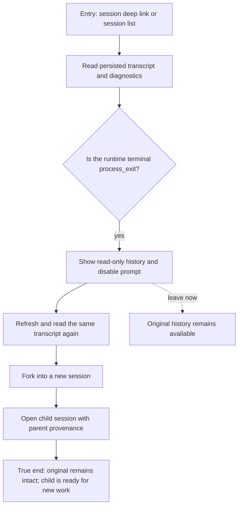

# J-dead-session-history-recovery — Read and fork a dead session

A returning session user opens a session after its ACP provider process has ended unexpectedly. The
session must remain a truthful record of what happened, not a failing resume loop. The user reads the
preserved transcript and diagnostics, then forks a new child only if they choose to continue.



```yaml
journey:
  id: J-dead-session-history-recovery
  name: "Read and fork a dead session"
  value_statement: "I can understand an interrupted agent session without losing its history or triggering another hidden runtime retry."
  personas: [Théo]
  entry_points:
    - url: "web session deep link or session list"
      origin: return-visit
    - url: "CLI: compozy session recap <session-id>"
      origin: direct
  actions:
    - step: 1
      verb: "Open the stopped session after a provider process exit"
      expected_observable: "Persisted transcript, process_exit summary, and diagnostic path remain readable; the prompt composer is unavailable."
    - step: 2
      verb: "Refresh and re-read the session"
      expected_observable: "The same transcript remains available and no session/load retry or generic server error appears."
    - step: 3
      verb: "Fork into a new session"
      expected_observable: "A child opens in the same workspace with parent_session_id pointing to the original; the original remains unchanged and readable."
  goal:
    observable: "The user can safely inspect the original failure and start separate follow-up work without rewriting history."
    side_effects: [child-session-created]
  true_end_state: "The original transcript and diagnostics survive refresh; the child is a distinct session linked to its parent."
  exit:
    natural: "The user either leaves with the original history intact or continues in the child session."
  abandonment:
    - at_step: 1
      how: "The user closes the tab after seeing the runtime unavailable notice."
      resume: "Reopen the same deep link; persisted history remains readable without attaching to ACP."
  crosses: [web, CLI, HTTP, UDS, session-store, transcript-projection, workspace-isolation]
```
