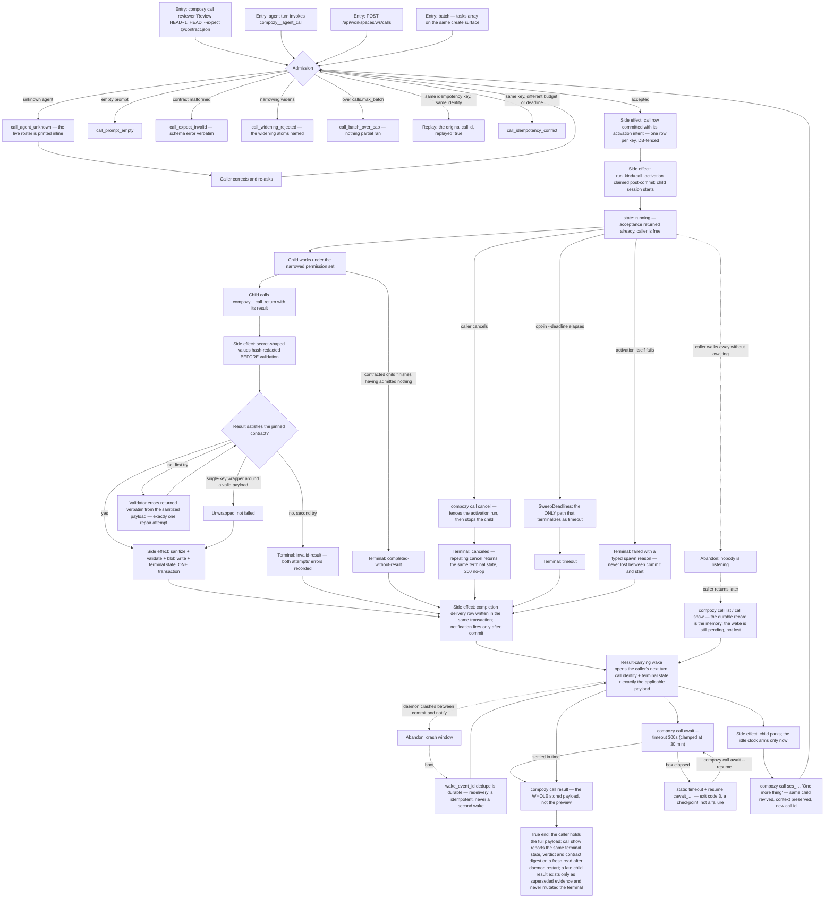

# J-delegate-work-to-an-agent — Hand a piece of work to a specialist and get a typed answer back

A caller — an operator at the CLI, or an agent inside its own turn — hands a named specialist a
piece of work with a **result contract** (`expect`), then gets on with something else. The call is
asynchronous by default: acceptance returns immediately with a call id and a child session id, and
the answer arrives later as a result-carrying wake on the caller's next turn. `await` is the
explicit, bounded, resumable way to block on purpose. The child's terminal act is
`compozy__call_return`, which validates against the pinned contract, gets exactly one repair
attempt, and settles the call in the same transaction that records the result.

The journey ends when the caller holds the whole stored payload — not when the call was accepted.

Covers ADR-001 (durable call record), ADR-002 (one call verb), ADR-003 (parked and revivable),
ADR-004 (durable delivery; waking an idle recipient costs a turn), ADR-006 and ADR-013 (one contract
regime, digest-pinned), ADR-007 (batch fan-out), ADR-009 (async by default, await is explicit) and
ADR-011 (activations are accounting-only — a committed call is never admission-denied).



```yaml
journey:
  id: J-delegate-work-to-an-agent
  name: "Delegate work to an agent and get a typed answer"
  value_statement: "I hand a specialist a piece of work with a contract, keep working, and the answer comes back to me typed, complete, and durable — even if I looked away or the daemon restarted."
  personas: [Bruno, Ada]
  entry_points:
    - url: "CLI: compozy call <agent|session-id> <prompt> [--expect @file|inline] [--strict] [--result-budget] [--result-overflow] [--idle-ttl] [--deadline] [--idempotency-key] [--runtime] [--tools|--skills|--workspace-paths|--network-channels]"
      origin: direct
    - url: "CLI: compozy call list [--state] [--caller] [--limit]; compozy call show <call-id>; compozy call await <call-id> [--timeout] [--resume]; compozy call cancel <call-id> [--reason]; compozy call result <call-id>"
      origin: direct
    - url: "HTTP/UDS: POST /api/workspaces/{workspace_id}/calls (single, batch tasks[], follow-up target.session_id); GET /api/workspaces/{workspace_id}/calls?state={states}&caller={session_id}&cursor={cursor}; GET /api/workspaces/{workspace_id}/calls/{call_id}; GET /api/workspaces/{workspace_id}/calls/{call_id}/result; POST /api/workspaces/{workspace_id}/calls/{call_id}/cancel; POST /api/workspaces/{workspace_id}/calls/{call_id}/await"
      origin: direct
    - url: "native: compozy__agent_call; compozy__call_return; compozy__call_await; compozy__call_cancel; compozy__call_result"
      origin: direct
  actions:
    - step: 1
      verb: "Ask a named specialist for work under a result contract"
      expected_observable: "Acceptance returns immediately with call id, child session id, state running and idle_expires_at null; an unknown name fails with call_agent_unknown and prints the live roster inline instead of a bare error"
    - step: 2
      verb: "Replay the same request with the same idempotency key"
      expected_observable: "The original call id comes back with replayed true and exactly one call row exists; changing the budget or deadline under the same key is call_idempotency_conflict, not a second call"
    - step: 3
      verb: "Fan out a mixed batch, then one batch over calls.max_batch"
      expected_observable: "The mixed batch returns 200 with independent accepted and typed rejected items; the over-cap batch is rejected as one request with call_batch_over_cap and nothing partial ran"
    - step: 4
      verb: "Let the child return a result that violates the contract, then a valid one"
      expected_observable: "The first violation returns the validator's errors verbatim from the already-sanitized payload and grants exactly one repair attempt; a second failure settles invalid-result with both attempts recorded; a single-key wrapper around a valid payload is unwrapped rather than failed"
    - step: 5
      verb: "Await a running call with a deliberate short box, then resume"
      expected_observable: "The box returns state timeout with a resume handle at exit code 3 and the call keeps running; --resume picks the same wait back up; over-max timeouts are clamped to 30 minutes and the output says so"
    - step: 6
      verb: "Cancel one call, and let another opt-in deadline elapse"
      expected_observable: "Cancel fences the activation run before the call closes, stops the child, settles canceled once, and repeats as an idempotent no-op; the deadline settles timeout through the same single settlement writer; return-vs-deadline and cancel-vs-deadline resolve to exactly one terminal outcome"
    - step: 7
      verb: "Read the wake, then fetch the whole result and call the parked child again"
      expected_observable: "The wake carries the call identity, terminal state and exactly the applicable payload — result reference and bounded preview for completed, typed reason for every resultless terminal; call result returns the full stored payload; calling the child's session id revives the same child with its context and mints a new call id"
  goal:
    observable: "The caller holds the complete typed result for a call it did not have to sit and watch"
    side_effects: [call-record-committed, call-activation-run-claimed, child-session-started, result-blob-written, completion-delivery-row, result-carrying-wake, child-parked-and-idle-clock-armed]
  true_end_state: "After a daemon restart and fresh reads: compozy call show and GET /calls/{id} report the same terminal state, verdict and contract digest; call result still returns the identical stored bytes; the caller's transcript carries exactly one wake per call; a late child result appears only in superseded_ref and the terminal was never mutated."
  exit:
    natural: "The caller acts on the typed result — or asks the same parked child a follow-up question."
  abandonment:
    - at_step: 5
      how: "The caller accepts the call and never awaits it — closes the terminal, moves to other work."
      resume: "The call is durable, not attached to the listener: compozy call list and call show report its live state, and the result-carrying wake is still pending on the caller's next turn rather than lost. There is no default deadline, so the call runs until it settles, is canceled, or the parent drains."
    - at_step: 7
      how: "The daemon crashes in the window between settlement commit and wake notification."
      resume: "Delivery is committed in the settlement transaction and notified only after commit, so boot redelivers from the durable row; wake_event_id dedupe is durable, so the caller sees exactly one wake, never two."
  crosses: [calls-service, contracts-registry, task_runs-activation, session-lineage, safe-spawn-engine, wake-delivery, GlobalDB, CLI, HTTP, UDS, native-tools]
```
