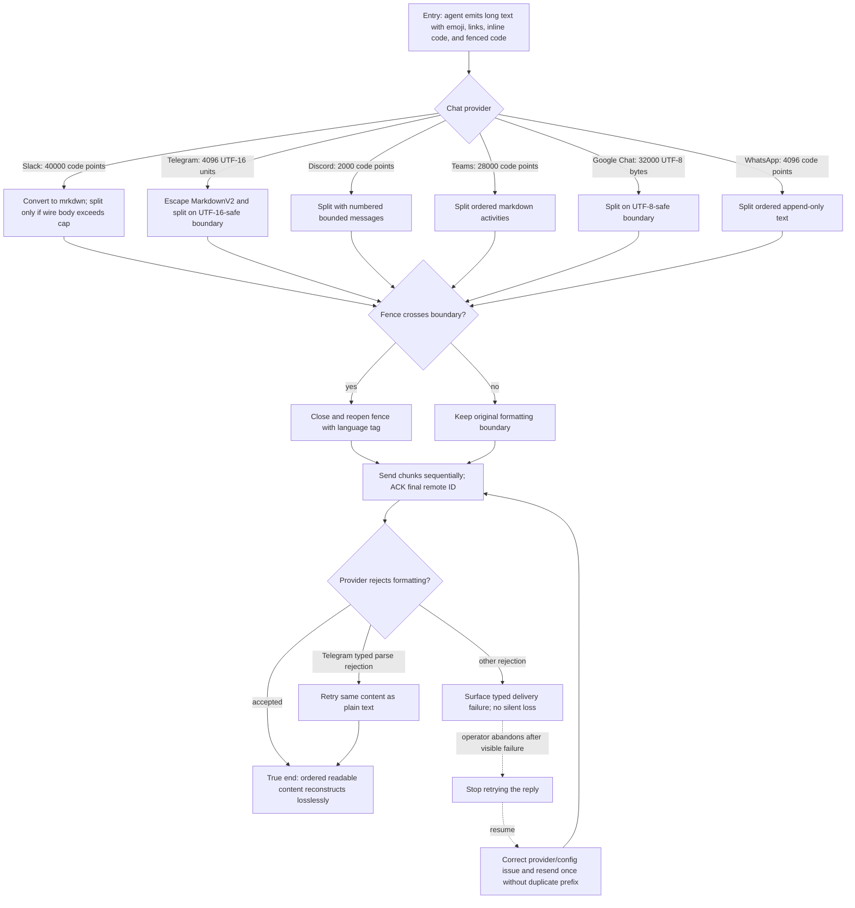

# J-deliver-long-formatted-reply — Deliver a long formatted reply without loss

An operator sends a markdown-heavy reply above the provider limit and confirms that every wire
message stays within its real measurement unit. The runtime computes the chunk count; the plan does
not freeze an invalid “6000 characters equals three Discord chunks” expectation because numbering
and fence repair also consume the provider limit.



```yaml
journey:
id: J-deliver-long-formatted-reply
  name: "Deliver a long formatted reply without loss"
  value_statement: "I receive the complete agent answer in order, readable in my platform's dialect, without invalid Unicode or silent truncation."
  personas: [Omar, Maya]
  entry_points:
    - url: "Public Slack, Telegram, Discord, Teams, Google Chat, or WhatsApp bridge turn"
      origin: external-share
  actions:
    - step: 1
      verb: "Generate a long fixture containing astral emoji, links, markdown, inline code, and a fenced block crossing a boundary"
      expected_observable: "The provider receives one or more bodies measured in its real wire unit, each within the cap"
    - step: 2
      verb: "Read the delivered sequence in the provider"
      expected_observable: "Numbering is ordered, fences remain valid, and reconstructed content is lossless"
    - step: 3
      verb: "Exercise Slack mrkdwn and Telegram MarkdownV2 handling"
      expected_observable: "Markup outside code is readable; code stays literal; Telegram falls back to plain text rather than returning a user-visible 400"
    - step: 4
      verb: "Inspect the delivery acknowledgement"
      expected_observable: "The final materialized provider message ID is the textual ACK anchor"
  goal:
    observable: "All provider messages stay within their caps and reconstruct the intended reply exactly, with readable provider-specific formatting."
    side_effects: [formatted-wire-bodies-produced, ordered-provider-messages-created, final-remote-id-acknowledged]
  true_end_state: "After all sends settle, the provider shows one complete logical reply in order and AGH records the final materialized message as the acknowledgement anchor."
  exit:
    natural: "The teammate reads the full answer and continues the conversation."
  abandonment:
    - at_step: 2
      how: "A visible provider rejection or corrupt fence makes the operator stop retrying the long reply."
      resume: "After correcting the provider or fixture, one fresh delivery completes without duplicating an acknowledged prefix."
  crosses: [provider-formatters, shared-chunker, unicode-measurement, provider-api, delivery-state, acknowledgements]
```

Automated backbone: `_tests.md` integration 5.5–5.6 and the six provider fake-transport suites.
Task 10 supplies provider-visible spot checks with deterministic fakes where credentials are absent.
