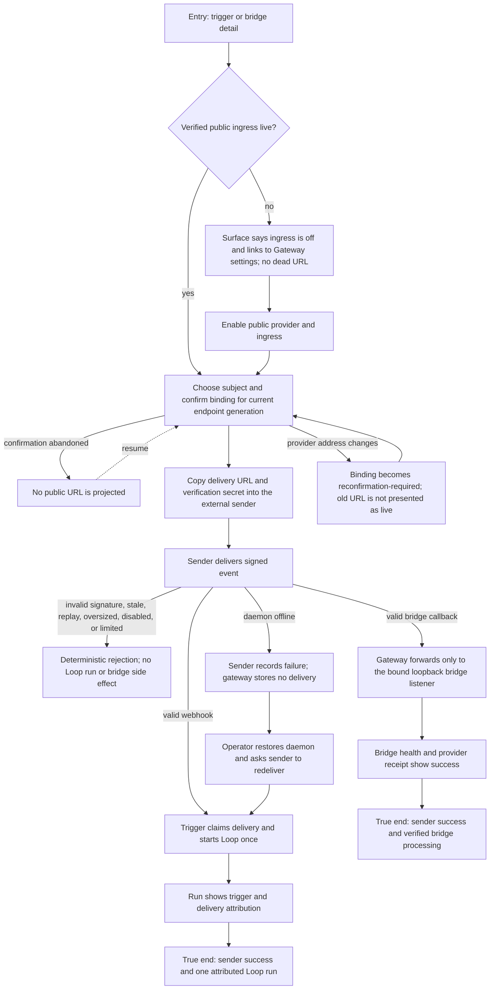

# J-deliver-through-public-gateway: Deliver an external event through the gateway

An operator exposes only signed public ingress, binds a webhook trigger or bridge to the verified address, and observes the external delivery reach its real Loop or bridge destination.



```yaml
journey:
  id: J-deliver-through-public-gateway
  name: Deliver an external event through the gateway
  value_statement: "I can connect a repository webhook or bridge callback to Compozy without maintaining a reverse proxy, while every public request remains bounded and attributable."
  personas: [Bruno, Tessa, Dora]
  entry_points:
    - url: /triggers/<trigger-id>
      origin: in-app-nav
    - url: /bridges/<bridge-id>
      origin: in-app-nav
    - url: POST /api/gateway/ingress-bindings
      origin: direct
    - url: External repository or bridge provider console
      origin: external-share
  actions:
    - step: 1
      verb: Inspect ingress state on the trigger or bridge
      expected_observable: Off and unconfirmed states explain the next action and never show a URL as live before endpoint verification and binding confirmation
    - step: 2
      verb: Enable public ingress and confirm the subject binding
      expected_observable: A URL is projected only for the current verified endpoint generation and the same workspace-owned subject
    - step: 3
      verb: Configure the external sender with the URL and verification secret
      expected_observable: The sender accepts the configuration without exposing the secret back through Compozy reads
    - step: 4
      verb: Send one real signed delivery
      expected_observable: A valid webhook starts one attributed Loop or a valid callback reaches only its bound bridge adapter; invalid requests have no side effect
    - step: 5
      verb: Confirm the delivery at both ends
      expected_observable: Sender status and Compozy run or bridge health agree on the outcome
    - step: 6
      verb: Recover an offline delivery through sender-side redelivery
      expected_observable: Downtime produces a sender-visible failure and no hidden queue; after recovery, one explicit redelivery produces one result
  goal:
    observable: The external sender reports success and Compozy shows exactly one correctly attributed destination effect
    side_effects: [ingress-binding-created, delivery-claimed, loop-run-started, bridge-callback-forwarded, gateway-events-appended]
  true_end_state: The sender receipt, binding health, and destination record agree after fresh reads; disabling ingress or changing the endpoint invalidates reachability instead of leaving a plausible dead URL
  exit:
    natural: The operator remains on the Loop run or bridge detail with delivery attribution visible
  abandonment:
    - at_step: 2
      how: The operator does not confirm the binding or public provider authorization fails
      resume: The subject remains off or unconfirmed and shows no live delivery URL; resume from Gateway settings
    - at_step: 4
      how: The daemon is offline when the sender delivers
      resume: Restore the daemon, verify ingress health, then use the sender's redelivery action because Compozy has no store-and-forward queue
    - at_step: 5
      how: The Loop refuses start or the bridge rejects the callback
      resume: Read the attributed refusal, repair the destination, and redeliver with a new delivery identity
  crosses: [web, automation, loops, bridges, gateway-ingress, connectivity-provider, external-sender, http, uds]
```

## Coverage notes

- Taxonomy sweep: journey coverage follows sender to final destination; functional coverage includes signing, replay, workspace binding, rate limits, attribution, and health; experiential coverage requires honest off and reconfirmation states; edge coverage includes daemon downtime, invalid input, refusal, address changes, and disable mid-delivery; cross-cutting coverage compares sender, web, CLI/API, and event truth.
- Expected limitation: Compozy does not buffer public deliveries while the daemon is offline. Sender-visible failure plus sender-side redelivery is the shipped recovery contract, not a defect.
- Deliberate skip: mobile provider-console layout is not owned by Compozy; the Compozy trigger and bridge read surfaces still receive the normal responsive sweep.

