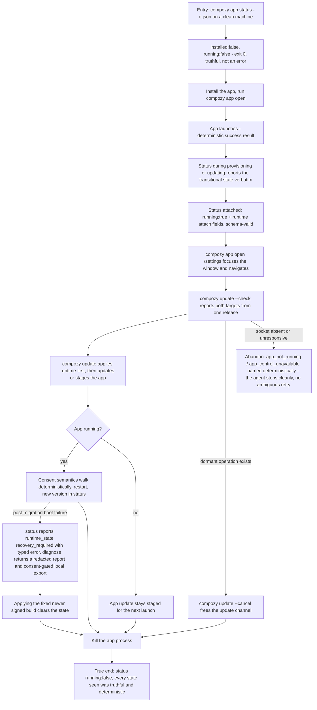

# J-desktop-agent-headless: Operate the desktop surface from a terminal with no human at the screen

An agent drives the desktop capability through structured CLI verbs: `compozy app` owns app state,
launch, recovery, and diagnostics, while `compozy update` owns runtime and app updates. Every result
is deterministic, machine-readable, schema-valid, and observable without the UI.



```yaml
journey:
  id: J-desktop-agent-headless
  name: "Operate the desktop app through structured CLI"
  value_statement: "The desktop capability is not UI-only: an agent can install-check, launch, inspect, update, and diagnose it with deterministic structured output end to end."
  personas: [Ada]
  entry_points:
    - url: "compozy app status | open [path] | diagnose; compozy update [--check|--cancel] (-o json)"
      origin: direct
  actions:
    - step: 1
      verb: "Query status before any install"
      expected_observable: "`{installed:false, running:false}`, exit 0 — truth, not an error"
    - step: 2
      verb: "Launch and track the surface through install → provisioning → attached"
      expected_observable: "Every transitional state (provisioning, attaching, updating) reported verbatim, never reduced to running/not-running"
    - step: 3
      verb: "Navigate via `compozy app open /settings`"
      expected_observable: "Existing window focuses and shows the target; invalid targets return `invalid_target_path`"
    - step: 4
      verb: "Drive app and runtime updates headlessly"
      expected_observable: "`compozy update --check` reports both targets; apply is runtime-first; a closed app stages; `--cancel` releases only a dormant operation"
    - step: 5
      verb: "Probe failure vocabulary"
      expected_observable: "`app_not_installed`, `app_not_running`, `app_control_unavailable`, and `recovery_required` are named, typed, and stable"
  goal:
    observable: "Full desktop lifecycle driven and observed from a terminal alone"
    side_effects: [app-launched, update-applied, diagnostic-report-returned]
  true_end_state: "Every `-o json` payload validated against the canonical app-state schema across the whole lifecycle, including `running:false` after the app is killed."
  exit:
    natural: "The agent reports the surface state upstream and moves on."
  abandonment:
    - at_step: 4
      how: "The control socket is absent or unresponsive mid-operation."
      resume: "The deterministic error names the condition; a later retry against a healthy app proceeds with no residue from the aborted attempt."
  crosses: [cli-app-verbs, control-socket, app-state-schema, update-feeds, quiesce-contract, platform-registration]
```
