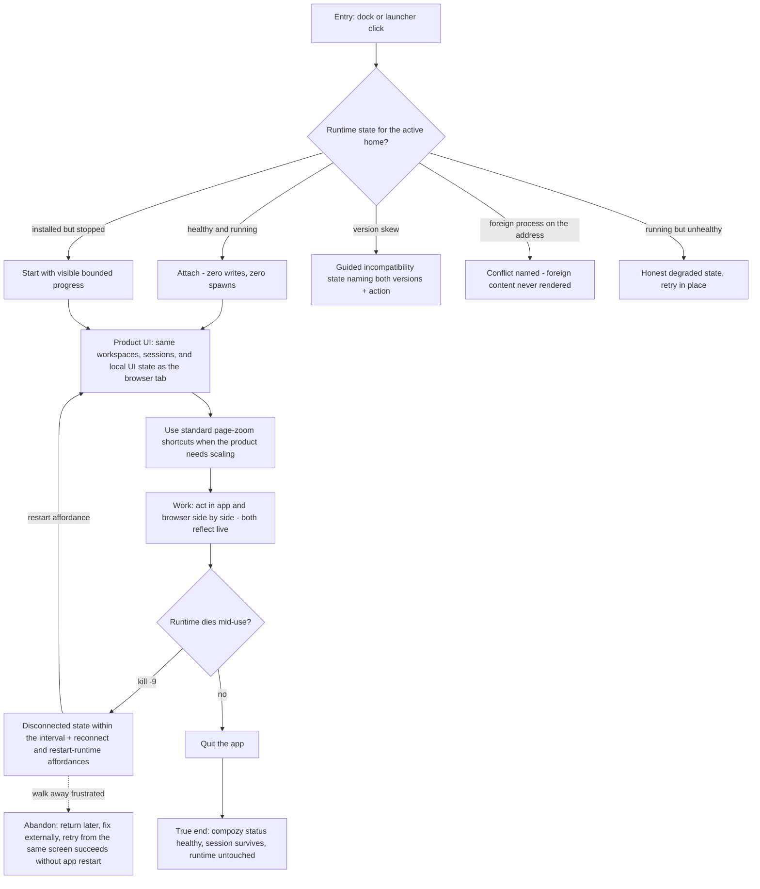

# J-desktop-attach-daily: Open the app onto the runtime I already own and never lose it

A CLI power user opens the native window onto their existing runtime. The app attaches to what
runs, starts what is installed-but-stopped, mirrors the browser's exact state, degrades honestly
when the runtime dies, and quitting never stops the runtime or in-flight agent work.



```yaml
journey:
  id: J-desktop-attach-daily
  name: "Open the app onto my running runtime"
  value_statement: "Choosing the app costs me nothing I had in the browser, and the app never disturbs the runtime, my data, or my in-flight agent work."
  personas: [Dora, Bruno]
  entry_points:
    - url: "dock / launcher / start-menu icon"
      origin: in-app-nav
    - url: "compozy app open (CLI)"
      origin: direct
  actions:
    - step: 1
      verb: "Open the app with a runtime already running"
      expected_observable: "Attach only — same product state as the browser, no second daemon in the process table"
    - step: 2
      verb: "Open the app with the runtime installed but stopped"
      expected_observable: "Visible starting progress, then the product UI; no dead white screen"
    - step: 3
      verb: "Scale the product with standard page-zoom shortcuts"
      expected_observable: "Command or Control plus, minus, and zero change or reset the whole product scale without triggering Compozy's single-window Zoom action"
    - step: 4
      verb: "Work with app and browser tab side by side"
      expected_observable: "Actions in one surface appear live in the other"
    - step: 5
      verb: "Kill the daemon under the app, then restart it"
      expected_observable: "Disconnected state within a perceivable interval; reconnect returns to the product without app restart"
    - step: 6
      verb: "Quit the app"
      expected_observable: "Window closes; `compozy status` still healthy; the active session survives"
  goal:
    observable: "The app is a second door to the exact same product, never an actor on the runtime"
    side_effects: [window-geometry-persisted]
  true_end_state: "After quit (and even force-kill), the runtime and all in-flight agent work continue, verifiable from the CLI; the next launch attaches normally with restored geometry."
  exit:
    natural: "The user returns to terminal work; agents keep running."
  abandonment:
    - at_step: 4
      how: "The user walks away from the disconnected state."
      resume: "After an external fix, retry from the same screen succeeds without restarting the app."
  crosses: [daemon-discovery, identity-probe, supervisor, browser-surface, window-geometry, quit-contract]
```
