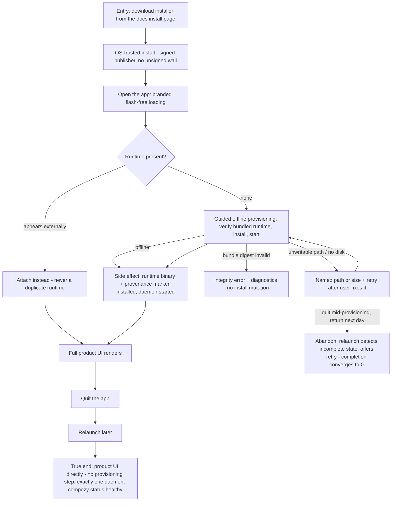

# J-desktop-first-run: Install CompozyOS and reach a working product with no terminal

A desktop-first newcomer downloads one installer and must land in the full product without ever
opening a terminal. The installer already carries the matching runtime, so first run works offline;
provisioning is guided and visibly staged, every failure names its cause and offers retry, and a
later relaunch never re-runs setup.



```yaml
journey:
  id: J-desktop-first-run
  name: "Install CompozyOS and reach a working product"
  value_statement: "My first contact with CompozyOS is download → open → working product, with no terminal and no broken half-installed state."
  personas: [Lea, Cora]
  entry_points:
    - url: "platform installer (macOS dmg, Windows installer, Linux package) from the docs install page"
      origin: direct
  actions:
    - step: 1
      verb: "Install and open the app"
      expected_observable: "OS accepts a verified publisher; a branded CompozyOS window appears with no white flash"
    - step: 2
      verb: "Watch the guided first run"
      expected_observable: "Verify, install, and start stages are visible; airplane mode does not block provisioning and there is never an indefinite spinner"
    - step: 3
      verb: "Reach the product and quit"
      expected_observable: "Full product UI renders inside the app; quit closes only the window"
    - step: 4
      verb: "Relaunch later"
      expected_observable: "Product UI is reachable directly; no provisioning reappears"
  goal:
    observable: "Working product UI on a machine that had nothing installed"
    side_effects: [bundled-runtime-verified, runtime-binary-installed, provenance-marker-written, daemon-started]
  true_end_state: "Relaunch lands directly in the product; exactly one daemon process exists and `compozy status` reports healthy."
  exit:
    natural: "The newcomer starts real work in the product window."
  abandonment:
    - at_step: 2
      how: "An unwritable path or insufficient disk space blocks provisioning; the user quits and comes back later."
      resume: "The app detects the incomplete state and offers retry after the local problem is fixed; completion converges to a verified install."
  crosses: [installer-signing, bundled-runtime-manifest, provisioning-pipeline, runtime-daemon, platform-registration]
```
