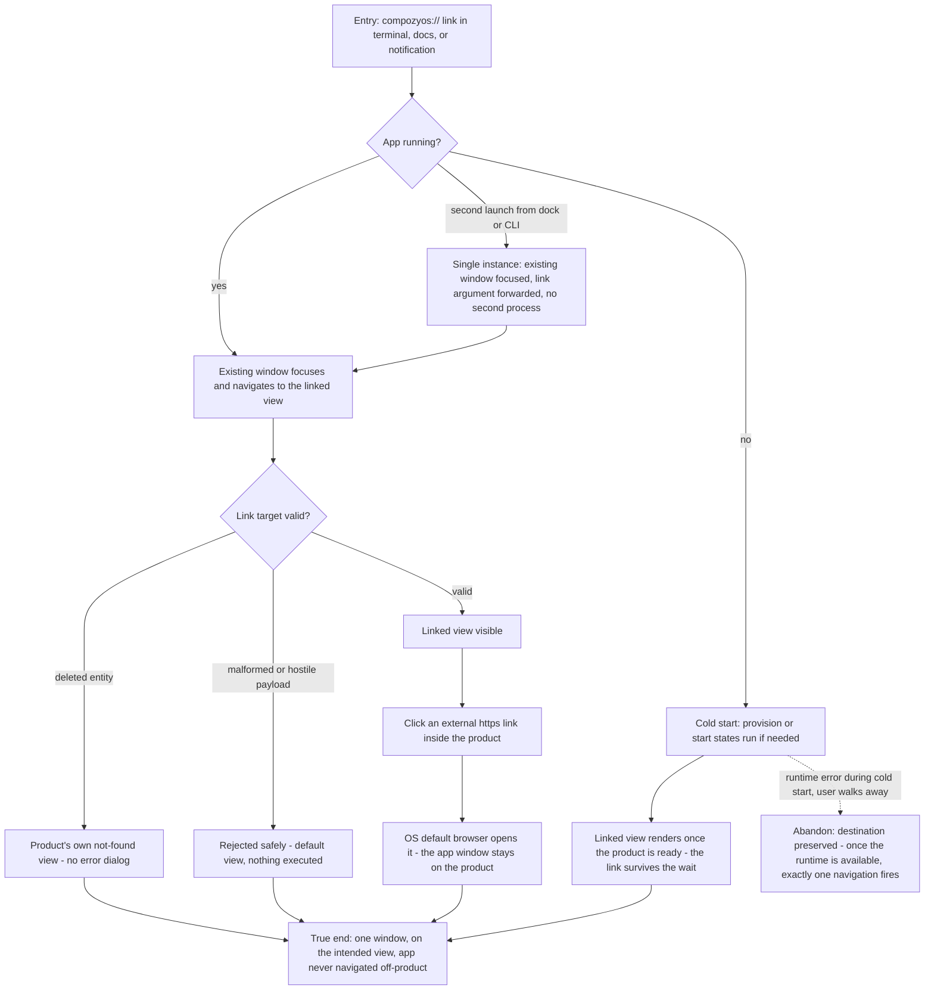

# J-desktop-link-driven: Follow a CompozyOS link into the exact view, one window, always

A returning user follows CompozyOS links from terminal output, docs, or notifications. Links open
the right view in the single app window — running or cold-started — hostile payloads land safely on
the default view, and external links always leave for the OS browser.



```yaml
journey:
  id: J-desktop-link-driven
  name: "Follow a CompozyOS link into the app"
  value_statement: "Following a link never spawns another browser tab or duplicate window — it lands me on the exact view, even from a cold start."
  personas: [Théo, Bruno]
  entry_points:
    - url: "compozyos://open/<product-path> from terminal output, docs, or notifications"
      origin: external-share
    - url: "second app launch (dock, launcher, `compozy app open [path]`)"
      origin: direct
  actions:
    - step: 1
      verb: "Activate a link while the app runs"
      expected_observable: "The window focuses and shows the linked view — no new instance"
    - step: 2
      verb: "Activate a link with the app closed"
      expected_observable: "The app cold-starts, runs any needed provision/start states, then lands on the linked view"
    - step: 3
      verb: "Launch the app again while it is running"
      expected_observable: "The existing window is focused/unminimized; process count unchanged; a link argument is forwarded, never dropped"
    - step: 4
      verb: "Activate a link to a deleted entity, then a malformed one"
      expected_observable: "Product not-found view for the first; safe default view for the second; never a dialog or off-product navigation"
    - step: 5
      verb: "Open an external https link from inside the product"
      expected_observable: "The OS default browser opens it; the app stays on the product"
  goal:
    observable: "Every link lands in the one app window on the right view"
    side_effects: [existing-window-focused, os-browser-opened-for-external]
  true_end_state: "The linked view is rendered in the focused single window; rapid successive links resolve to the last one; the app never rendered or navigated to a non-product origin."
  exit:
    natural: "The user continues in the linked session or view."
  abandonment:
    - at_step: 2
      how: "The cold start lands in a runtime-error state and the user walks away."
      resume: "The destination is preserved; when the runtime becomes available, exactly one navigation to the queued path fires."
  crosses: [os-url-scheme-registration, single-instance-forwarding, link-validation, navigation-fencing, cold-start-resolution]
```
