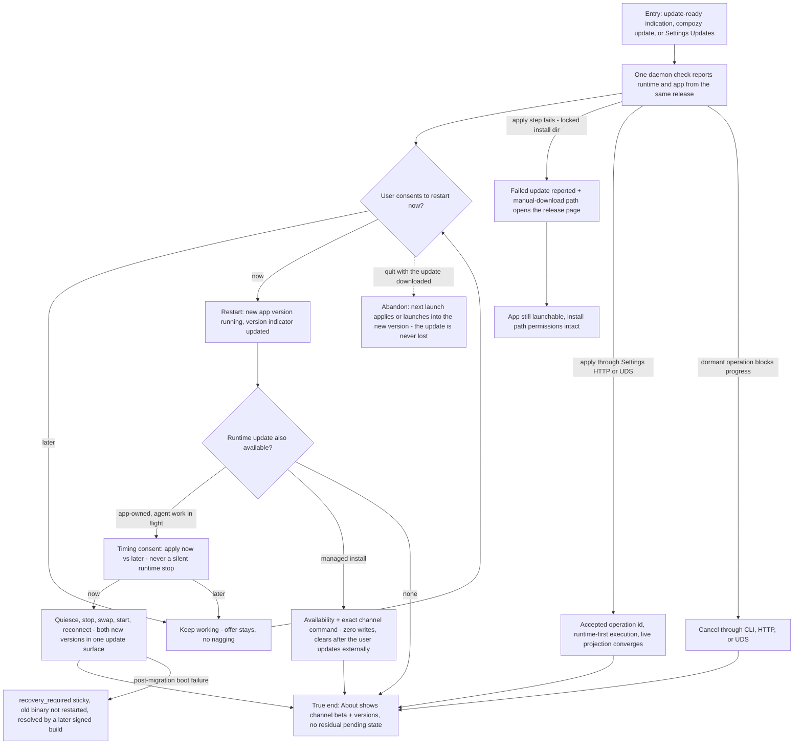

# J-desktop-update-moment: Take an update at my convenience and never get stranded

A daily user meets the update moment: the app keeps itself current in the background and applies on
consented restart; an app-provisioned runtime updates through the same single experience with
timing consent under in-flight agent work; managed installs get a recommendation, never a write;
every failure leaves the app launchable with a way forward.



```yaml
journey:
  id: J-desktop-update-moment
  name: "Take app and runtime updates at my convenience"
  value_statement: "I stay current without manual downloads, my agent work is never interrupted without consent, and a failed update always leaves me a way forward."
  personas: [Bruno, Dora]
  entry_points:
    - url: "in-app update-ready indication; Settings Updates; compozy update"
      origin: in-app-nav
  actions:
    - step: 1
      verb: "Keep working while a newer app version publishes"
      expected_observable: "Background download completes; a calm ready indication appears — no forced restart"
    - step: 2
      verb: "Consent to restart"
      expected_observable: "The new app version is running and the version indicator reflects it"
    - step: 3
      verb: "Meet a runtime update with agent work in flight (app-owned home)"
      expected_observable: "Timing consent; 'later' keeps everything working; 'now' quiesces, applies, restarts, reconnects"
    - step: 4
      verb: "Meet a runtime update on a managed install"
      expected_observable: "Availability plus the exact channel command; no binary is touched; the surface clears after an external update"
    - step: 5
      verb: "Check the About/update surface"
      expected_observable: "Channel (beta) and versions visible; no stable channel selector exists"
    - step: 6
      verb: "Apply or cancel through a structured settings route"
      expected_observable: "HTTP and UDS return the same accepted, blocked, or canceled operation truth"
  goal:
    observable: "One coherent update experience covering app and app-owned runtime"
    side_effects: [app-binary-replaced-on-restart, runtime-binary-swapped-under-lock, provenance-marker-updated]
  true_end_state: "Both new versions visible in one update surface with no residual pending state; every failure branch (failed apply, malformed feed, post-migration boot failure) leaves the app openable with diagnostics and a manual path."
  exit:
    natural: "The user resumes work on the new versions."
  abandonment:
    - at_step: 2
      how: "Quit with the update downloaded but unapplied."
      resume: "The next launch applies or launches into the new version per platform convention — the update is not lost."
  crosses: [github-release-channel, platform-signing, quiesce-contract, update-lock-journal, install-method-detection, release-pipeline]
```
