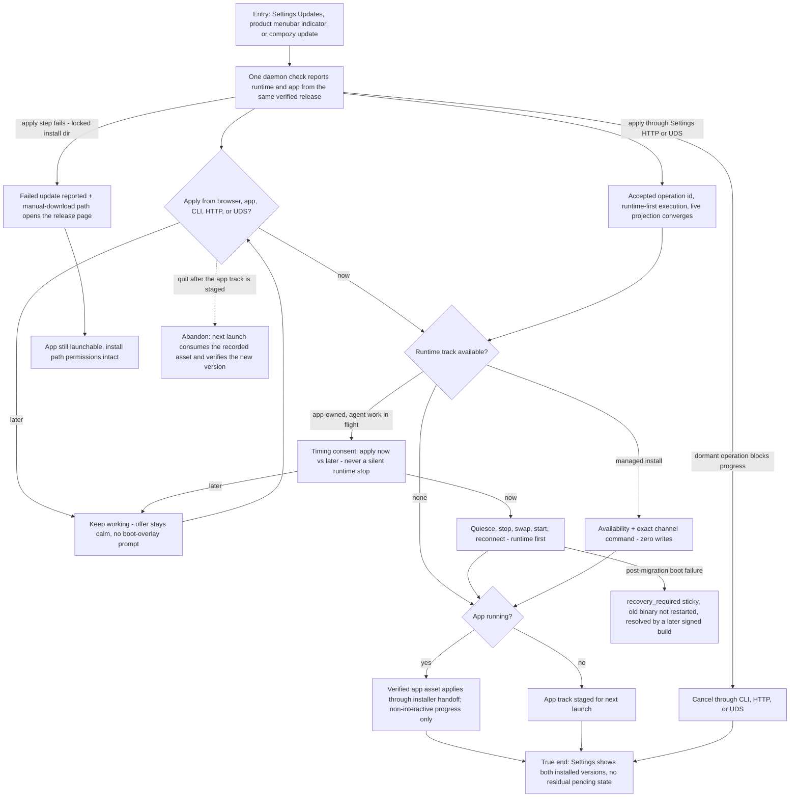

# J-desktop-update-moment: Take an update at my convenience and never get stranded

A daily user meets the update moment in the product UI, identically in Chrome and the app: the
daemon reports both tracks, Settings owns every offer and action, and the menubar only points to
Settings. The boot window never offers an update; it only reports non-interactive apply progress.
Runtime updates run first, a closed app stages for next launch, managed installs get a
recommendation rather than a write, and every failure leaves a truthful way forward.



```yaml
journey:
  id: J-desktop-update-moment
  name: "Take app and runtime updates at my convenience"
  value_statement: "I stay current without manual downloads, my agent work is never interrupted without consent, and a failed update always leaves me a way forward."
  personas: [Bruno, Dora]
  entry_points:
    - url: "Settings → General → Updates; product menubar update indicator; compozy update"
      origin: in-app-nav
  actions:
    - step: 1
      verb: "Keep working while the daemon reports a newer release"
      expected_observable: "A calm menubar indicator points to Settings; the boot window never offers or accepts an update"
    - step: 2
      verb: "Apply from Settings, then consent to the installer handoff"
      expected_observable: "The durable operation runs runtime-first; the boot window reports progress without actions; the new app version is verified after restart"
    - step: 3
      verb: "Meet a runtime update with agent work in flight (app-owned home)"
      expected_observable: "Timing consent; 'later' keeps everything working; 'now' quiesces, applies, restarts, reconnects"
    - step: 4
      verb: "Meet a runtime update on a managed install"
      expected_observable: "Availability plus the exact channel command; no binary is touched; the surface clears after an external update"
    - step: 5
      verb: "Compare the update surface in Chrome and the app"
      expected_observable: "Both render the same daemon-owned tracks, phases, actions, and beta versions; neither surface has shell-only update behavior"
    - step: 6
      verb: "Apply or cancel through a structured settings route"
      expected_observable: "HTTP and UDS return the same accepted, blocked, or canceled operation truth"
  goal:
    observable: "One coherent update experience covering app and app-owned runtime"
    side_effects: [app-binary-replaced-on-restart, runtime-binary-swapped-under-lock, provenance-marker-updated]
  true_end_state: "Both installed versions are visible in Settings with no residual pending state; every failure branch (failed apply, malformed feed, post-migration boot failure) leaves the app openable with diagnostics and a manual path."
  exit:
    natural: "The user resumes work on the new versions."
  abandonment:
    - at_step: 2
      how: "Quit after the app track is staged but before the installer handoff."
      resume: "The next launch consumes only the recorded verified asset and confirms the new version — the update is not lost."
  crosses: [github-release-channel, platform-signing, quiesce-contract, update-lock-journal, install-method-detection, release-pipeline]
```
