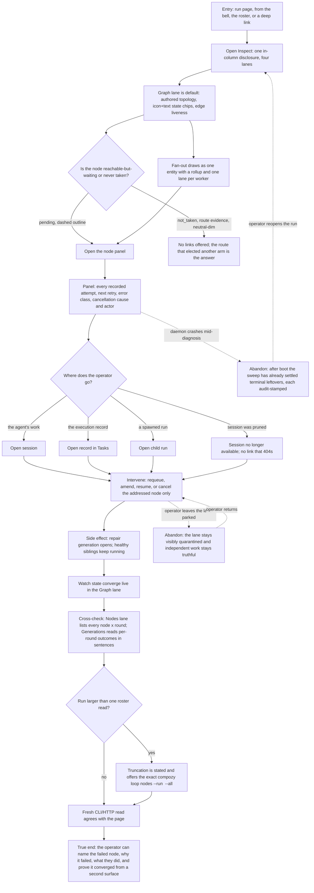

# J-diagnose-loop-run-operator — Locate and repair the hot node inside one run

An operator who already knows something is wrong opens the run and goes one step deeper. Everything
they need is behind a single in-column Inspect disclosure — never a sheet, never a route change:
the executing graph to locate the node, the roster to see every node across rounds, the per-round
history, and the raw events. From the node they reach its session, its execution record, or its
child run, and they intervene from there. The journey ends when the run's state has converged and a
fresh read from another surface agrees.



```yaml
journey:
  id: J-diagnose-loop-run-operator
  name: "Locate and repair the hot node inside one run"
  value_statement: "An operator can find the node that is failing, understand why from its recorded attempts, act on it in place, and prove the run converged."
  personas: [Dora, Bruno]
  entry_points:
    - url: "web /loop-runs/:runId Inspect"
      origin: in-app-nav
    - url: "web /loop-runs?nodes=waiting and ?nodes=attention"
      origin: deep-link
    - url: "CLI: compozy loop nodes --run <run-id> --all --state <state> --generation <n>"
      origin: direct
    - url: "HTTP/UDS GET /api/workspaces/:workspace_id/loop-runs/:run_id/nodes and /timeline"
      origin: direct
  actions:
    - step: 1
      verb: "Open Inspect on a live run"
      expected_observable: "One in-column disclosure opens with four lanes over one read model; the URL does not change and no sheet appears"
    - step: 2
      verb: "Read the graph to locate the hot node"
      expected_observable: "Every state chip carries an icon and a literal word, the lane auto-centres on whatever needs a human and says so in its foot, and a pending node reads differently from a never-taken one"
    - step: 3
      verb: "Open the node and read its history"
      expected_observable: "Every recorded attempt is listed — including a single one — with next retry, error class in plain words, and the cancellation cause and actor"
    - step: 4
      verb: "Follow the node to its session, its execution record, or its child run"
      expected_observable: "Links work after the run ends; a session retention removed degrades to a stated absence instead of a link that 404s; a never-taken node offers no links at all"
    - step: 5
      verb: "Intervene on the addressed node and watch it converge"
      expected_observable: "Only the addressed lane changes, healthy siblings continue, and the graph reflects the new state live"
    - step: 6
      verb: "Cross-check the page against a structured read"
      expected_observable: "Nodes, Generations and a fresh CLI/HTTP read report the same node states, attempts and per-round outcomes; a truncated roster says so and offers the exact --all command"
  goal:
    observable: "The failing node is identified, explained from durable evidence, repaired, and confirmed converged from a second surface."
    side_effects: [repair-generation-started, attempt-recorded, node-requeued-or-resumed, timeline-entry-appended]
  true_end_state: "After a reload — and after a daemon restart — the run reports one converged state, the repair is in its recorded history, and no terminal run owns a live execution record."
  exit:
    natural: "The operator closes Inspect with the run either healthy again or truthfully terminal, and can explain both."
  abandonment:
    - at_step: 3
      how: "The daemon crashes while the operator is reading the node panel."
      resume: "The boot barrier settles terminal leftovers before claim traffic; reopening the run shows the audit-stamped result, not a ghost."
    - at_step: 5
      how: "The operator leaves a quarantined lane unrepaired."
      resume: "The lane stays visibly parked and requeueable while independent work stays truthful."
  crosses: [loop-coordinator, roster-projection, timeline-paging, settlement-sweep, session-retention, task-catalog, web-loops, CLI, HTTP, UDS, SSE]
```

Taxonomy note: journeys, functional, and edge/error dimensions carry this journey — the interesting
findings live in the failure branches (pruned session, never-taken node, single-attempt node,
truncated roster, crash mid-diagnosis). Experiential is in scope for the operator register's own
bar: plain-language error classes, no raw verdict enums, and estimated costs labelled as estimates.
Accessibility is in scope as icon+text chips (state never by colour alone), a keyboard path into
the disclosure and node selection, and the reduced-motion requirement that the edge pulse is
unmounted rather than paused. Cross-cutting: consistency of the "step" vocabulary against the node
inventory, and continuity across a daemon restart. Responsive is a recorded skip — the DAG canvas
is desktop-only by product decision.
