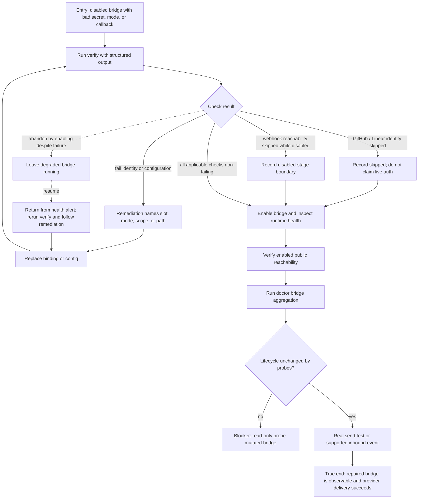

# J-diagnose-repair-bridge — Diagnose and repair a misconfigured bridge

An operator intentionally starts from invalid credentials or callback configuration, obtains
structured remediation without changing lifecycle state, fixes the named fault, and confirms the
enabled runtime. GitHub and Linear explicitly skip isolated identity checks; their live runtime
health is the authoritative authentication checkpoint.



```yaml
journey:
id: J-diagnose-repair-bridge
  name: "Diagnose and repair a misconfigured bridge"
  value_statement: "I can identify the exact operator-owned fault before enablement and prove the repair without a diagnostic changing runtime state."
  personas: [Tessa, Ada, Omar]
  entry_points:
    - url: "agh bridge verify <id> --json; agh doctor --only bridge --json"
      origin: direct
    - url: "POST /api/bridges/:id/verify over HTTP or UDS"
      origin: direct
    - url: "Web bridge detail verification cards"
      origin: in-app-nav
  actions:
    - step: 1
      verb: "Run verification against a deliberately invalid disabled bridge"
      expected_observable: "Every result is a parseable pass, warn, fail, or skipped record with actionable remediation"
    - step: 2
      verb: "Repair the exact secret, provider mode, scope, or callback"
      expected_observable: "A second verify clears only the corrected failure and keeps lifecycle state unchanged"
    - step: 3
      verb: "Enable and inspect provider runtime health"
      expected_observable: "Identity-skipped providers prove authentication only through enabled runtime health"
    - step: 4
      verb: "Aggregate checks and perform a real provider action"
      expected_observable: "Doctor agrees with the per-instance records and the provider target receives the test exactly once"
  goal:
    observable: "The bridge reaches ready or a truthful non-ready state after the named fault is fixed, with stable structured evidence and no probe-side lifecycle mutation."
    side_effects: [binding-or-config-updated, bridge-enabled, provider-health-refreshed, real-test-delivery]
  true_end_state: "A fresh bridge read, doctor report, and provider-side observable agree on the repaired identity and callback state."
  exit:
    natural: "The operator returns the bridge to service or leaves it disabled with a precise remaining action."
  abandonment:
    - at_step: 1
      how: "The operator ignores a failing record, enables anyway, and leaves after seeing degraded health."
      resume: "A later health alert points back to the same structured verification and preserves enough remediation to finish the repair."
  crosses: [cli, http, uds, provider-control-runtime, secret-bindings, webhook-reachability, doctor, runtime-health, delivery]
```

Automated backbone: `_tests.md` integration 5.10–5.11 and E2E runtime 6.4. Task 10 walks the
operator recovery and structured-output parity branches.
