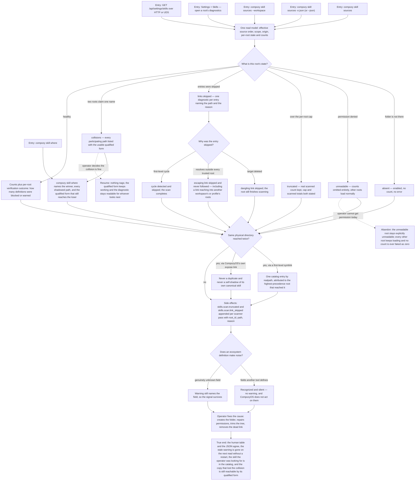

# J-diagnose-skill-sources — Find out why a skill I expected is not there

A skill the operator is sure they installed does not show up — or shows up as the wrong version.
This journey is the answer path: read the source health, find the one root that is absent,
unreadable, over its cap, or full of links that went nowhere, see which copy won a name collision
and how to reach the loser, fix the cause, and watch the warning clear without restarting anything.



```yaml
journey:
  id: J-diagnose-skill-sources
  name: "Find out why a skill I expected is not there"
  value_statement: "When a skill is missing or the wrong copy won, the product tells me which folder is at fault and why, and the answer stops being a guess."
  personas: [Dora, Bruno]
  entry_points:
    - url: "CLI: compozy skill sources, compozy skill sources -o json, compozy skill sources --workspace <ref>"
      origin: direct
    - url: "CLI: compozy skill where <name>, compozy skill info <name>, compozy skill list --source <tier>"
      origin: direct
    - url: "Web: /settings/skills — per-root diagnostics disclosure"
      origin: in-app-nav
    - url: "HTTP and UDS: GET /api/settings/skills (per-root diagnostic schema)"
      origin: direct
    - url: "Logs: compozy logs --type skills.scan.truncated|skills.scan.link_skipped --component skill"
      origin: direct
  actions:
    - step: 1
      verb: "Read the configured sources and their health in one place"
      expected_observable: "Effective order, scope, origin, per-root existence, counts, truncation, skipped links, and collisions — the same facts in the human table and in the JSON."
    - step: 2
      verb: "Look at a root that is absent, unreadable, or over its scan cap"
      expected_observable: "Absent and unreadable are distinct explicit states; unreadable shows no count at all; truncated keeps the real scanned count beside the cap."
    - step: 3
      verb: "Look at the entries a scan refused to follow"
      expected_observable: "Dangling, escaping, and cyclic first-level links are each skipped with their own diagnostic naming the path and reason, and none of them is fatal to the root."
    - step: 4
      verb: "Ask which copy of a duplicated name won"
      expected_observable: "The winner, every shadowed path, and a qualified form that still reaches the losing copy — with no custom-source slug invented from a path."
    - step: 5
      verb: "Check that a skill installed as a symlink appears once"
      expected_observable: "One catalog entry per physical directory by realpath, attributed to the highest-precedence root that reached it, and CompozyOS's own expose links never shadow their canonical skill."
    - step: 6
      verb: "Load skills written for another tool"
      expected_observable: "Their ecosystem fields load silently and are visibly not honored, while a genuinely unknown field still raises a warning."
    - step: 7
      verb: "Fix the cause and read again"
      expected_observable: "The stale diagnostic is gone on the next read, with no daemon restart."
  goal:
    observable: "The operator can name the root responsible for a missing or shadowed skill, and the surfaces agree on why."
    side_effects: [skills-scan-truncated-event, skills-scan-link-skipped-event, skill-shadowed-event, per-root-verification-summary]
  true_end_state: "The human table and the structured JSON report the same diagnostics for the same roots; the repaired root's warning has cleared without a restart; the skill the operator was hunting is in the catalog; and the copy that lost a collision is still reachable through the qualified form the diagnostic printed."
  exit:
    natural: "The operator stops guessing and goes back to using the skill they were looking for."
  abandonment:
    - at_step: 2
      how: "The operator cannot get permission on an unreadable root today and leaves it broken."
      resume: "The root stays explicitly unreadable, every other root keeps loading, and no count is ever presented as a measured zero."
    - at_step: 4
      how: "The operator decides a name collision is acceptable and does nothing."
      resume: "Nothing nags; the qualified form keeps working and the diagnostic stays readable for whoever looks next."
    - at_step: 7
      how: "The operator trims a huge directory but never comes back to check."
      resume: "The truncation flag clears on its own at the next scan; no manual acknowledgement is needed."
  crosses: [J-absorb-skills-from-other-tools, J-use-absorbed-skills-in-a-session, J-share-skills-with-other-tools, skill-scanner, realpath-containment, VerifyContent, CLI, HTTP, UDS, Web settings, observe-ledger]
```
