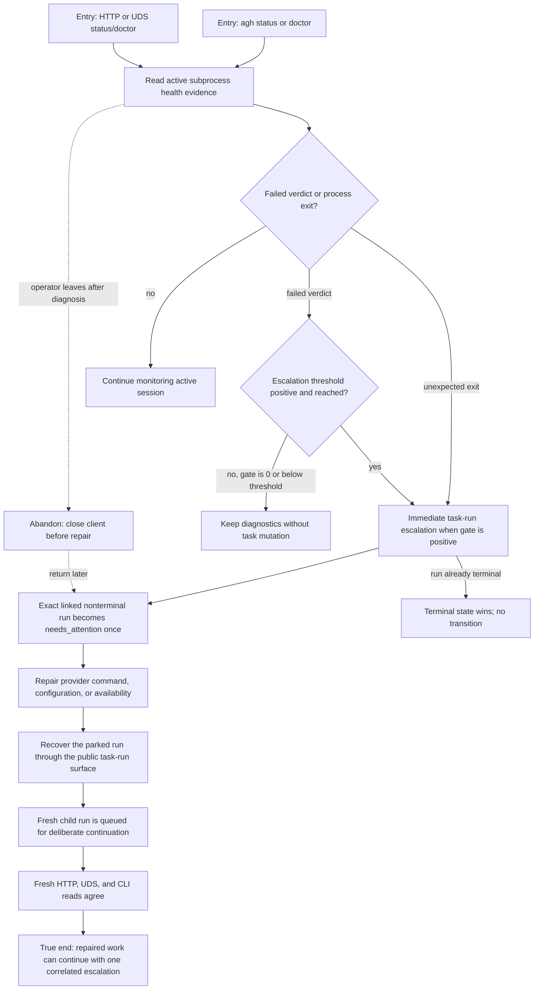

# J-diagnose-task-session-health — Diagnose and recover a task session

An agent operator identifies failed ACP subprocess health through structured runtime surfaces,
confirms the exact linked task run is parked once, repairs the provider cause, and deliberately
queues a continuation. The journey ends only when fresh reads agree and no automatic restart or
duplicate transition occurred.



```yaml
journey:
  id: J-diagnose-task-session-health
  name: "Diagnose and recover a task session"
  value_statement: "I can distinguish an unhealthy ACP subprocess from task state, repair the cause, and resume work without hidden restarts or duplicate transitions."
  personas: [Ada, Bruno]
  entry_points:
    - url: "CLI: agh status; agh doctor --only runtime.subprocess_health"
      origin: direct
    - url: "HTTP/UDS: GET /api/status and GET /api/doctor"
      origin: direct
  actions:
    - step: 1
      verb: "Inspect active subprocess health"
      expected_observable: "HTTP, UDS, and CLI report the same bounded failed-verdict counts and redacted evidence"
    - step: 2
      verb: "Confirm the task-run consequence"
      expected_observable: "A reached positive threshold, or an unexpected process exit, parks the exact linked nonterminal run as needs_attention once; gate 0 and terminal runs do not mutate"
    - step: 3
      verb: "Repair the subprocess cause and recover the run"
      expected_observable: "The public recovery surface terminalizes the parked source and queues one linked continuation only after an explicit operator or agent action"
    - step: 4
      verb: "Read fresh state across structured surfaces"
      expected_observable: "Status totals, run detail, and the canonical escalation event agree without an automatic subprocess restart"
  goal:
    observable: "The unhealthy session is diagnosed, the exact run is parked once, and repaired work has one deliberate continuation"
    side_effects: [task-run-needs-attention, task-run-continuation-queued]
  true_end_state: "Fresh HTTP, UDS, and CLI reads agree on one correlated escalation and one deliberate continuation; terminal precedence and gate-0 surfacing remain intact."
  exit:
    natural: "The operator returns to task execution after provider health is restored."
  abandonment:
    - at_step: 2
      how: "The operator closes the client after identifying the failed subprocess but before repairing it."
      resume: "The persisted needs_attention run remains discoverable; active-only health evidence may disappear after the crashed session stops, so run state and its canonical event remain the recovery authority."
  crosses: [ACP-subprocess-health, session-lifecycle, task-runs, CLI, HTTP, UDS, doctor, status]
```

Taxonomy note: this is a structured operator journey with no Web layout. Functional, failure,
abandon/resume, continuity, and cross-surface consistency are in scope; responsive and visual
accessibility checks are not applicable.
