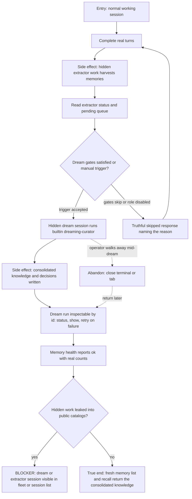

# J-digest-sessions-into-memory — Digest working sessions into durable memory

An operator works normally and trusts the daemon-owned memory pipeline to turn that work into durable, recallable knowledge without any hand-holding: the extractor harvests turns in hidden child work, dream consolidation runs the builtin `dreaming-curator` behind the scenes, and the health/dream surfaces report the whole pipeline truthfully. This journey is the adjacent canary for the `[roles]` rewiring — six consumers changed read paths, and the promise is that default behavior did not drift.



```yaml
journey:
  id: J-digest-sessions-into-memory
  name: "Digest working sessions into durable memory"
  value_statement: "My everyday sessions become durable, recallable knowledge automatically, and every stage of that background pipeline is inspectable and truthful."
  personas: [Dora, Théo]
  entry_points:
    - url: "any working session (web session thread or agh session prompt)"
      origin: direct
    - url: "agh memory dream trigger|status|show|retry; agh memory extractor status|list-pending"
      origin: direct
    - url: "POST /api/memory/dreams/trigger; GET /api/memory/dreams*; GET /api/memory/health"
      origin: direct
  actions:
    - step: 1
      verb: "Do real session work and let the extractor harvest it"
      expected_observable: "Extractor status/pending surfaces show harvested turns without any visible extractor session in public catalogs."
    - step: 2
      verb: "Trigger dream consolidation (or hit the gates naturally)"
      expected_observable: "Trigger reports running truthfully, or skipped with the exact gate/disabled reason; nothing pretends to run."
    - step: 3
      verb: "Inspect the dream run and pipeline health"
      expected_observable: "Dream list/status/show report the run by id with a terminal outcome; memory health returns ok with real counts; retry exists for failed runs."
    - step: 4
      verb: "Recall the consolidated knowledge"
      expected_observable: "A fresh memory list/recall returns the consolidated artifacts produced by this run."
  goal:
    observable: "One pass of real work flows through extraction and consolidation into recallable knowledge with all surfaces truthful."
    side_effects: [hidden-extractor-work, hidden-dream-session, memory-files-written, dream-run-recorded]
  true_end_state: "After the dream run reaches a terminal state, fresh reads of memory list, recall, dream show, and memory health agree on what was produced — and no hidden pipeline session ever appeared in the fleet, session list, or agent catalog."
  exit:
    natural: "The operator returns to normal work trusting the background pipeline."
  abandonment:
    - at_step: 3
      how: "The operator walks away while the dream session is still running."
      resume: "The dream completes in the background; dream show <date-or-run-id> reconstructs the outcome later, and retry covers a failed run."
  crosses: [session-runtime, memory-extractor, dream-consolidation, role-resolver, observability, knowledge-catalog]
```

Taxonomy sweep: this journey owns the functional pipeline walk (extract → consolidate → recall), the truthful skipped/disabled branches, the hidden-session visibility boundary, and the abandonment/retry path. Experiential depth on the knowledge catalog (paging, recovery, identity isolation) is deliberately owned by J-25, and routing overrides are owned by J-route-background-work — this journey walks defaults on purpose, because its job is catching default-behavior drift.
