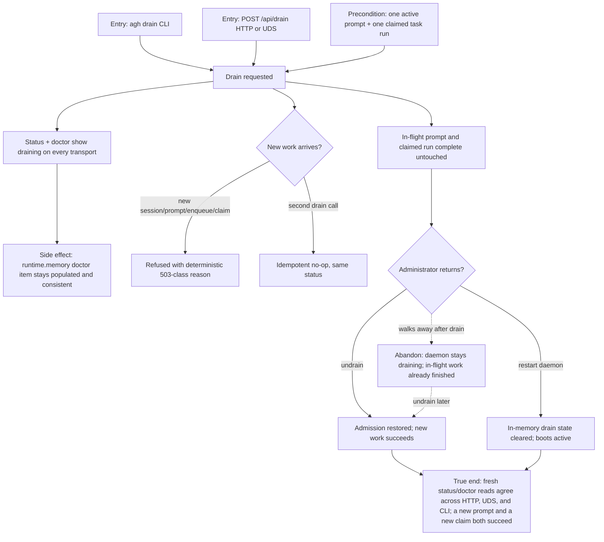

# J-drain-daemon-safely — Restart or deploy without killing work

A runtime administrator quiesces the daemon before a deploy: drain refuses new admission with a
deterministic reason while in-flight prompts and claimed runs finish untouched, status/doctor tell
the truth (including the `runtime.memory` probe), and undrain — or a restart — restores admission.
Covers US-006 (ADR-010 §3) and the §3.5 daemon memory observability probe.



```yaml
journey:
  id: J-drain-daemon-safely
  name: "Restart or deploy without killing work"
  value_statement: "I can quiesce the daemon deliberately: nothing new is admitted, nothing in flight is lost, and every surface tells me the same truthful state."
  personas: [Dora]
  entry_points:
    - url: "CLI: agh drain; agh undrain; agh status; agh doctor -o json"
      origin: direct
    - url: "HTTP/UDS: POST /api/drain; POST /api/undrain; GET /api/status; GET /api/doctor"
      origin: direct
  actions:
    - step: 1
      verb: "Drain while one prompt and one claimed run are active"
      expected_observable: "The same stable draining state on CLI, HTTP, and UDS; status and doctor project it; agents can observe it"
    - step: 2
      verb: "Attempt new work"
      expected_observable: "New session, prompt, enqueue, and claim admission are refused with a deterministic temporary reason; a second drain is an idempotent no-op"
    - step: 3
      verb: "Let admitted work finish"
      expected_observable: "The in-flight prompt and claimed run complete untouched; detached work is never cancelled"
    - step: 4
      verb: "Undrain (or restart) and read memory evidence"
      expected_observable: "Admission restores; after restart the in-memory drain state returns to active; the runtime.memory doctor item carries populated heap/goroutine/uptime/resident fields (or a deterministic disabled state at interval 0s)"
  goal:
    observable: "New work refused during drain, in-flight work completed, admission restored on undrain"
    side_effects: [drain-undrain-canonical-events, memory-report-log-lines]
  true_end_state: "Fresh HTTP, UDS, and CLI reads agree on the restored active state; a new prompt and a new claim both succeed; no in-flight work was interrupted at any point."
  exit:
    natural: "The administrator proceeds with the deploy/restart knowing nothing was dropped."
  abandonment:
    - at_step: 3
      how: "The administrator drains and walks away without undraining."
      resume: "The daemon keeps refusing new admission truthfully; a later undrain or restart restores service — drain state is in-memory and never survives a boot without a per-boot nonce."
  crosses: [daemon-lifecycle, admission-gates, doctor, status, memory-probe, CLI, HTTP, UDS]
```

Taxonomy note: structured operator journey with a small Web settings surface (memory interval).
Functional, failure, abandon/resume, and cross-surface consistency are in scope; responsive and
visual accessibility checks are not applicable.
