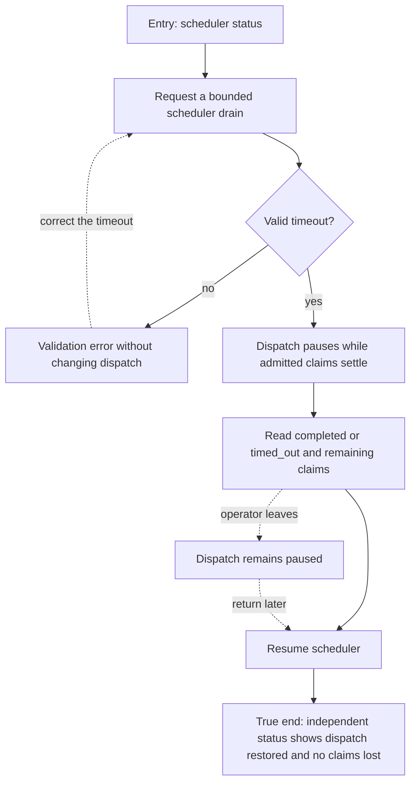

# J-drain-scheduler — Pause dispatch and finish admitted claims



```yaml
journey:
  id: J-drain-scheduler
  name: "Pause dispatch and finish admitted claims"
  value_statement: "An operator can stop new scheduler dispatch for maintenance without discarding admitted work."
  personas: [Dora]
  entry_points:
    - url: "CLI: compozy scheduler status; compozy scheduler drain; compozy scheduler resume"
      origin: direct
    - url: "HTTP/UDS: GET /api/scheduler/status; POST /api/scheduler/drain"
      origin: direct
  actions:
    - step: 1
      verb: "Read status and request drain with an explicit timeout"
      expected_observable: "Invalid durations refuse without mutation; valid requests pause dispatch and report completion or remaining claims."
    - step: 2
      verb: "Leave the drained scheduler and inspect from another client"
      expected_observable: "The independent read still shows paused dispatch and retained claims."
    - step: 3
      verb: "Resume and read fresh status"
      expected_observable: "Dispatch is restored without deleting admitted work."
  goal:
    observable: "Drain and resume have truthful bounded outcomes on CLI, HTTP, and UDS."
    side_effects: [scheduler-paused, scheduler-resumed]
  true_end_state: "Fresh status confirms resumed dispatch and any admitted claims remain accounted for."
  exit:
    natural: "The operator continues normal dispatch after maintenance."
  abandonment:
    - at_step: 2
      how: "The operator closes the client after draining."
      resume: "Read status and explicitly resume from a new client."
  crosses: [CLI, HTTP, UDS, scheduler]
```

Taxonomy: bounded completion, invalid input, recovery, abandonment, and transport consistency are
in scope. Browser affordance discovery is recorded separately; a CLI walk cannot prove a Web control.

