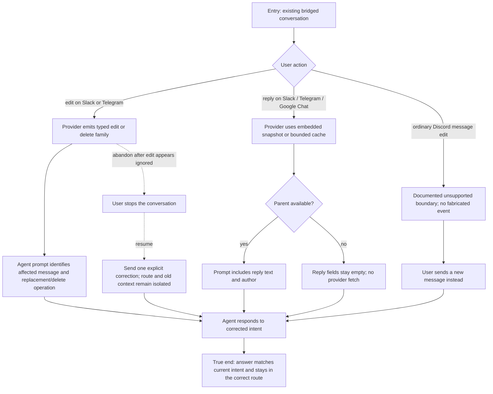

# J-edit-reply-context — Edit and reply in context

A teammate corrects a previously sent instruction or replies to an earlier message. Supported
providers preserve the new intent and bounded parent context; a cold cache remains empty without a
provider history fetch. Discord's HTTP interaction surface does not claim ordinary message-edit
support.



```yaml
journey:
id: J-edit-reply-context
  name: "Edit and reply in context"
  value_statement: "I can correct or contextualize my instruction without the agent treating stale quoted text as a new request."
  personas: [Maya]
  entry_points:
    - url: "Slack or Telegram message edit"
      origin: external-share
    - url: "Slack, Telegram, or Google Chat threaded reply"
      origin: external-share
  actions:
    - step: 1
      verb: "Edit a sent message or reply to an earlier provider message"
      expected_observable: "The provider accepts the supported event without creating a duplicate ordinary message family"
    - step: 2
      verb: "Observe the agent's prompt-visible behavior"
      expected_observable: "An edit names the affected message and operation; a reply uses already-observed parent text and author when available"
    - step: 3
      verb: "Restart to cold-cache the parent and reply again"
      expected_observable: "Missing parent context stays empty and produces no provider-history fetch storm"
    - step: 4
      verb: "Repeat in a second workspace or conversation"
      expected_observable: "Cached context never crosses workspace, bridge instance, or conversation ownership"
  goal:
    observable: "The agent response reflects the user's current instruction and available reply context without stale, fetched, or cross-route parent data."
    side_effects: [typed-edit-ingested, bounded-reply-context-rendered, agent-response-delivered]
  true_end_state: "After the response and an independent route/session read, the current intent is visible once and no provider fetch or cross-workspace context leak occurred."
  exit:
    natural: "The teammate continues from the corrected answer in the same conversation."
  abandonment:
    - at_step: 1
      how: "The teammate stops after an edit appears ignored or attributed to the wrong message."
      resume: "A later explicit correction stays in the same isolated route and the new answer reflects only the current instruction."
  crosses: [provider-webhooks, inbound-envelope, reply-cache, prompt-rendering, workspace-routing, session-delivery]
```

Automated backbone: `_tests.md` integration 5.12 and E2E runtime 6.5. Task 10 exercises both
warm and cold-cache user-visible behavior.
