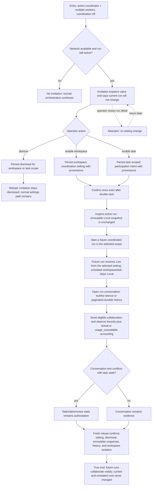

# Enable coordination conversations for future runs

An autonomy operator opens an active multi-agent run that is coordinating successfully without Network participation, accepts or dismisses the contextual invitation, and proves that only future runs in the selected scope become Live. The conversation then adds evidence and visibility without acquiring authority over task status, claims, reviews, or terminal outcomes.



```yaml
journey:
  id: J-enable-coordinated-conversations
  name: "Enable coordination conversations for future runs"
  value_statement: "An operator can adopt Network collaboration at the moment it is useful without mutating an in-flight run or weakening task authority."
  personas: [Bruno, Marina]
  entry_points:
    - url: "web task run detail and kanban contextual invitation"
      origin: in-app-nav
    - url: "HTTP/UDS/CLI coordination setting and invitation endpoints"
      origin: direct
  actions:
    - step: 1
      verb: "Open an eligible coordinated run and read the invitation"
      expected_observable: "The invitation appears only for an active multi-agent shape with Network available, names the workspace/task choices, and states that the active run is immutable"
    - step: 2
      verb: "Dismiss or accept for one scope"
      expected_observable: "Dismissal persists across reload; acceptance is idempotent, records provenance, and changes only future resolution"
    - step: 3
      verb: "Compare the active run with a future coordinated run"
      expected_observable: "The active run keeps its original Local snapshot; the future run resolves Live from the selected scope; an unrelated scope stays Local"
    - step: 4
      verb: "Watch the future run's conversation and usage"
      expected_observable: "Silence is explained, history pages without duplicate rows, bounds and actual-or-unavailable usage are truthful, and messages cannot mutate task/claim/review state"
  goal:
    observable: "A future coordinated run gains a visible bounded conversation while current and unrelated executions remain unchanged"
    side_effects: [coordination-setting-persisted, invitation-dismissal-or-acceptance-persisted, future-live-snapshot-persisted, conversation-evidence-recorded]
  true_end_state: "After reload, the selected setting and any dismissal are durable, the old run retains Local, the future run retains Live with the correct source, conversation/usage remain workspace-scoped, and task state agrees across Web and structured reads."
  exit:
    natural: "The operator continues watching the coordinated run or disables coordination for subsequent runs."
  abandonment:
    - at_step: 1
      how: "The operator closes run detail without acting on the invitation."
      resume: "The run continues normally; the invitation returns only while its eligibility conditions still hold and no setting changed."
  crosses: [kanban, coordinator, invitation-store, workspace-settings, task-profile, participation-resolver, run-detail, conversation-pagination, usage, SSE, workspace-isolation]
```
