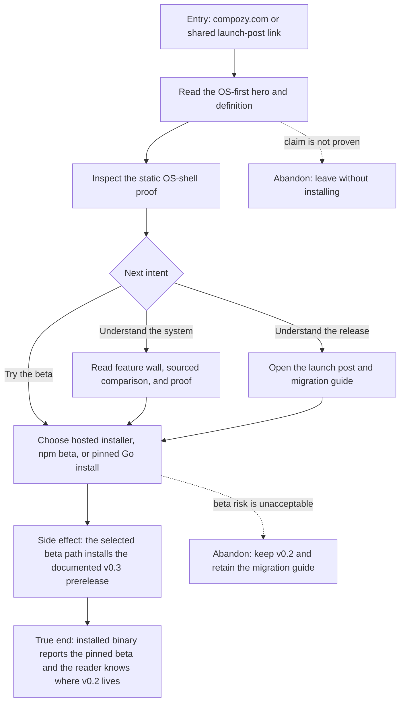

# J-evaluate-compozy-beta: Evaluate CompozyOS and choose a beta path



```yaml
journey:
  id: J-evaluate-compozy-beta
  name: Evaluate CompozyOS and choose a beta path
  value_statement: "A first-time reader can decide whether Compozy is an integrated agent OS, understand the beta boundary, and choose a truthful install or migration path."
  personas: [Cora, Dora]
  entry_points:
    - url: https://compozy.com
      origin: direct
    - url: https://compozy.com/blog/introducing-compozyos
      origin: external-share
  actions:
    - step: 1
      verb: Read the hero claim and adjacent definition
      expected_observable: The page defines an OS through work, memory, permissions, coordination, and extensibility before asking for trust
    - step: 2
      verb: Inspect how the product proves the claim
      expected_observable: A static OS-shell capture, integrated feature wall, sourced market table, and runtime proof tell one consistent story
    - step: 3
      verb: Open the release narrative or choose an install path
      expected_observable: The launch post, migration guide, and install surfaces agree on beta status, hard cuts, and legacy ownership
    - step: 4
      verb: Install through one documented beta channel
      expected_observable: The installed binary reports the explicit v0.3 beta version and no stable-only channel is offered
  goal:
    observable: The reader can explain what makes CompozyOS integrated and select the correct beta or legacy path without contradictory copy
    side_effects: [beta-binary-installed]
  true_end_state: A fresh version check reports the documented v0.3 beta, while the launch post and migration guide still identify legacy/v0.2 as the maintained old line
  exit:
    natural: Runtime quick start or migration guide, with the correct version boundary understood
  abandonment:
    - at_step: 2
      how: The OS claim reads as a generic dashboard or disconnected feature list
      resume: Return only when the landing proof shows the shipped shell, task board, loop run, and integrated system
    - at_step: 4
      how: The reader decides prerelease risk is not acceptable
      resume: Stay on v0.2 and retain the migration guide until a later release is acceptable
  crosses: [marketing-site, blog, release-notes, installer, npm, go-module, migration-docs]
```

## Coverage note

The journey's true end requires a published beta and therefore remains post-publish backlog under
Task 10's single-cut runbook. Task 13 selects only `REL-os-landing-proof` as its one adjacent canary:
that session renders the landing locally and judges the integrated-OS claim, but it does not execute
step 4, install a package, call a live registry, validate cosign output, or touch DNS. The live
`REL-beta-install-paths`, `REL-beta-installer-provenance`, and `REL-beta-self-update` rows stay
`untested` until a real publication exists.
