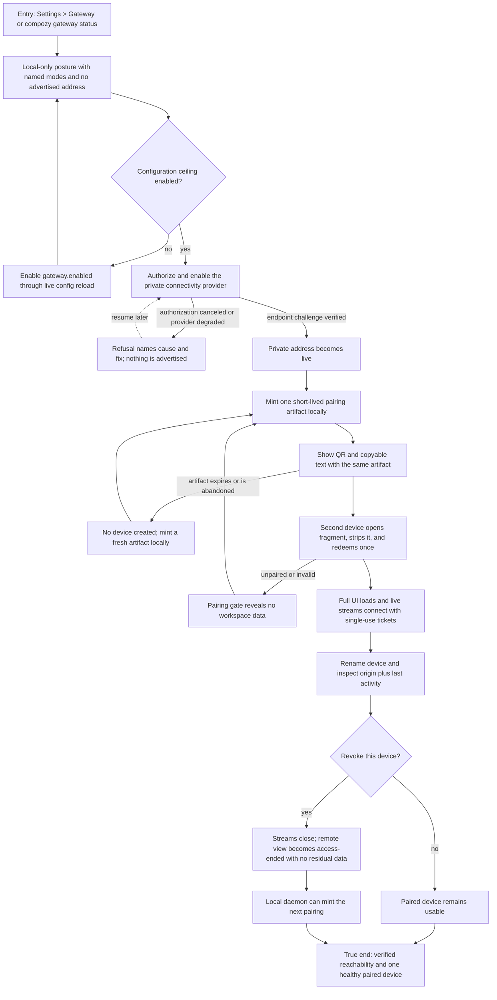

# J-expose-and-pair-gateway: Expose a private gateway and pair a device

An operator turns a fresh local-only daemon into a verified private endpoint, pairs a second device without moving secret files, and retains a local recovery path when remote access fails.



```yaml
journey:
  id: J-expose-and-pair-gateway
  name: Expose a private gateway and pair a device
  value_statement: "I can reach my self-hosted Compozy from another device without becoming a network engineer, and I can always recover locally."
  personas: [Iris, Dora, Sol]
  entry_points:
    - url: /settings/gateway
      origin: in-app-nav
    - url: compozy gateway status -o json
      origin: direct
    - url: compozy pair mint
      origin: direct
  actions:
    - step: 1
      verb: Inspect the fresh exposure posture
      expected_observable: Every named mode is off, no remote address is advertised, and the UI plus structured status explain the next safe action
    - step: 2
      verb: Enable the configuration ceiling and authorize the private provider
      expected_observable: Live config reload preserves local readiness; only a challenge-verified provider endpoint becomes advertised
    - step: 3
      verb: Mint a pairing on the trusted local surface
      expected_observable: One short-lived artifact appears as both a scannable code and copyable text without entering a server-visible URL component
    - step: 4
      verb: Redeem from a second device
      expected_observable: The artifact is consumed once, the URL fragment disappears, and the named device lands in the full UI while an unpaired context sees only the gate
    - step: 5
      verb: Work over the remote UI and inspect the device inventory
      expected_observable: Live streams reconnect with fresh tickets and name, origin, and last activity agree across web and structured surfaces
    - step: 6
      verb: Revoke the device and recover locally
      expected_observable: Active work is fenced before commit, every stream closes, no residual data remains visible, and the local root can mint a replacement
  goal:
    observable: A challenge-verified private address serves the full product to exactly the paired devices the operator still trusts
    side_effects: [provider-authorized, private-endpoint-advertised, device-created, pairing-consumed, gateway-events-appended]
  true_end_state: Fresh web and CLI status agree on observed reachability and device state; a revoked device is terminal, and the local daemon remains able to recover access without any remote credential
  exit:
    natural: The paired device stays in the full Compozy UI or the operator returns to the local Gateway settings page after revocation
  abandonment:
    - at_step: 2
      how: Provider authorization is canceled, denied, or never verifies
      resume: The daemon stays local-only with a visible cause and remediation; retry authorization without cleaning partial exposure
    - at_step: 3
      how: The operator closes the pairing dialog or the artifact expires
      resume: No device exists; mint a fresh artifact from the local trusted surface
    - at_step: 4
      how: Every paired device is lost or revoked
      resume: Return to the daemon host, open the local UI or CLI, and mint a replacement pairing
  crosses: [web, cli, http, uds, gateway-policy, connectivity-provider, browser-auth, sse, websocket]
```

## Coverage notes

- Taxonomy sweep: journey and functional coverage live in the pairing and provider scenarios; experiential coverage targets plain-language risk, keyboard use, QR text equivalence, loading, and access-ended recovery; edge coverage includes canceled consent, expired pairing, empty inventories, revocation, and network loss; cross-cutting coverage includes phone and desktop layouts plus web/CLI/API truth.
- Deliberate skip: locale variation is outside this cycle because the gateway surfaces ship only the current en-US product language; the skip does not relax layout or screen-reader checks.

