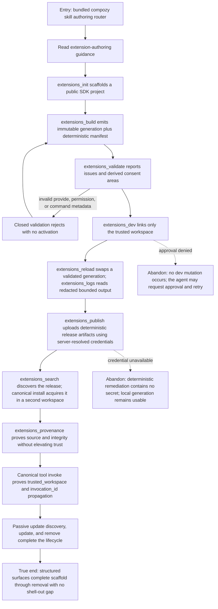

# J-extension-agent-authoring: Author and ship an extension through structured surfaces only

Ada activates the bundled `compozy` skill and completes the authoring loop without a shell, browser,
or hand-written manifest. The nine authoring native tools must expose the same services, structured
results, risk gates, and workspace scope as their CLI or daemon owners.



```yaml
journey:
  id: J-extension-agent-authoring
  name: Author and ship an extension through structured surfaces only
  value_statement: "As an autonomous agent, I can use the official Compozy skill and native tools to create, validate, run, publish, inspect, and retire an extension without operator hand-holding or hidden shell steps."
  personas: [Ada]
  entry_points:
    - url: skills/compozy/SKILL.md and skills/compozy/references/extension-authoring.md
      origin: direct
    - url: compozy__extensions_init|compozy__extensions_build|compozy__extensions_validate
      origin: direct
    - url: compozy__extensions_dev|compozy__extensions_reload|compozy__extensions_logs
      origin: direct
    - url: compozy__extensions_search|compozy__extensions_provenance|compozy__extensions_publish
      origin: direct
    - url: compozy__extensions_install|compozy__extensions_update|compozy__extensions_remove|compozy__tool_invoke
      origin: direct
  actions:
    - step: 1
      verb: Discover and follow the official extension-authoring guidance
      expected_observable: The skill routes to current public concepts, native tool IDs, risk gates, and source-union grammar
    - step: 2
      verb: Scaffold, build, and validate through native tools
      expected_observable: Structured outputs match CLI service results; the manifest is generated deterministically from SDK registrations
    - step: 3
      verb: Link, reload, and inspect logs in the trusted workspace
      expected_observable: Interaction gates apply, workspace_id is server-bound, last-good behavior survives failure, and logs are redacted before transport
    - step: 4
      verb: Publish, search, install, and inspect provenance
      expected_observable: Publish credentials never enter tool input or output; discovery and provenance report source integrity without trust inflation
    - step: 5
      verb: Invoke, discover an update passively, update, and remove
      expected_observable: Invocation identity reaches the handler and all lifecycle reads stay structured and workspace-safe
  goal:
    observable: The complete authoring lifecycle is agent-manageable with the nine new native tools and canonical lifecycle tools
    side_effects: [project-scaffolded, generation-built, dev-link-created, release-published, extension-installed, extension-removed]
  true_end_state: The published extension was invoked from a second workspace and removed there, while the original author workspace remains isolated and every transcript is secret-free
  exit:
    natural: Continue managing another extension through the same structured contracts
  abandonment:
    - at_step: 3
      how: Operator declines an interaction-gated build, dev, or reload
      resume: Re-request approval with the same deterministic input; no partial activation exists
    - at_step: 4
      how: Publish credential binding is absent
      resume: Bind the credential server-side and replay publish; never place it in the native input
  crosses: [official-skill, native-tools, go-sdk, typescript-sdk, generated-contracts, extension-dev, extension-registry, github, tool-runtime, workspace-isolation]
```

## Coverage notes

- The nine new native tool IDs are explicit entry points; install, update, remove, and invoke remain
  canonical existing tools that close the lifecycle.
- SDK simplicity, completeness, and currency are re-graded in this journey with the same brief rubric;
  the acceptance floor is A−/B/B.
- Human CLI rendering and Web management are intentionally covered by the newcomer, distribution,
  command, and canary journeys.
