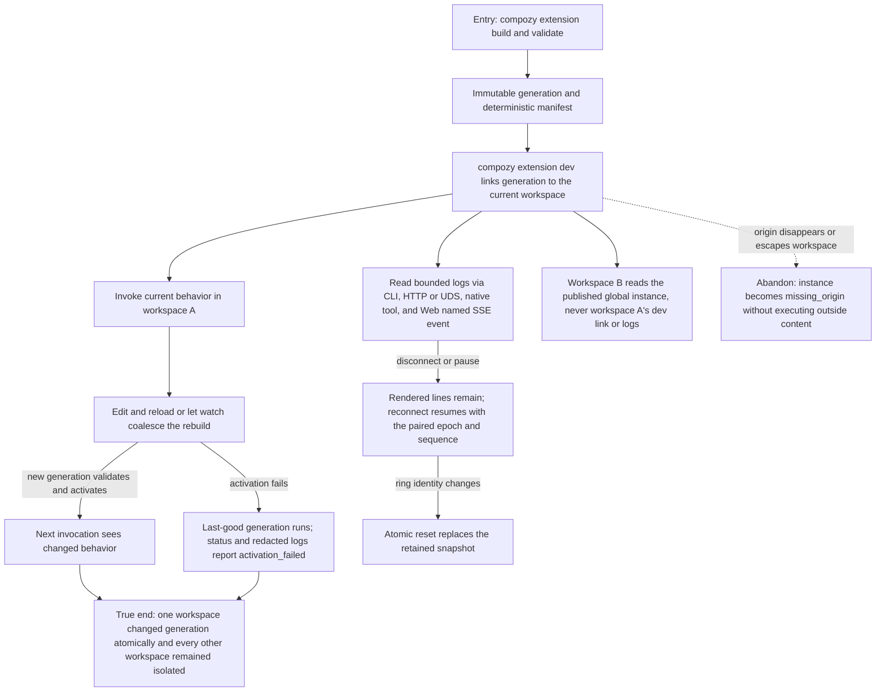

# J-extension-dev-lifecycle: Operate a workspace-scoped extension generation safely

An extension author moves from a code-backed or passive resource-only build through dev, reload, watch, logs, and failure
recovery. The journey concentrates the workspace isolation, immutable-generation, last-good, and
redaction invariants shared by CLI, HTTP, UDS, native tools, and the Web logs panel.



```yaml
journey:
  id: J-extension-dev-lifecycle
  name: Operate a workspace-scoped extension generation safely
  value_statement: "As an extension author, I can iterate quickly while failed or concurrent reloads never expose partial code, leak another workspace, or lose the last working generation."
  personas: [Bruno, Ada]
  entry_points:
    - url: compozy extension build|validate|dev|reload|logs
      origin: direct
    - url: POST /api/extensions/dev and POST /api/extensions/{name}/reload (HTTP + UDS)
      origin: direct
    - url: GET /api/extensions/{name}/logs?follow=1&after=&stream_epoch= (HTTP + UDS)
      origin: direct
    - url: compozy__extensions_build|compozy__extensions_validate|compozy__extensions_dev|compozy__extensions_reload|compozy__extensions_logs
      origin: direct
    - url: /marketplace/extension/$entryId Logs panel
      origin: in-app-nav
  actions:
    - step: 1
      verb: Build and validate the code-backed project or passive resource kit
      expected_observable: Identical source yields a byte-identical manifest and immutable generation handle
    - step: 2
      verb: Link the generation to the current workspace
      expected_observable: Only dev creates a dev link; workspace identity comes from trusted caller scope and no marketplace trust field is stored
    - step: 3
      verb: Reload concurrently and inject an activation failure
      expected_observable: Operations serialize per instance, torn generations are unobservable, and the last-good generation continues with truthful errored status
    - step: 4
      verb: Follow logs across supported planes
      expected_observable: Secret masking happens before a bounded ring and every transport observes the same redacted epoch/sequence cursor, replacing retained rows atomically when the ring changes
    - step: 5
      verb: Compare a second workspace and an invalidated origin
      expected_observable: No cross-workspace state or global-log access leaks; missing or escaping origins are refused without daemon failure
  goal:
    observable: Fast local iteration with atomic generations, truthful recovery, bounded redacted logs, and workspace isolation
    side_effects: [workspace-dev-link-created, generation-swapped, extension-log-events-emitted]
  true_end_state: Workspace A serves either the new valid generation or the last-good one with an explicit error, while workspace B remains on its own resolved instance
  exit:
    natural: Publish the validated generation through J-extension-distribution
  abandonment:
    - at_step: 3
      how: The new generation cannot activate
      resume: Fix the source and reload; the last-good generation remains callable
    - at_step: 4
      how: The log connection drops
      resume: Reconnect with the last stream_epoch and sequence; retained lines remain visible, duplicates are rejected, and a changed epoch resets the snapshot
  crosses: [cli, httpapi, udsapi, native-tools, web, manifest-build, extension-manager, sse, workspace-isolation]
```

## Coverage notes

- This journey owns Safety Invariants 1-3, 7-8, and 12-15.
- Distribution integrity is J-extension-distribution; command policy is J-run-extension-commands.
