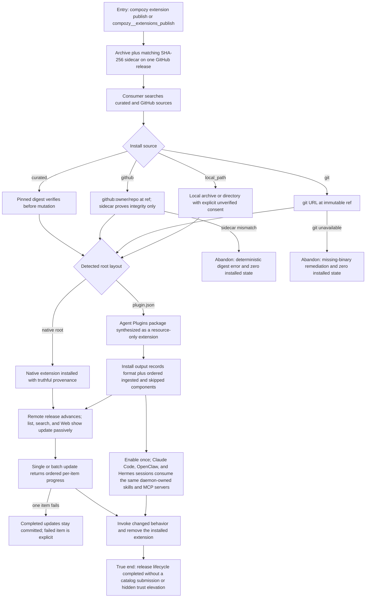

# J-extension-distribution: Publish, acquire, update, and remove an extension

An author publishes one deterministic GitHub release, and a consumer acquires it through the source
union with at most one command and one consent. Passive update discovery and per-item batch progress
complete the lifecycle without turning integrity evidence into trust.



```yaml
journey:
  id: J-extension-distribution
  name: Publish, acquire, update, and remove an extension
  value_statement: "As an extension author or consumer, I can publish directly and acquire from curated, GitHub, git, or local sources with one explicit trust decision and truthful lifecycle state."
  personas: [Bruno, Ada]
  entry_points:
    - url: compozy extension publish and compozy__extensions_publish
      origin: direct
    - url: compozy extension install <curated|github|git|local_path> and POST /api/extensions (HTTP + UDS)
      origin: direct
    - url: compozy extension status|inventory|list and GET /api/extensions[/<name>/inventory] (HTTP + UDS)
      origin: direct
    - url: /marketplace/extensions Install extension
      origin: in-app-nav
    - url: compozy extension list|search|provenance|update|remove
      origin: direct
    - url: GET /api/extensions and GET /api/extensions/search (HTTP + UDS)
      origin: direct
    - url: compozy__extensions_search|compozy__extensions_provenance|compozy__extensions_update|compozy__extensions_remove
      origin: direct
    - url: https://compozy.com/runtime/core/extensions/install and https://compozy.com/runtime/core/extensions/publish
      origin: external-share
    - url: packages/site/content/docs/extensions/agent-plugins.mdx
      origin: direct
  actions:
    - step: 1
      verb: Publish a deterministic release
      expected_observable: Archive and sidecar match the built generation; the credential is server-resolved and absent from output, events, and logs
    - step: 2
      verb: Install once from each source-union variant
      expected_observable: One install command per source carries source, ref, optional version/asset, and explicit consent only; native and plugin.json roots are auto-detected with fixed precedence, and portable output reports format plus every ingested or skipped component
    - step: 3
      verb: Inspect provenance and tamper with integrity evidence
      expected_observable: Curated digest verification alone sets checksum_verified; sidecar match never elevates trust and mismatch leaves zero state
    - step: 4
      verb: Discover and apply an update
      expected_observable: Human, structured, and Web reads advertise updates without a check flag; degraded remote discovery never blocks local inventory
    - step: 5
      verb: Partially fail a batch update, then remove
      expected_observable: Ordered outcomes preserve completed mutations; portable data survives updates; and removal either deletes or quarantines that data, never reporting success while a reusable instance key retains residue
    - step: 6
      verb: Deliver one portable package through all supported ACP providers
      expected_observable: Claude Code, OpenClaw, and Hermes sessions activate the same ingested skill, run the stdio server with the absolute root/data environment, and reach the remote server through the daemon without provider-specific package handling
  goal:
    observable: Direct publication and source-union consumption with passive update discovery and truthful integrity, trust, and partial progress
    side_effects: [release-published, extension-installed, extension-updated, extension-removed]
  true_end_state: A second isolated home consumed, updated, invoked, and removed the extension; portable content worked through all three providers; failed source attempts left zero install state
  exit:
    natural: Continue publishing another release without Compozy catalog intervention
  abandonment:
    - at_step: 2
      how: Source verification or policy consent fails
      resume: Correct the immutable ref or provide the single explicit consent and replay; no partial install exists
    - at_step: 4
      how: A discovery source is unavailable
      resume: Local inventory remains usable and a later read refreshes the cached-or-omitted source result
  crosses: [cli, httpapi, udsapi, native-tools, web, github, git, extension-registry, marketplace, public-docs]
```

## Coverage notes

- This journey owns the scorecard's `own install ≤ 1 command + 1 consent` and passive-update
  measures.
- Agent Plugins adds root precedence, recorded diagnostics, provider-neutral delivery, and the
  data-preserving update/removal contract. Dev-link semantics remain in J-extension-dev-lifecycle.
