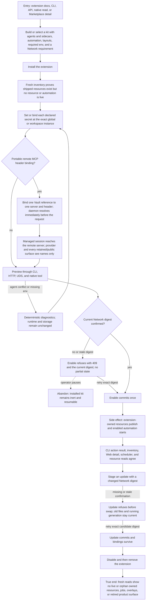

# J-extension-kit-lifecycle: Bring an extension kit live safely

An operator follows the public extension guidance, installs one complete kit without side effects,
binds its declared secrets, previews the exact change, confirms the current Network requirement,
and enables the kit as one owned unit. The journey ends only after update and disable prove the
same lifecycle remains truthful across structured and Web surfaces.



```yaml
journey:
  id: J-extension-kit-lifecycle
  name: Bring an extension kit live safely
  value_statement: "I can install, inspect, consent to, enable, update, and retire one extension kit without hidden work, leaked secrets, or partial lifecycle state."
  personas: [Bruno, Ada]
  entry_points:
    - url: /docs/extensions/install, /docs/extensions/develop, /docs/extensions/manifest, and /docs/extensions/secrets
      origin: external-share
    - url: compozy extension install|inventory|preview|secrets|enable|update|disable|remove -o json|jsonl|toon
      origin: direct
    - url: compozy extension secrets bind <name> --remote-header <server>:<header> and GET|PUT /api/extensions/:name/secrets (HTTP + UDS)
      origin: direct
    - url: /api/extensions/:name inventory, preview, secrets, enable, update, disable, and remove over HTTP and UDS
      origin: direct
    - url: compozy__extensions_inventory|preview|enable|update|disable|remove
      origin: direct
    - url: /marketplace/extension/$entryId?installed_name=$name and /marketplace/extensions
      origin: in-app-nav
  actions:
    - step: 1
      verb: Build or select a complete extension kit and install it
      expected_observable: Static agents and sidecars, automation, layouts, env declarations, and Network requirement are discoverable while installation writes no live resources or runnable automation
    - step: 2
      verb: Bind declared secrets at the launching instance
      expected_observable: Hidden values or existing Vault refs satisfy only that global or workspace instance; a portable remote-header binding reaches only its named server at request time; list, API, logs, events, diagnostics, provider input, and transcripts expose names only
    - step: 3
      verb: Preview the lifecycle change
      expected_observable: Every read plane agrees on publish set, conflicts, missing env, automation starting, and current digest while fresh persisted and runtime state remains byte-stable
    - step: 4
      verb: Confirm the exact digest and enable
      expected_observable: Missing or stale consent refuses with no partial state; exact consent commits one owned kit and enumerates exactly the automation made runnable
    - step: 5
      verb: Inspect the live kit across structured and Web surfaces
      expected_observable: Inventory joins shipped and live items by kind and name; bound key names and consent state are truthful; workspace dev overlays never appear as global inventory
    - step: 6
      verb: Update and retire the kit
      expected_observable: A changed digest refuses before swap until exactly confirmed; bindings survive update; disable and remove stop automation and clean only the extension-owned set
  goal:
    observable: One complete kit is brought live and retired through the extension lifecycle with informed consent and identical cross-surface state
    side_effects: [extension-secrets-bound, extension-network-confirmed, extension-resources-published, extension-automation-started, extension-resources-removed]
  true_end_state: A fresh restart and inventory show the final extension state, no orphan owned resources or overlays, no secret disclosure, and no separate activation lifecycle
  exit:
    natural: Return to the interrupted work with the kit either truthfully live or fully retired
  abandonment:
    - at_step: 4
      how: Operator declines or postpones the current Network requirement
      resume: The installed kit stays inert; preview returns the current digest and the exact retry is safe later
    - at_step: 6
      how: Update presents a changed digest the operator does not accept
      resume: The prior version and running generation remain intact until an exact confirmed retry
  crosses: [public-docs, cli, httpapi, udsapi, native-tools, vault, extension-registry, resources, hosted-mcp, automation, window-manager, web]
```

## Coverage notes

- Journey and functional coverage: complete install-to-retirement flow, cross-plane reads, and true
  end-state checks.
- Experiential coverage: Marketplace detail and installed management at 375, 768, and 1280 pixels;
  the adjacent Marketplace/Skills canary owns shared discovery presentation.
- Edge and error coverage: missing/stale consent, agent conflicts, invalid bindings, refused updates,
  abandon-and-resume, and removal cleanup.
- Cross-cutting coverage: global versus workspace-instance isolation, owner-attributed resources,
  deterministic structured output, restart persistence, and secret redaction.
- Portable remote access adds the source-aware fixed-header policy and operator-only credential path;
  remote servers stay daemon-side and never enter ACP provider configuration.
