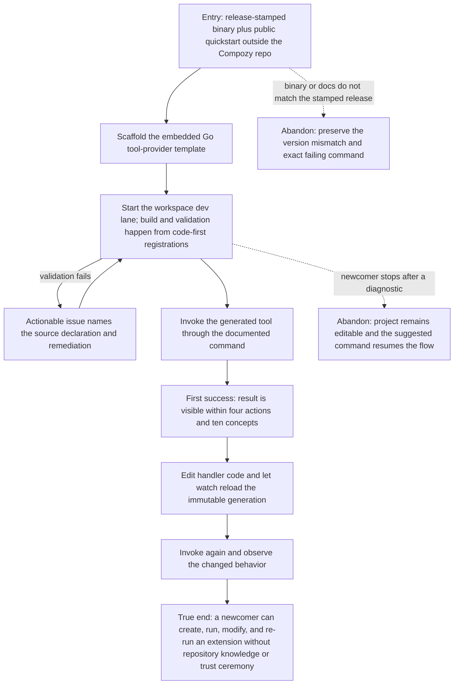

# J-extension-newcomer-first-success: Reach a working extension from the public quickstart

A newcomer uses a release-stamped Compozy binary outside the repository and follows only the
published quickstart. The scorecard is part of the observable result: no more than ten concepts and
four actions before the first successful invocation, with no undocumented trust or manifest step.



```yaml
journey:
  id: J-extension-newcomer-first-success
  name: Reach a working extension from the public quickstart
  value_statement: "As a newcomer outside the Compozy repository, I can follow the release-matched public guide verbatim and see my extension work before I need to understand the runtime internals."
  personas: [Lea]
  entry_points:
    - url: https://compozy.com/runtime/guides/build-your-first-extension
      origin: external-share
    - url: compozy extension init <name> --template tool-provider-go
      origin: direct
    - url: compozy extension dev <dir> --watch
      origin: direct
    - url: compozy tool invoke ext__<name>__search --workspace . --input <json>
      origin: direct
  actions:
    - step: 1
      verb: Scaffold from the embedded release-matched template
      expected_observable: The generated project is self-contained, imports only public SDK paths, and asks for no hand-written manifest
    - step: 2
      verb: Start the local dev lane
      expected_observable: Code-first registrations build and validate into one immutable generation, link only to the current workspace, and require no marketplace trust prompt
    - step: 3
      verb: Invoke the documented tool
      expected_observable: The invocation returns the documented result with at most four total actions and ten introduced concepts
    - step: 4
      verb: Edit and observe the reloaded behavior
      expected_observable: Watch swaps a validated generation and the next invocation changes without reinstalling
  goal:
    observable: A working, then modified, extension reached from public docs verbatim on a release-stamped binary
    side_effects: [project-scaffolded, workspace-dev-link-created, immutable-generation-activated]
  true_end_state: The changed handler result is visible, the workspace owns the dev link, and no global install or trust state was created
  exit:
    natural: Continue into the complete author-publish-consume lifecycle
  abandonment:
    - at_step: 1
      how: The public guide and release binary disagree
      resume: Install the release named by the guide or open the matching stamped docs and replay the exact command
    - at_step: 2
      how: Validation blocks the dev link
      resume: Apply the rendered source-level remediation and rerun the same dev command; no partial link needs cleanup
  crosses: [public-docs, cli, embedded-templates, go-sdk, manifest-build, extension-dev, tool-runtime, workspace-isolation]
```

## Coverage notes

- The quickstart owns the scorecard's `concepts ≤ 10` and `first-success actions ≤ 4` measures.
- Release-stamped execution outside the checkout prevents repository fixtures, replace directives, or
  unpublished docs from masking a newcomer failure.
- Distribution, update, and removal continue in J-extension-distribution; the full agent-only loop is
  J-extension-agent-authoring.
