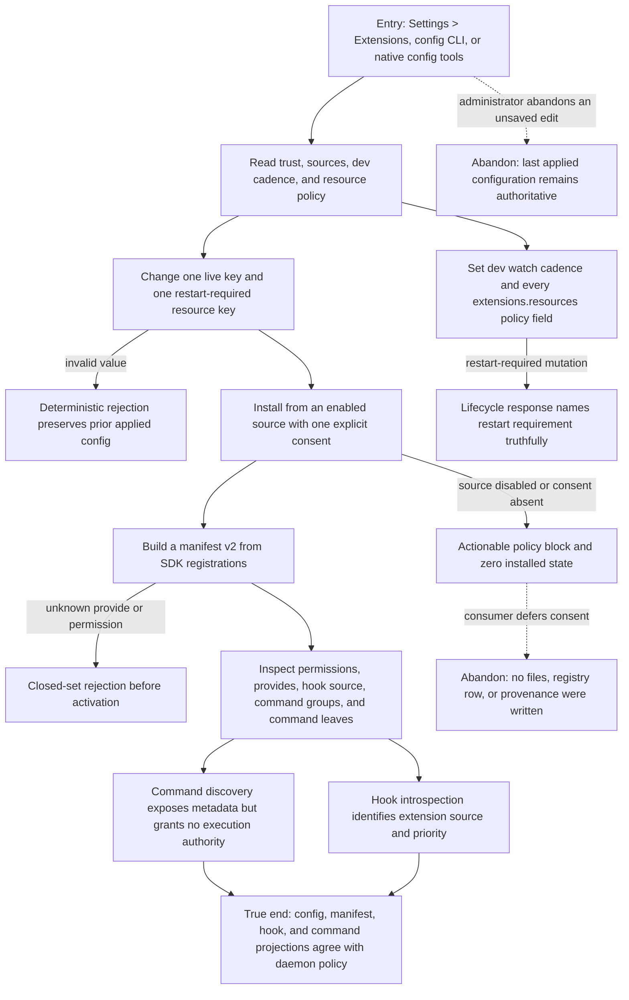

# J-extension-policy-admin: Govern extension trust, sources, resources, and declarations

The policy owner exercises the complete `[extensions.*]` lifecycle and the declaration surfaces
that turn authored code into runtime capabilities. Configuration, generated manifest v2, extension
hook source, and contributed-command metadata must agree across user and agent management planes.



```yaml
journey:
  id: J-extension-policy-admin
  name: Govern extension trust, sources, resources, and declarations
  value_statement: "As a policy administrator, I can control every extension configuration key and verify that generated declarations expose only capabilities, hooks, and commands the runtime will actually enforce."
  personas: [Vera, Ada]
  entry_points:
    - url: /settings/extensions and /settings/hooks
      origin: in-app-nav
    - url: compozy config get|set extensions.trust.allow_unverified
      origin: direct
    - url: compozy config get|set extensions.sources.github.enabled|extensions.sources.github.base_url|extensions.sources.git.enabled
      origin: direct
    - url: compozy config get|set extensions.dev.watch_interval
      origin: direct
    - url: compozy config get|set extensions.resources.allowed_kinds|extensions.resources.max_scope
      origin: direct
    - url: compozy config get|set extensions.resources.snapshot_rate_limit.requests|window|queue
      origin: direct
    - url: compozy config get|set extensions.resources.operator_write_rate_limit.requests|window|queue
      origin: direct
    - url: compozy__config_get|compozy__config_set and HTTP/UDS settings routes
      origin: direct
    - url: generated extension.toml; compozy extension build|validate; compozy hooks list; compozy extension commands
      origin: direct
    - url: https://compozy.com/docs/configuration/config-toml and https://compozy.com/docs/extensions/manifest
      origin: external-share
  actions:
    - step: 1
      verb: Read and mutate every extensions configuration key
      expected_observable: Defaults, validation, merge behavior, CLI registry, structured config tools, settings API, and docs agree; lifecycle is live or restart-required exactly as declared
    - step: 2
      verb: Exercise trust and source gates
      expected_observable: Source disablement and missing consent fail with actionable diagnostics and zero residue; allowed installation keeps integrity distinct from trust
    - step: 3
      verb: Build and validate the manifest v2 declaration
      expected_observable: Permissions and provides are closed-set, generated from code, deterministic, and invalid values fail before registry or runtime mutation
    - step: 4
      verb: Inspect extension-provided hooks and contributed commands
      expected_observable: Hook source and priority are truthful; command groups/leaves and risk metadata survive build and discovery without bypassing the canonical tool runtime
    - step: 5
      verb: Compare Web, CLI, HTTP, UDS, native, and public documentation reads
      expected_observable: Every supported plane presents one daemon-owned configuration and declaration contract
  goal:
    observable: Complete extension policy and declaration agreement with no permissive fallback or hidden configuration key
    side_effects: [config-lifecycle-applied, policy-events-emitted, generated-manifest-built]
  true_end_state: Fresh structured reads and Web settings show the intended policy, and one loaded extension exposes only its valid provides, permissions, hook source, and command metadata
  exit:
    natural: Continue with distribution or command execution under the applied policy
  abandonment:
    - at_step: 1
      how: Leave before applying a configuration edit
      resume: Reopen the surface; the last applied value remains authoritative
    - at_step: 2
      how: Decline unverified-source consent
      resume: Re-run the one install request after review; no partial state requires cleanup
  crosses: [settings, config-lifecycle, cli, httpapi, udsapi, native-tools, manifest-build, hooks, commands, public-docs]
```

## Coverage notes

- Every current `[extensions.*]` key is named in the entry points; wildcard prose is not used as
  evidence of coverage.
- This journey owns Safety Invariant 6 and the declaration/config portions of 10-12 and 17.
- Runtime generation safety is J-extension-dev-lifecycle; command execution authority is
  J-run-extension-commands.
