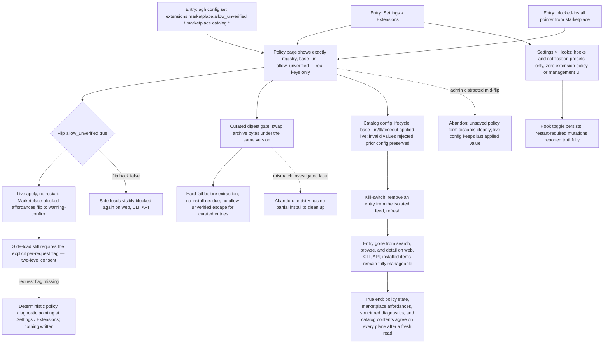

# J-extension-policy-admin: Govern acquisition trust policy and the curated catalogs

The PRD admin journey plus the curation-administration story it implies: the policy owner keeps unverified side-loads blocked by default (ADR-020), flips policy deliberately and watches marketplace affordances change live, verifies the curated digest gate has no bypass, owns the `[marketplace.catalog]` config lifecycle, and proves the kill-switch (ADR-008): a pulled entry disappears without a daemon release. It also owns the settings-split truth (ADR-004): Hooks means hooks; Extensions policy is exactly three real keys.



```yaml
journey:
  id: J-extension-policy-admin
  name: Govern acquisition trust policy and the curated catalogs
  value_statement: "I decide what this runtime may acquire: unverified stays blocked until I say otherwise, curated means digest-verified, and a bad catalog entry disappears the moment curation pulls it."
  personas: [Vera, Ada]
  entry_points:
    - url: /settings/extensions
      origin: in-app-nav
    - url: /settings/hooks
      origin: in-app-nav
    - url: agh config set extensions.marketplace.allow_unverified <bool>
      origin: direct
    - url: agh config set marketplace.catalog.<base_url|ttl|timeout>
      origin: direct
    - url: agh.network/runtime/core/configuration
      origin: external-share
  actions:
    - step: 1
      verb: Read the split settings pages
      expected_observable: Extensions policy shows exactly registry, base_url, allow_unverified; Hooks shows hooks and presets only; the deleted hooks-extensions route has no alias
    - step: 2
      verb: Flip allow_unverified and observe the product change live
      expected_observable: No restart; marketplace and CLI affordances flip between visibly-blocked and warning-confirm; the per-request consent flag is still required when allowed
    - step: 3
      verb: Attempt a side-load under each policy value
      expected_observable: Deterministic policy diagnostics (422-class) with a Settings › Extensions pointer; nothing written on any blocked path
    - step: 4
      verb: Verify the curated digest gate
      expected_observable: A tampered archive under a pinned version hard-fails before extraction with no bypass and no residue; a clean install persists verified provenance
    - step: 5
      verb: Exercise the catalog config lifecycle and the kill-switch
      expected_observable: Valid keys apply live to the next refresh; invalid values are rejected preserving prior config; a pulled entry disappears from every discovery surface while installed items stay manageable
  goal:
    observable: Policy, provenance, and catalog contents read identically on web, CLI, and API after each administrative change
    side_effects: [config-lifecycle-applied, policy-events-emitted, catalog-projection-replaced]
  true_end_state: A fresh read of settings, marketplace affordances, structured diagnostics, and catalog contents agrees with the administrator's last applied decision on every plane; no blocked or failed path left partial state
  exit:
    natural: Settings › Extensions with the intended posture in force
  abandonment:
    - at_step: 2
      how: Navigate away with an unsaved policy form
      resume: The form discards cleanly; live config keeps the last applied value
    - at_step: 4
      how: Digest mismatch found but remediation deferred
      resume: No partial install exists; the curated entry can be pulled via the kill-switch lane
  crosses: [settings-api, config-lifecycle, extension-registry, curated-feeds, marketplace-api, web, cli]
```

## Coverage notes (Task 10 planning)

- Taxonomy sweep: journeys (policy flip, digest gate, kill-switch, settings split), functional (config validation, deterministic diagnostics, round-trips), experiential (blocked affordances explain themselves and point at the right page), edge/error/empty (garbage config values, tampered archives, no-hooks-configured empty state), cross-cutting (config-lifecycle truth: live vs restart-required reported honestly).
- Deliberate skip: responsiveness/mobile on settings pages — administrative desktop surfaces; no mobile persona claims this journey (recorded, consistent with the personas.md mobile-lens policy).
- ET-019/ET-020/ET-021/ET-022 (agent-plane extension update/remove/enable/status) stay journey-unlinked this cycle: ET-web-extensions-manage owns the management invariant on the web plane, and a dedicated agent-surface cycle owns the structured lifecycle parity sweep.
