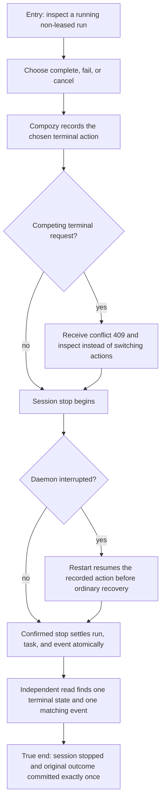

# J-finish-task-run — Finish active work without losing its outcome

Bruno finishes a non-leased task run that has an active session. The journey proves that Compozy
keeps one chosen outcome across concurrent requests and daemon restart, stops the session before
publishing terminal state, and leaves one matching durable event.



```yaml
journey:
  id: J-finish-task-run
  name: "Finish active work without losing its outcome"
  value_statement: "I can finish an active run once, even when another command races mine or the daemon restarts during session shutdown."
  personas: [Bruno]
  entry_points:
    - url: "CLI compozy task run complete|fail|cancel"
      origin: terminal
    - url: "HTTP/UDS POST /api/task-runs/{id}/complete|fail|cancel"
      origin: api-client
    - url: "web task run header cancel"
      origin: in-app-nav
  actions:
    - step: 1
      verb: "Inspect a non-leased running run with an active session"
      expected_observable: "The run and attached session are visible through an independent structured read"
    - step: 2
      verb: "Choose complete, fail, or cancel"
      expected_observable: "Compozy records one terminal action before asking the session to stop"
    - step: 3
      verb: "Race a different terminal action"
      expected_observable: "The losing action receives conflict 409 and cannot replace the recorded outcome"
    - step: 4
      verb: "Interrupt and restart the daemon while the stop is pending"
      expected_observable: "Startup resumes the original action before ordinary active-run recovery"
    - step: 5
      verb: "Read the final run, task, session, and event history"
      expected_observable: "The session is stopped and exactly one terminal state and matching canonical event are durable"
  goal:
    observable: "The original complete, fail, or cancel action survives concurrency and restart without a second outcome."
    side_effects: [session-stopped, run-terminalized, task-reconciled, canonical-event-appended]
  true_end_state: "The session is stopped, the chosen run outcome is durable exactly once, and task state plus event history agree."
  exit:
    natural: "Bruno returns to the task catalog after confirming the final state through a fresh read."
  abandonment:
    - at_step: 4
      how: "The daemon stops after the action is recorded but before the run is terminal."
      resume: "The next startup resumes the recorded action and refuses a competing outcome."
  crosses: [task-run-lifecycle, session-stop, cli, http, uds, web, daemon-restart, event-history]
```
