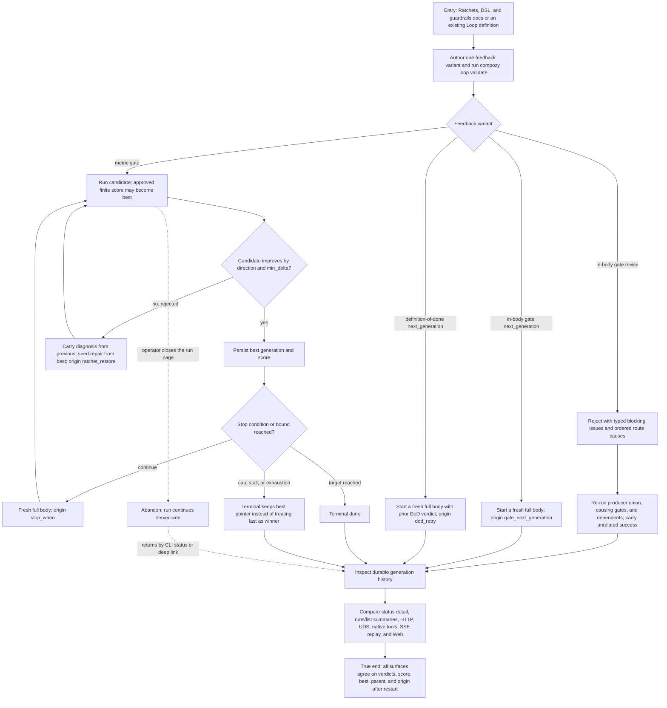

# J-improve-loop-with-feedback — Improve a Loop without losing the best result

A delivery builder wants each generation to use typed feedback instead of repeating the same work.
They validate one of three feedback routes, run it to convergence or a truthful bound, and inspect
the durable history through human and agent surfaces. The value is not merely another generation:
the next attempt repairs the right work, the accepted best is never replaced by a regression, and
every surface explains why the generation exists.



```yaml
journey:
  id: J-improve-loop-with-feedback
  name: "Improve a Loop through typed feedback without losing the best result"
  value_statement: "A builder can converge work through targeted repair or fresh retries, preserve the strongest accepted candidate, and understand every generation from durable public history."
  personas: [Bruno, Ada]
  entry_points:
    - url: "docs: /docs/loops/ratchet, /docs/loops/dsl-reference, /docs/loops/guardrails"
      origin: direct
    - url: "CLI: compozy loop validate|inspect|list|run|status|runs"
      origin: direct
    - url: "HTTP/UDS Loop definition, run, status, list, and SSE routes"
      origin: direct
    - url: "native tools: compozy__loop_status / compozy__loop_runs"
      origin: in-app-nav
    - url: "hooks: loop.gate.post / loop.generation.pre; official Compozy skill Loop reference"
      origin: direct
    - url: "web /loops and /loop-runs/:run_id"
      origin: in-app-nav
  actions:
    - step: 1
      verb: "Choose a feedback contract and validate the definition"
      expected_observable: "Metric, route, template-root, and scorer-response errors are rejected before a run; valid command, judge, and extension score contracts publish without hidden defaults"
    - step: 2
      verb: "Run a metric variant through improvement, regression, restore, and a bound"
      expected_observable: "Only approved finite improvements advance best; rejected regressions repair from best while previous retains their diagnosis; exhausted or stalled history still points to the accepted best"
    - step: 3
      verb: "Run revise and both next-generation variants"
      expected_observable: "Revise reruns the deterministic producer union with typed prior verdicts; in-body and DoD next_generation each start a fresh full body with distinct origins"
    - step: 4
      verb: "Reload and compare every public read surface"
      expected_observable: "Detail exposes verdicts and provenance; summaries expose only best fields; Web, CLI, HTTP, UDS, native tools, and replayed SSE agree after restart"
  goal:
    observable: "The Loop either reaches its target or stops truthfully while preserving and linking the accepted best generation"
    side_effects: [generation-history-persisted, verdicts-persisted, best-pointer-updated, SSE-events-replayable]
  true_end_state: "After daemon restart, every workspace-scoped read agrees on generation parent/origin, criterion and aggregate verdict scores, and best; another workspace cannot observe the run, and the final UI links an exhausted or stalled outcome to the best candidate."
  exit:
    natural: "The builder opens the best generation or the verified done result and can explain how the Loop got there."
  abandonment:
    - at_step: 2
      how: "The builder closes the run page during a regression repair."
      resume: "The run continues server-side; status or the persisted deep link restores the exact history without duplicate generations or a lost best pointer."
  crosses: [site-docs, official-skill, DSL-lint, extension-scorer, loop-coordinator, globaldb-plan-atomicity, workspace-isolation, CLI, HTTP, UDS, native-tools, hooks, SSE, web-run-detail, run-summaries]
```

Taxonomy note: the three route branches own functional and error coverage; abandon/resume covers
continuity; the cross-surface comparison covers consistency and workspace isolation; the Web
charter covers experiential truth. Responsive editing is not in scope because the Loop editor is
desktop-only, while the run-detail read remains covered at its supported desktop viewport.
