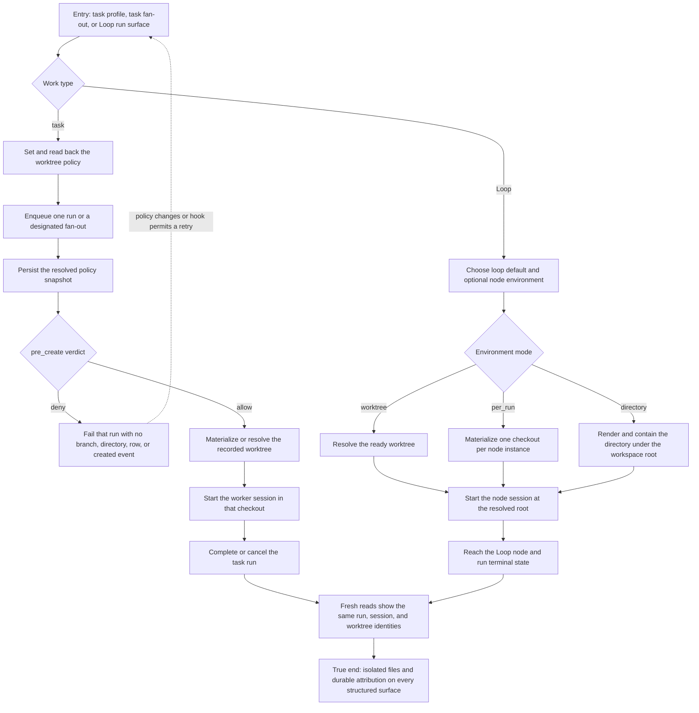

# J-isolated-task-loop-execution — Run task and Loop work in isolated environments

An operator or autonomous agent selects an execution environment before queueing work, then trusts
Compozy to keep every run in the environment that was recorded at enqueue time. A single run may
reuse a selected worktree, while `per_run` work creates one fresh Git checkout for each task or Loop
node instance.



```yaml
journey:
  id: J-isolated-task-loop-execution
  name: "Run task and Loop work in isolated environments"
  value_statement: "I can isolate queued and fan-out work without races, checkout leakage, or a hidden fallback to the workspace root."
  personas: [Bruno, Ada]
  entry_points:
    - url: "CLI: compozy task profile set-worktree; compozy task fan-out --worktree-per-run"
      origin: direct
    - url: "HTTP or UDS: task execution-profile, fan-out, Loop definition, config, and run routes"
      origin: direct
    - url: "Native tools: compozy__task_worktree_policy_set, compozy__task_fanout_runs, compozy__loop_create|configure|run"
      origin: agent
  actions:
    - step: 1
      verb: "Choose a task worktree policy or Loop environment"
      expected_observable: "Every structured read returns the same normalized mode and reference, while invalid references or environment shapes fail before work starts."
    - step: 2
      verb: "Queue a single run or fan out independent work"
      expected_observable: "Task runs retain the enqueue-time policy snapshot, and every per-run task or Loop node instance receives its own worktree identity."
    - step: 3
      verb: "Let the worker or node execute"
      expected_observable: "The session runs from the resolved worktree or contained directory, with no fallback to the parent root and no sibling checkout leakage."
    - step: 4
      verb: "Complete, cancel, or observe a denied materialization"
      expected_observable: "Successful and canceled worktrees remain inspectable with run attribution; a pre-create denial fails only its run and leaves no orphan."
    - step: 5
      verb: "Read the outcome through another structured surface"
      expected_observable: "CLI, HTTP, UDS, native tools, run summaries, sessions, and worktree events agree on the terminal state and identities."
  goal:
    observable: "Task and Loop work runs in the selected isolated environment and remains attributable after completion."
    side_effects: [policy-snapshotted, worktree-created, session-bound, run-attributed, terminal-state-persisted]
  true_end_state: "Fresh structured reads show each run and session bound to the same durable worktree or contained directory used for execution; denied creation has no Git, registry, or event residue."
  exit:
    natural: "The operator inspects or removes retained worktrees after the task or Loop reaches a terminal state."
  abandonment:
    - at_step: 2
      how: "A registered worktree pre-create hook denies materialization."
      resume: "Compozy records the named denial, leaves no orphan, and a later run can retry after the policy changes or the hook permits creation."
    - at_step: 3
      how: "A saved worktree reference disappears before execution."
      resume: "The run fails with a deterministic reference error and never silently executes from the workspace root."
  crosses: [task-queue, Loop-runtime, Git, worktree-registry, session-runtime, CLI, HTTP, UDS, native-tools, SSE]

coverage:
  journeys: "Task profile through terminal run, designated fan-out, and Loop node execution all reach a durable end state."
  functional: "Snapshot authority, distinct per-run roots, directory containment, hook denial cleanup, and cross-surface parity are in scope."
  experiential: "Structured output must make the selected mode, resulting binding, and recoverable failure clear without requiring database or Git inspection."
  edge_error_empty: "Post-enqueue profile edits, invalid refs, explicit hook denial, cancellation, and empty fan-out attribution are covered by the walk."
  cross_cutting: "Workspace isolation, event correlation, config lifecycle, and agent-manageability are checked across task and Loop consumers."
```
