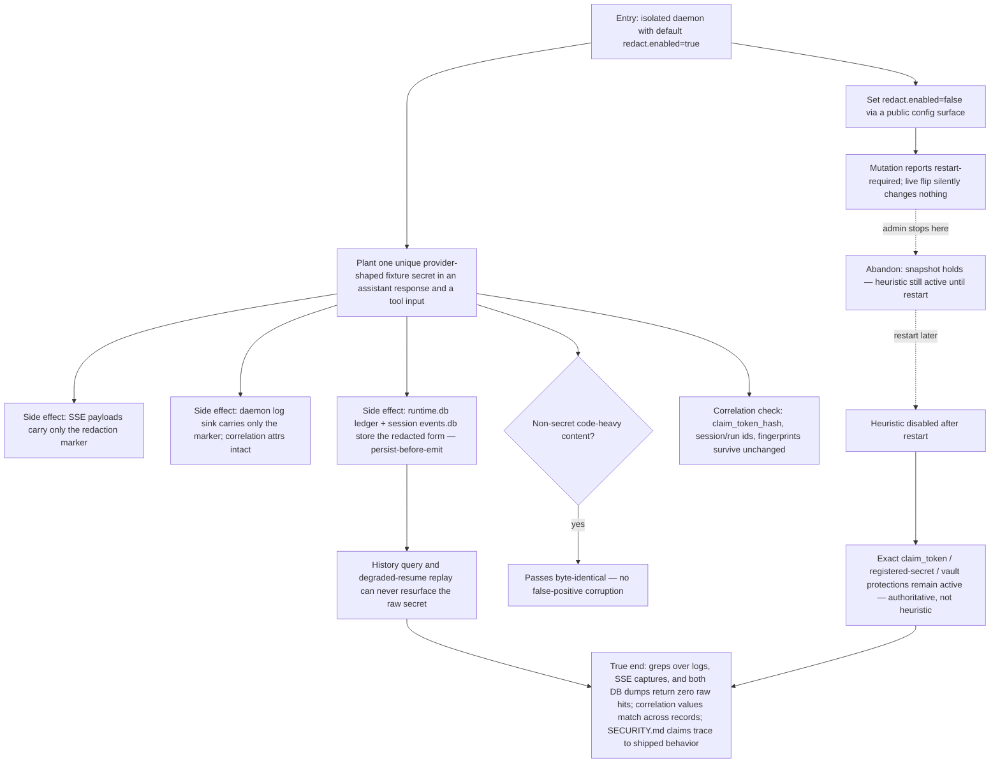

# J-keep-secrets-contained — A leaked secret never reaches disk or stream

A runtime administrator proves the default-on redaction boundary: a provider-shaped secret that an
agent echoes into output or tool input exists only as the redaction marker across logs, SSE, the
global event ledger, and the per-session events store — redacted BEFORE durable append — while
correlation ids and hashes survive intact, and the enable flag is tamper-resistant (process
snapshot; restart-required). Covers US-009 (G2, ADR-005; Safety Invariants 10/11; N-402).



```yaml
journey:
  id: J-keep-secrets-contained
  name: "A leaked secret never reaches disk or stream"
  value_statement: "Even when an agent echoes a live key, nothing durable or streamed ever holds the raw value — and I can prove it with greps, not promises."
  personas: [Dora]
  entry_points:
    - url: "CLI: agh config get/set redact.enabled; daemon logs; agh session events"
      origin: direct
    - url: "HTTP/UDS: session SSE stream; history queries; GET /api/doctor"
      origin: direct
    - url: "web: General Settings (redaction, restart-required copy)"
      origin: in-app-nav
  actions:
    - step: 1
      verb: "Emit a planted provider-shaped secret through agent output and tool input"
      expected_observable: "SSE, logs, runtime.db, and events.db contain only the canonical redaction marker — content was redacted before durable append"
    - step: 2
      verb: "Verify the correlation envelope"
      expected_observable: "claim_token_hash, session/run ids, fingerprints, and idempotency keys survive byte-identical on every seam"
    - step: 3
      verb: "Flip redact.enabled at runtime"
      expected_observable: "The mutation reports restart-required (config/CLI/UI copy states it); the boot snapshot holds until restart"
    - step: 4
      verb: "Restart with the heuristic disabled and emit exact-class secrets"
      expected_observable: "Exact claim_token, registered-secret, and vault redaction remain active — the heuristic is additive, never the authoritative guarantee"
  goal:
    observable: "Zero raw secret hits across output, logs, SSE, and both event stores"
    side_effects: [redacted-durable-rows, restart-required-config-record]
  true_end_state: "Fresh greps over captured logs, streams, and DB dumps return zero raw hits; history queries and resume replay return only the redacted form; non-secret content is byte-identical."
  exit:
    natural: "The administrator records the sweep as evidence for the security posture."
  abandonment:
    - at_step: 3
      how: "The administrator flips the flag but never restarts."
      resume: "The process snapshot keeps the boot-time behavior — no silent no-op window; the pending change applies at the next restart and the UI says so."
  crosses: [internal-redact, slog-sink, SSE-broadcaster, runtime.db, events.db, config-lifecycle, SECURITY.md]
```

Taxonomy note: structured/administrative journey. Functional, failure, and cross-surface
consistency in scope; responsive/visual accessibility not applicable (settings copy is covered by
the restart-required check).
