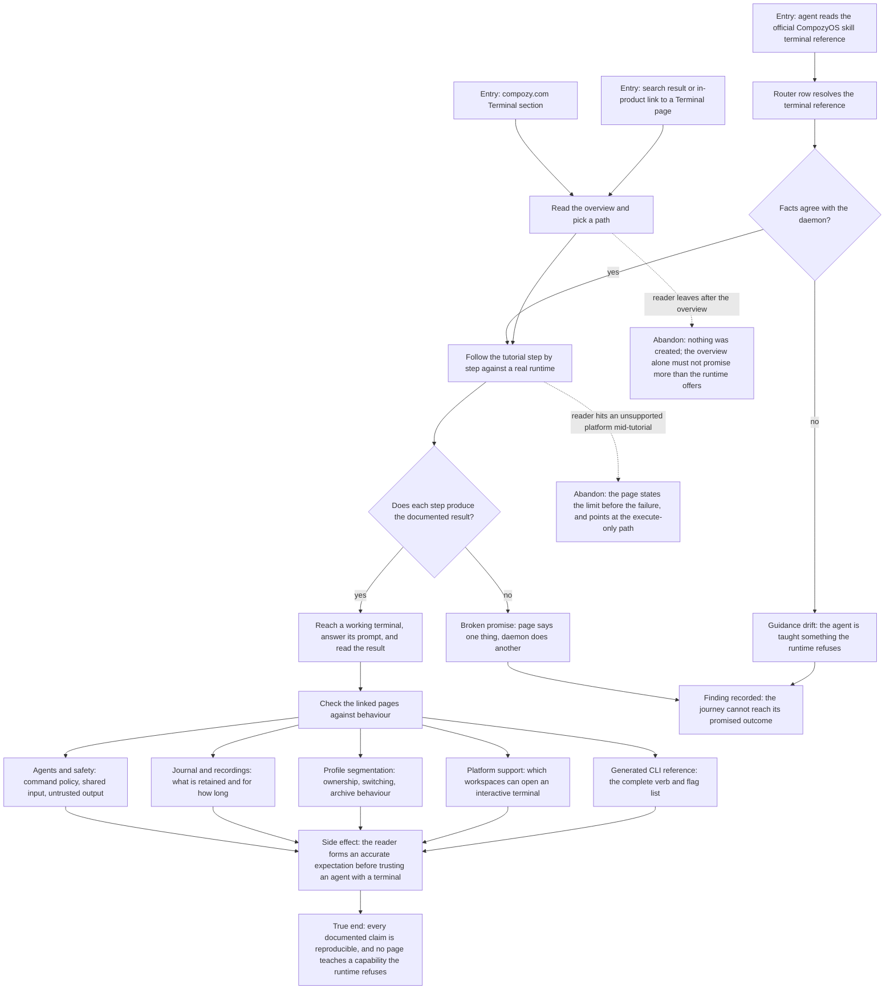

# J-learn-terminal-from-docs — Learn the terminal from the published pages and succeed on the first try

Someone new to the terminal arrives at the public documentation, follows the tutorial verbatim
against a real runtime, and finds that every promise on the page — commands, flags, output shapes,
platform limits, profile behaviour, safety rules — matches what the daemon actually does. An agent
reading the official CompozyOS skill reaches the same facts through its own reference.



```yaml
journey:
  id: J-learn-terminal-from-docs
  name: "Learn the terminal from the published pages and succeed on the first try"
  value_statement: "I can trust the published terminal documentation enough to follow it verbatim, and my agent reads the same facts from its own official reference."
  personas: [Lea, Ada]
  entry_points:
    - url: "compozy.com /docs/terminal, /docs/terminal/tutorial, /docs/terminal/agents-and-safety, /docs/terminal/journal-and-recordings, /docs/terminal/profile-segmentation, /docs/terminal/platform-support"
      origin: external-share
    - url: "compozy.com /docs/cli/terminal (generated reference)"
      origin: in-app-nav
    - url: "Official CompozyOS skill terminal reference, reached through the skill router"
      origin: agent
  actions:
    - step: 1
      verb: "Read the Terminal overview and choose a path"
      expected_observable: "The section navigation lists exactly the published pages, and the overview promises only what the runtime supports."
    - step: 2
      verb: "Follow the tutorial verbatim against a real runtime"
      expected_observable: "Every command runs as printed and every documented output shape matches what the daemon returns."
    - step: 3
      verb: "Check the safety, journal, profile, and platform pages against behaviour"
      expected_observable: "Command approval, shared input, retention windows, profile ownership, and interactive availability read the same on the page and from the daemon."
    - step: 4
      verb: "Open the generated CLI reference"
      expected_observable: "It carries the complete verb and flag list, with no verb the CLI does not accept and no accepted verb missing."
    - step: 5
      verb: "Read the official skill's terminal reference as an agent"
      expected_observable: "The router resolves it, and its tool ids, platform facts, and safety rules agree with both the daemon and the public pages."
  goal:
    observable: "A newcomer and an agent can each act on the published terminal guidance without being contradicted by the runtime."
    side_effects: [terminal-created-by-following-the-tutorial, journal-row-written, reader-expectation-set]
  true_end_state: "The tutorial's final read reproduces the documented result on a real runtime, and every linked page and the skill reference describe the same terminal the daemon just ran."
  exit:
    natural: "The reader continues into real terminal work with correct expectations, or stops at the execute-only path the platform page named."
  abandonment:
    - at_step: 2
      how: "The reader's workspace cannot open an interactive terminal."
      resume: "The platform page states the limit before the failure and routes to the execute-only commands, so the walk continues instead of dead-ending."
  crosses: [public-docs-site, generated-CLI-reference, official-compozy-skill, terminal-runtime, journal, profile-scope, platform-capabilities]
```
