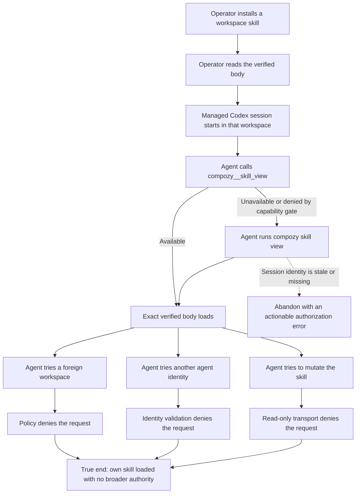

# J-load-skill-in-managed-session: Load an installed skill without losing session identity

A managed agent needs the exact installed skill body while it works. The daemon-owned native tool is the first path; `compozy skill view` is the documented fallback. Both paths must keep the same workspace, session, and agent scope. An operator can still inspect the skill directly, while a managed agent cannot claim another agent identity or cross into a workspace that policy does not allow.



```yaml
journey:
  id: J-load-skill-in-managed-session
  name: Load an installed skill without losing session identity
  value_statement: "As a managed agent I load an installed skill through the native tool or documented CLI fallback without escaping my workspace, session, or agent scope."
  personas: [Ada]
  entry_points:
    - url: compozy__skill_view
      origin: native-tool
    - url: compozy skill view <name>
      origin: direct
    - url: GET /api/skills/{name}/content
      origin: direct
  actions:
    - step: 1
      verb: Install and inspect a distinctive workspace skill as the operator
      expected_observable: The operator reads the exact verified body without managed-session headers
    - step: 2
      verb: Start a managed Codex session in the workspace and load the skill through compozy__skill_view
      expected_observable: The native tool returns the same verified body under the daemon-issued session and agent identity
    - step: 3
      verb: Load the same skill with compozy skill view from the managed session shell
      expected_observable: The CLI uses the session-bound local transport and the API resolves the same workspace and agent scope
    - step: 4
      verb: Request a foreign workspace and a different agent identity
      expected_observable: Existing workspace policy and identity validation deny both attempts with structured authorization errors
    - step: 5
      verb: Try to disable the skill through the managed CLI transport
      expected_observable: The read-only capability rejects the mutation and a subsequent own-scope read still succeeds
  goal:
    observable: Native and CLI skill reads agree with the operator-visible verified body while scope violations are denied
    side_effects: []
  true_end_state: The managed agent has the exact skill body it needs and no authority beyond its active workspace, session, and agent identity
  exit:
    natural: Independent operator read confirms the managed session loaded the same verified body
  abandonment:
    - at_step: 3
      how: Session identity or its local transport is missing, stale, or cannot be validated
      resume: Start or recover a valid managed session; do not replace the daemon-issued identity or transport variables
  crosses: [cli, httpapi, udsapi, native-tools, sessions, skills, workspaces, policy]
```

## Coverage notes

- Functional coverage: operator read, managed native read, managed CLI fallback, exact-body parity, and structured errors.
- Security coverage: foreign-workspace policy denial, mismatched-agent denial, mutation denial, non-skill route denial, and no caller-controlled identity override.
- Deliberate skip: web interaction is unchanged; its operator-only skill viewer remains covered by the existing marketplace journey.
