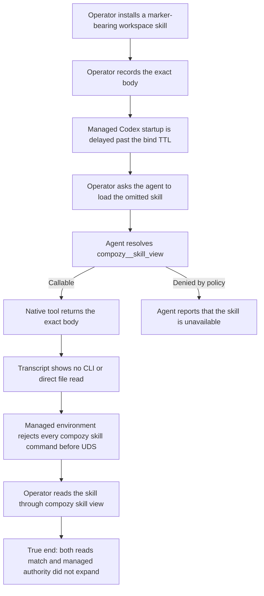

# J-load-skill-in-managed-session: Load an omitted skill through the native seam

A managed agent needs the exact body of an installed skill that does not fit in its truncated prompt
catalog. The agent discovers and reads that skill through the daemon-native tool. It never invokes the
operator CLI or reads the source file directly. The operator can inspect the same body independently.



```yaml
journey:
  id: J-load-skill-in-managed-session
  name: Load an omitted skill through the native seam
  value_statement: "As a managed agent I load an installed skill outside my prompt catalog through the native skill tool without gaining operator CLI authority."
  personas: [Ada]
  entry_points:
    - url: managed session prompt
      origin: direct
    - url: compozy__skill_view
      origin: native-tool
    - url: compozy skill view <name>
      origin: operator
  actions:
    - step: 1
      verb: Install a distinctive workspace skill and record its exact body as the operator
      expected_observable: The operator reads the complete marker-bearing body
    - step: 2
      verb: Delay managed Codex startup beyond the configured bind TTL while omitting the skill from its truncated catalog
      expected_observable: Hosted MCP binds after initialization and the catalog contains no target entry or body; the target name appears only in the operator request
    - step: 3
      verb: Ask the managed agent to load the omitted skill
      expected_observable: The transcript records compozy__skill_view and its exact result
    - step: 4
      verb: Inspect the transcript and events
      expected_observable: No compozy skill view command or direct skill-file read occurred
    - step: 5
      verb: Run every compozy skill command with managed environment markers
      expected_observable: Each command returns the supported-path error before client or filesystem access and state is unchanged
    - step: 6
      verb: Read the skill from an operator shell
      expected_observable: compozy skill view returns the same exact body
  goal:
    observable: The managed and operator reads agree byte-for-byte while the managed session uses only the native tool
    side_effects: []
  true_end_state: The managed agent has the exact omitted skill body and no managed CLI fallback was offered or used
  exit:
    natural: Independent operator output and persisted session events confirm the native result
  abandonment:
    - at_step: 3
      how: Policy denies compozy__skill_view
      resume: Grant the native tool through session policy; do not route the managed process to the operator socket
  crosses: [native-tools, sessions, skills, workspaces, policy, cli]
```

## Coverage notes

- Functional coverage: truncated catalog, native discovery, exact-body parity, and operator read.
- Support-path coverage: no managed CLI fallback, no direct file read, and an early UX guard for every
  skill CLI command while managed environment markers are present.
- Deliberate boundary: local same-user processes are not separated from the operator socket by an OS
  sandbox, so the product does not claim that socket as a managed-process authorization boundary.
