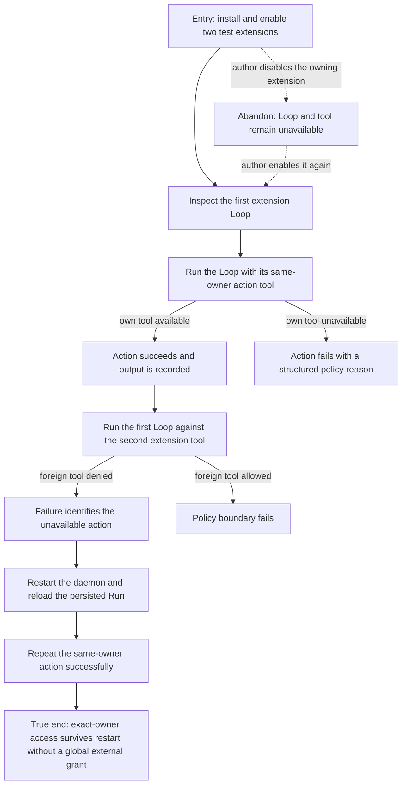

# J-loop-extension-actions: Run extension-owned Loop actions

An extension author installs a Loop and its tools, runs the Loop under the default external-source
policy, and confirms that ownership grants only the Loop's own action tools.



```yaml
journey:
  id: J-loop-extension-actions
  name: Run extension-owned Loop actions
  value_statement: "As an extension author, I can ship a Loop that calls my extension tools without opening access to tools from other extensions."
  personas: [Bruno, Ada]
  entry_points:
    - url: compozy extension install|enable
      origin: direct
    - url: compozy loop list|run|status
      origin: direct
    - url: Loop HTTP and UDS routes
      origin: direct
  actions:
    - step: 1
      verb: Install and enable two independent extensions
      expected_observable: Each extension exposes its own identity, resources, and tool descriptors
    - step: 2
      verb: Run the first extension Loop with its same-owner action tool
      expected_observable: The action executes under the default disabled external-source policy and records its output
    - step: 3
      verb: Point the first Loop at the second extension tool
      expected_observable: Resolution fails with the existing structured unavailable-action reason
    - step: 4
      verb: Restart the daemon, reload the persisted Run snapshot, and repeat the same-owner action
      expected_observable: The pinned owner survives snapshot hydration, the previous result remains intact, and a fresh own action still succeeds
  goal:
    observable: Same-owner action execution succeeds while foreign extension action execution remains denied
    side_effects: [loop-run-persisted, action-output-recorded, policy-denial-recorded]
  true_end_state: Fresh Loop status after daemon restart proves exact-owner access without enabling the global external-source policy
  exit:
    natural: Continue authoring extension Loop actions under the default policy
  abandonment:
    - at_step: 1
      how: Disable the extension before running its Loop
      resume: Enable the extension and re-read the Loop catalog before starting a new Run
  crosses: [extensions, loops, executed-definition-snapshots, tool-registry, tool-policy, cli, httpapi, udsapi]
```

## Coverage notes

- Functional and cross-cutting coverage are the own-tool success, foreign-tool denial, and restart
  continuity checks.
- The Feature Tour owns runtime and documentation agreement. UI, viewport, locale, and browser-only
  dimensions are out of scope because this journey uses structured runtime surfaces.
