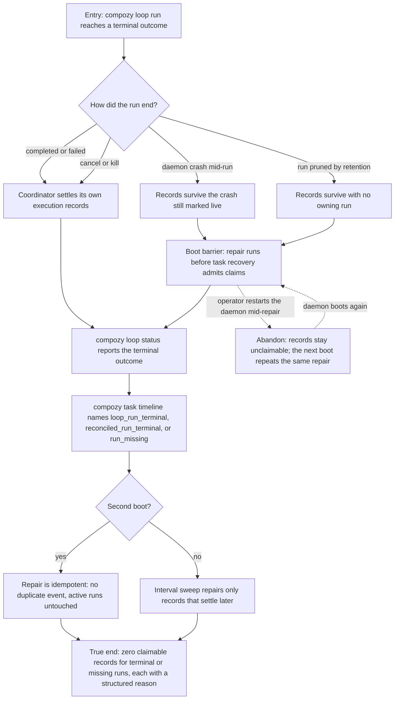

# J-loop-terminal-recovery — Settle a finished Loop run and repair what it left behind

An autonomous operator ends a Loop run — naturally, by cancel, by kill, or by crashing the daemon
mid-flight — and needs the runtime to leave no claimable execution record behind. The daemon repairs
what a crash or a retention prune left live, once at boot before task recovery begins and again on a
configured interval, and every repaired record carries a structured reason a reader can act on.



```yaml
journey:
  id: J-loop-terminal-recovery
  name: "Settle a finished Loop run and repair what it left behind"
  value_statement: "An operator can trust that a Loop run which has ended owns no live work, and can read why every repaired record was settled."
  personas: [Ada]
  entry_points:
    - url: "CLI: compozy daemon; compozy loop status; compozy task timeline"
      origin: direct
    - url: "CLI: compozy config get loops.reconcile_interval -o json"
      origin: direct
  actions:
    - step: 1
      verb: "End a Loop run by completion, cancel, and kill"
      expected_observable: "Each terminal path leaves no claimable task run, and the run's own status reports the terminal outcome"
    - step: 2
      verb: "Seed crash-orphaned and retention-orphaned ownership shapes, then boot the daemon"
      expected_observable: "The boot barrier removes claim eligibility before task recovery admits work"
    - step: 3
      verb: "Read the affected task timelines"
      expected_observable: "Each repaired record carries loop_run_terminal, reconciled_run_terminal, or run_missing as its structured reason"
    - step: 4
      verb: "Boot a second time and let the interval sweep run"
      expected_observable: "The repair emits no duplicate event, active Loop runs are untouched, and the configured interval affects only later sweeps"
  goal:
    observable: "No terminal or missing Loop run owns a claimable execution record on any surface"
    side_effects: [claim-eligibility-removed, reconciliation-event-recorded, timeline-reason-appended]
  true_end_state: "After a fresh boot, a claim attempt finds no work owned by an ended run, and every settled record explains itself through its recorded reason."
  exit:
    natural: "The operator restarts or deploys knowing no ghost work survives a finished run."
  abandonment:
    - at_step: 2
      how: "The operator restarts the daemon while the boot repair is still running."
      resume: "The records stay unclaimable and the next boot repeats the same idempotent repair."
  crosses: [daemon-lifecycle, loop-coordinator, task-claims, scheduler-recovery, config-lifecycle, CLI, HTTP, UDS]
```

Taxonomy note: a structured operator journey with no Web surface. Functional, crash-recovery, and
cross-boot continuity are in scope; responsive, visual, and accessibility checks are not applicable.
