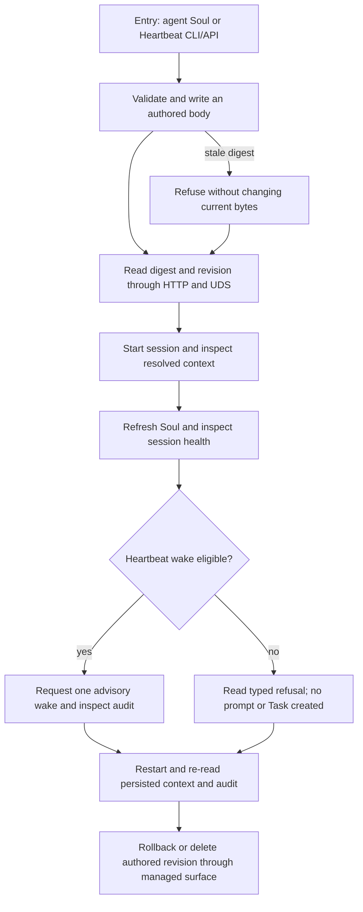

# J-manage-agent-authored-context — Author context and inspect an advisory wake

An operator manages an agent's authored context, confirms what a session resolved, and observes one
policy-controlled Heartbeat wake without changing Task ownership or crossing a workspace boundary.



```yaml
journey:
  id: J-manage-agent-authored-context
  name: Author context and inspect an advisory wake
  value_statement: I can inspect and change what my agent is told and why it wakes, with durable revisions and no hidden Task execution.
  personas: [Ada]
  entry_points:
    - url: compozy agent soul and compozy agent heartbeat
      origin: direct
    - url: /api/agents/:name/soul and /api/agents/:name/heartbeat
      origin: direct
  actions:
    - step: 1
      verb: Validate and write both authored files
      expected_observable: CLI, HTTP, and UDS read the same scoped body, digest, and revision; stale writes refuse
    - step: 2
      verb: Inspect resolved session context and refresh Soul
      expected_observable: The session reports its actual authored snapshot; foreign scopes cannot read or mutate it
    - step: 3
      verb: Read health and request a Heartbeat wake
      expected_observable: Policy chooses one audited advisory decision without Task enqueue or claim authority
    - step: 4
      verb: Restart and inspect history, then rollback or delete
      expected_observable: Authored bytes and revision history persist and managed mutations remain scoped
  goal:
    observable: Authored context remains usable and inspectable throughout one complete lifecycle
    side_effects: [authored-revision-written, advisory-wake-audited, revision-rolled-back]
  true_end_state: Fresh reads agree after restart, no foreign context leaked, and no wake created or claimed a Task
  exit:
    natural: The operator returns to the session with its current authored context understood
  abandonment:
    - at_step: 1
      how: A stale digest refuses the write
      resume: Read the current revision and explicitly retry against its digest
  crosses: [config, hooks, agents, sessions, soul, heartbeat, cli, http, uds, native-tools, revision-history]
```
