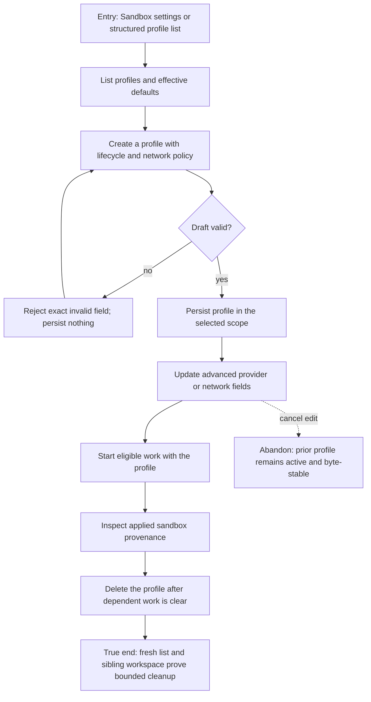

# J-manage-sandbox-profiles — Manage sandbox policy without scope leaks

A runtime administrator creates, inspects, updates, and removes a sandbox profile through public
surfaces, while validation, secret handling, workspace scope, and execution adoption remain
consistent.



```yaml
journey:
  id: J-manage-sandbox-profiles
  name: "Manage sandbox policy without scope leaks"
  value_statement: "I can govern execution isolation through public surfaces and prove the chosen policy applied only where intended."
  personas: [Dora]
  entry_points:
    - url: "web Settings › Sandboxes"
      origin: in-app-nav
    - url: "CLI, HTTP, UDS, and native sandbox-profile surfaces"
      origin: direct
  actions:
    - step: 1
      verb: "List and inspect sandbox profiles"
      expected_observable: "Defaults, scope, lifecycle, network, and provider fields agree across public reads"
    - step: 2
      verb: "Create and update a profile, including an invalid draft"
      expected_observable: "Validation rejects the bad draft without residue; the valid draft persists exactly once"
    - step: 3
      verb: "Run eligible work with the selected profile"
      expected_observable: "Execution provenance names the applied profile and does not leak values from another workspace"
    - step: 4
      verb: "Delete the profile and perform a fresh read"
      expected_observable: "The profile disappears only from its owning scope and dependent behavior falls back truthfully"
  goal:
    observable: "CRUD, applied execution policy, and workspace isolation agree across every public surface"
    side_effects: [sandbox-profile-persisted, sandbox-policy-applied, sandbox-profile-deleted]
  true_end_state: "A fresh list excludes the deleted profile, sibling scope remains unchanged, and no secret-bearing field appears in output or logs."
  exit:
    natural: "The administrator returns to normal execution with the intended sandbox policy active or removed."
  abandonment:
    - at_step: 2
      how: "Cancel an advanced edit before save."
      resume: "Reopen the profile; the prior policy remains authoritative."
  crosses: [settings-web, sandbox-registry, execution-runtime, CLI, HTTP, UDS, native-tools, workspace-isolation]
```
