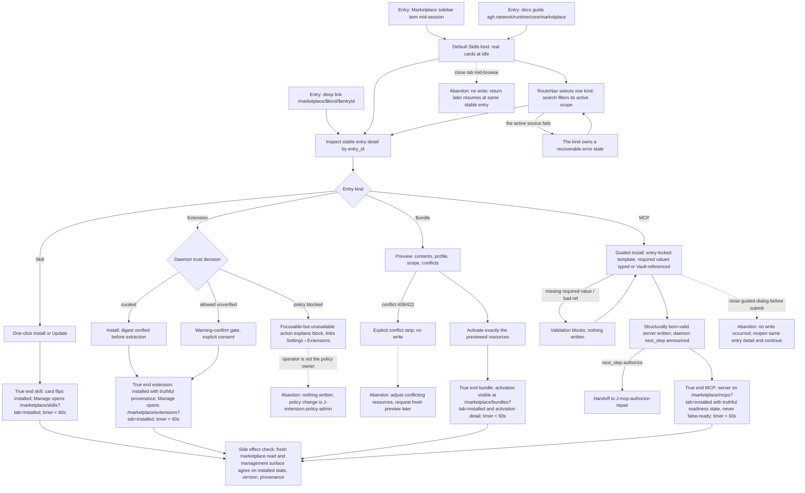

# J-marketplace-acquisition: Discover and acquire marketplace capabilities

The program's money journey (PRD G4 "under-a-minute scene"): an agent needs a capability mid-session; the operator detours to Marketplace, finds it, judges it, acquires it born-valid, and returns to work. The PRD success-metric anchor rides this journey: **time-to-acquire per kind — from opening Marketplace to installed/activated — must be under 60 seconds, captured per kind in the run report**.



```yaml
journey:
  id: J-marketplace-acquisition
  name: Discover and acquire marketplace capabilities
  value_statement: "I can evaluate and acquire a capability of any kind from one truthful marketplace in under a minute, without losing control of scope, secrets, or trust policy."
  personas: [Bruno, Ada]
  entry_points:
    - url: /marketplace
      origin: in-app-nav
    - url: /marketplace/$kind/$entryId
      origin: direct
    - url: agh.network/runtime/core/marketplace
      origin: external-share
  actions:
    - step: 1
      verb: Detour mid-session to Marketplace, select a kind, and browse or search its active scope
      expected_observable: The index enters Skills by default; RouteNav changes kind without stale chrome; counts, errors, and empty states stay truthful
    - step: 2
      verb: Inspect one entry by its stable feed identity
      expected_observable: Kind-specific metadata, installed state, update state, and trust evidence match daemon output; no invented trust for skills
    - step: 3
      verb: Acquire per kind — skill one-click, extension trust-gated, bundle preview-then-activate, MCP guided install
      expected_observable: Required values validated up front, secrets write-only, previews precede mutation, policy blocks explain themselves; wall-clock from step 1 to acquired is under 60 seconds per kind
    - step: 4
      verb: Follow Manage after acquisition
      expected_observable: The matching Marketplace kind opens in Installed scope, and bundle activation links open the exact activation detail
    - step: 5
      verb: Re-read the marketplace after acquiring
      expected_observable: Cards, detail, and management surfaces agree on installed state and next action; update badges render only from real comparisons (skills/extensions semver, bundle spec_drift, MCP badge-less)
  goal:
    observable: Each of the four kinds acquired born-valid in under 60 seconds, with discovery and installed state in agreement
    side_effects: [capability-installed, scoped-config-written, bundle-resources-projected, canonical-vault-refs-created]
  true_end_state: A fresh marketplace read and the destination management surface report the same installed capability, scope, provenance, and update state without exposing secret values; per-kind acquisition timings are captured as evidence
  exit:
    natural: Back to the interrupted session, capability available
  abandonment:
    - at_step: 1
      how: Close the tab mid-browse
      resume: No write occurred; the same stable entry detail deep-links back
    - at_step: 3
      how: Close the guided install or preview dialog before submitting
      resume: No write occurred; reopen the same entry detail and continue
    - at_step: 3
      how: Trust policy blocks acquisition or the bundle preview reports a conflict
      resume: Policy changes happen in J-extension-policy-admin; conflicts are adjusted outside the dialog, then a fresh preview is requested
  crosses: [web, marketplace-api, curated-feeds, vault, settings, skills, extensions, bundles, mcp, docs]
```

## Coverage notes (Task 10 planning)

- Taxonomy sweep: journeys (per-kind happy paths above), functional (validation, entry-id identity, RouteNav, and round-trips — scenario rows), experiential (keyboard operability with open `BUG-20260714-keyboard-focus-invisible`; curated-showcase copy must not imply exhaustiveness), edge/error/empty (per-kind failure, all-zero search, abandonments above), cross-cutting (mobile kind pages and redirect-to-sibling breadcrumb continuity; regression canary is CH-033 on J-22).
- MCP acquisition ends at the structurally-valid server + truthful readiness handoff; authorization is J-mcp-authorize-repair.
- Agent-plane equivalents of every step are J-agent-marketplace-parity.
