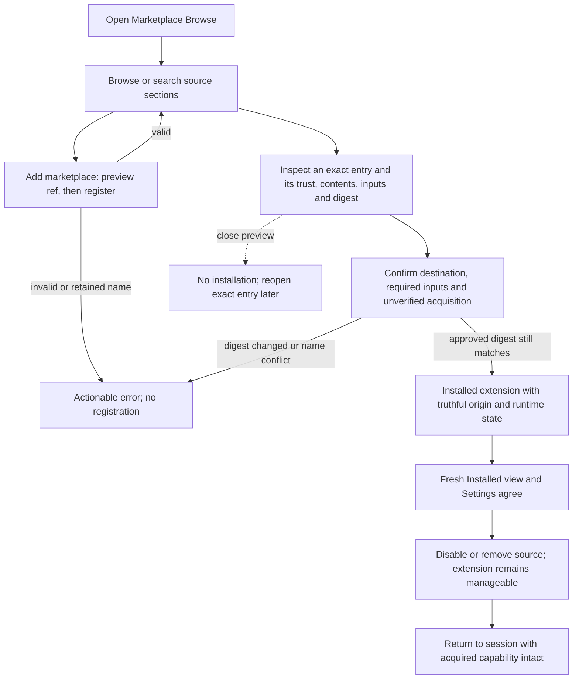

# J-marketplace-acquisition: Acquire an extension from the catalog

Current Marketplace hard-cut journey. Final execution and visual evidence belong to task_10; historical run reports remain unchanged.



```yaml
journey:
  id: J-marketplace-acquisition
  name: Acquire an extension from the catalog
  value_statement: "Acquire and manage one extension with an explicit origin and truthful installed state."
  personas: [Bruno, Marina]
  entry_points:
    - url: /marketplace
      origin: direct
  actions:
    - step: 1
      verb: "Open Browse or a stable entry detail"
      expected_observable: "The complete catalog groups enabled sources and preserves source counts, stale state and identity."
    - step: 2
      verb: "Preview and add a fixture marketplace"
      expected_observable: "Preview writes no registration; Add creates a custom section with diagnostics and an experimental label."
    - step: 3
      verb: "Inspect and install an entry"
      expected_observable: "Required inputs, trust and the displayed digest gate acquisition; errors leave no partial installed state."
    - step: 4
      verb: "Manage the result and its source"
      expected_observable: "Installed remains usable after source disable/removal; re-add of the same origin rejoins; another origin cannot reuse its retained name."
  goal:
    observable: "Fresh reads confirm the installed extension, origin, destination, declared resources and truthful readiness. Record elapsed acquisition time against the under-60-second target."
    side_effects: [source-registration, extension-installed, scoped-input-bindings]
  true_end_state: "Fresh reads confirm the installed extension, origin, destination, declared resources and truthful readiness. Record elapsed acquisition time against the under-60-second target."
  exit:
    natural: Return to the interrupted session
  abandonment:
    - at_step: 2
      how: Close source preview before Add
      resume: No registration; preview the ref again
    - at_step: 3
      how: Cancel install confirmation
      resume: No installed instance; reopen the exact source entry
  crosses: [web, marketplace-api, plugin-sources, vault, settings, extensions, mcp, docs]
```

Coverage: happy path, exact identity and parity, degraded/off/empty sources, validation and digest races, cancellation, destination isolation, keyboard access and narrow windows. Human visual coverage uses Bruno/Marina; Ada owns deterministic structured output. Retired per-kind acquisition is outside the current contract.
