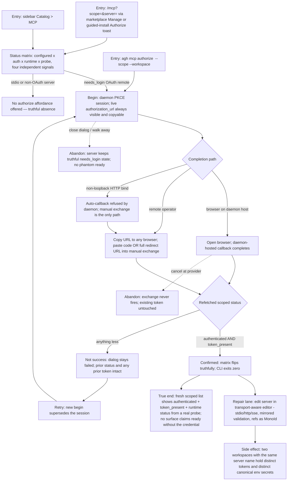

# J-mcp-authorize-repair: Authorize and repair a remote MCP server

The PRD repair journey under the ADR-011 authorization floor and ADR-016 daemon-mediated OAuth: a freshly installed (or long-broken) remote MCP server shows `needs_login`; the operator — local or away from the daemon host — authorizes it and watches truthful status confirm. Success exists only as `authenticated && token_present` (safety invariant 6); a failed or canceled attempt never leaves the server worse than before (invariant 7). This journey also owns the second PRD metric anchor for MCP: **truthful readiness — zero installed-but-broken, zero false greens**.



```yaml
journey:
  id: J-mcp-authorize-repair
  name: Authorize and repair a remote MCP server
  value_statement: "I can make a remote MCP server actually usable — and see the truth when it is not — from any machine, without ever losing a working credential to a failed attempt."
  personas: [Bruno, Iris, Ada]
  entry_points:
    - url: /mcp?scope=workspace|global&server=<name>
      origin: in-app-nav
    - url: agh mcp authorize <name> [--manual] [--scope --workspace]
      origin: direct
    - url: POST /api/settings/mcp-servers/{name}/auth/begin|exchange|logout
      origin: direct
    - url: agh.network/runtime/core/marketplace
      origin: external-share
  actions:
    - step: 1
      verb: Read the status matrix for the target server
      expected_observable: configured, auth_status, runtime_status, and probe render as four independent truthful signals; tool count only on a succeeded probe; unknown values neutral, never green
    - step: 2
      verb: Begin authorization
      expected_observable: A live PKCE authorization URL is rendered copyable immediately; browser open is optional; stdio/non-OAuth servers never offer the action
    - step: 3
      verb: Complete via browser callback or manual code/redirect-URL paste
      expected_observable: Exactly one of code or redirect_url is accepted; the daemon completes a single-use session; nothing echoes the code, verifier, or token
    - step: 4
      verb: Confirm
      expected_observable: Success is declared only on refetched authenticated && token_present; failure or cancel visibly preserves the prior status and token
    - step: 5
      verb: Repair configuration in the editor when needed
      expected_observable: Transport-conditional fields mirror daemon validation; bound secret refs render as identifiers; plaintext is write-only
  goal:
    observable: The target server reads authenticated with a present token and truthful runtime status on every plane that renders it
    side_effects: [scoped-token-persisted, pkce-session-consumed, auth-events-emitted-redacted]
  true_end_state: A fresh scoped settings read (web, CLI, API agree) reports authenticated && token_present with runtime status from a real probe; a deliberately failed or abandoned attempt leaves the previous credential and status intact
  exit:
    natural: /mcp management page with the repaired server row confirmed
  abandonment:
    - at_step: 2
      how: Close the authorize dialog without completing
      resume: Server keeps its truthful needs_login state; a later begin supersedes cleanly
    - at_step: 3
      how: Cancel at the provider, paste an expired/mismatched code, or let the PKCE session expire (5 min)
      resume: Deterministic failure; prior token untouched; retry with a fresh begin
    - at_step: 4
      how: Operator never returns (structurally-valid-but-never-authorized accumulation)
      resume: The status matrix keeps showing the honest needs_login next-step — the ADR-011 mitigation
  crosses: [web, cli, settings-api, mcp-auth, vault, external-oauth-provider, workspaces]
```

## Coverage notes (Task 10 planning)

- Taxonomy sweep: journeys (authorize + repair lanes), functional (state machine, XOR exchange inputs, scoped identity), experiential (status legibility without color-only signaling; copyable-URL affordance), edge/error/empty (expiry, supersession, cancel, non-loopback refusal, unknown status values), cross-cutting (workspace isolation of BOTH credential channels — OAuth tokens and canonical secret_env refs; redaction across logs/SSE/payloads).
- Deliberate skip: locale variation (en-US only this cycle — no localized surfaces shipped in the program).
