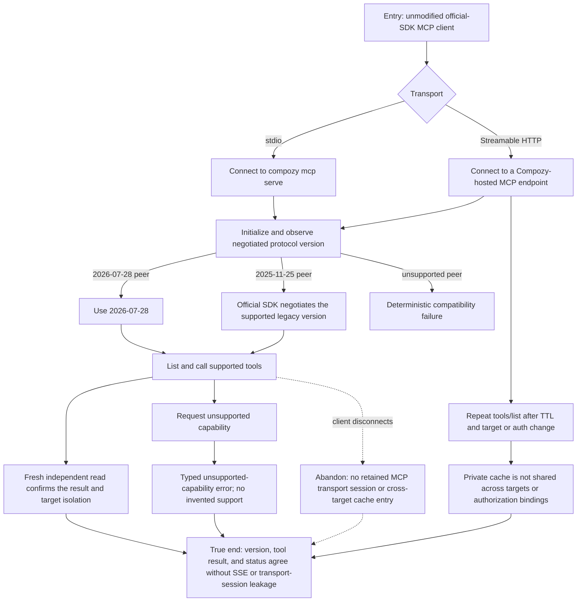

# J-mcp-protocol-interop: Connect MCP peers through the supported protocol contract

An agent operator connects an unmodified MCP client to Compozy over stdio or Streamable HTTP,
discovers tools, and uses a supported capability without relying on transport state, an obsolete
SSE endpoint, or a Compozy-specific client shim. This journey owns the 2026-07-28 default,
official-SDK negotiation to 2025-11-25, private tool-list caching, and honest refusal of
capabilities Compozy does not implement.



```yaml
journey:
  id: J-mcp-protocol-interop
  name: "Connect MCP peers through the supported protocol contract"
  value_statement: "I can use Compozy from an ordinary MCP client with a negotiated, bounded protocol contract instead of a custom integration."
  personas: [Ada, Dora]
  entry_points:
    - url: "MCP stdio client spawning compozy mcp serve"
      origin: direct
    - url: "MCP Streamable HTTP client"
      origin: direct
  actions:
    - step: 1
      verb: "Connect an unmodified MCP client and initialize"
      expected_observable: "Status exposes the negotiated 2026-07-28 protocol version, or the official-SDK 2025-11-25 negotiated fallback."
    - step: 2
      verb: "Discover and invoke a supported tool"
      expected_observable: "The tool list and call return the target-bound, authorization-bound result through stdio and Streamable HTTP."
    - step: 3
      verb: "Request an intentionally unsupported capability"
      expected_observable: "Compozy returns its typed unsupported-capability error without advertising roots, sampling, elicitation, logging, or tasks as supported."
    - step: 4
      verb: "Repeat discovery across cache and identity boundaries"
      expected_observable: "Tool-list cache entries obey ttlMs and cacheScope=private; a different target or authorization binding cannot receive the prior result."
  goal:
    observable: "A standard client completes a supported tool round trip and can tell exactly which protocol and capabilities are active."
    side_effects: [negotiated-protocol-observed, private-tool-list-cache-observed]
  true_end_state: "A fresh status and independent result read agree on the negotiated version and target-bound result, while no SSE endpoint or transport-session state is required."
  exit:
    natural: "The operator can keep using the same standard MCP client with Compozy."
  abandonment:
    - at_step: 2
      how: "The client disconnects after discovery or before the tool result."
      resume: "A fresh client reconnects without inheriting a transport session, a private cache entry, or another target's authorization binding."
  crosses: [mcp-sdk, stdio, streamable-http, hosted-mcp, status, tool-cache, workspace-isolation]
```

## Coverage notes (MCP 2026/catalog v2 planning)

- Taxonomy sweep: journeys (modern and negotiated-legacy peers), functional (initialization, discovery, call, version/status parity), experiential (clear unsupported-capability and compatibility errors), edge/error/empty (disconnect, unsupported peer/capability, TTL expiry), cross-cutting (target/workspace/auth cache isolation and no SSE residual surface).
- This is a protocol-integrator journey. The human install path remains `J-marketplace-acquisition`; OAuth registration and authorization remain `J-mcp-authorize-repair`.
